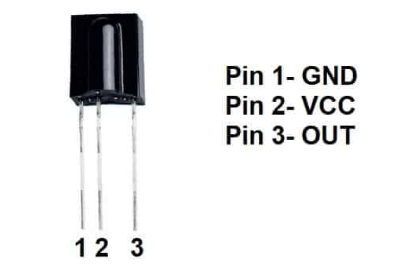
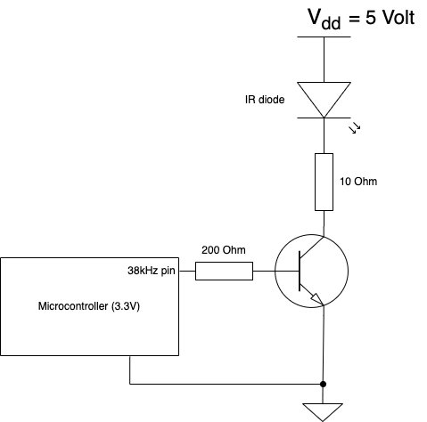

- [Infrarood communicatie](#infrarood-communicatie)
  - [Protocol](#protocol)
  - [Hardware voor ontvangst](#hardware-voor-ontvangst)
    - [Internals](#internals)
  - [NEC protocol](#nec-protocol)
  - [Hardware voor verzenden](#hardware-voor-verzenden)
    - [Goedkoop verkrijgbaar](#goedkoop-verkrijgbaar)
    - [Zelf maken](#zelf-maken)
    - [Belangrijke tips](#belangrijke-tips)

# Infrarood communicatie

We zijn allemaal bekend met infrarood communicatie. Bijvoorbeeld van afstandsbedieningen van apparaten.

Communicatie kan ook met radiogolven (Bluetooth, WiFi, etc.) maar infrarood heeft zijn voordelen:

1. **Energieverbruik**

   Het verzenden van informatie kan met heel weinig energieverbruik. Daarom hoeven batterijen van IR afstandsbedieningen slechts eens in de zoveel jaar vervangen te worden.

2. **Breedbandig**

   IR-licht heeft een veel hogere frequentie dan radiogolven. Daardoor kan er een veel hogere bandbreedte mee bereikt worden.

3. **Storingen**

   IR communicatie veroorzaakt geen RF-storingen en wordt ook niet gestoord door RF-storingen.

4. **Veiligheid**

   IR communicatie werk alleen in het zichtveld. Daardoor blijft de data binnen de muren of wordt alleen ontvangen door waar de IR-laser op gericht staat.

- Punt 3 is belangrijk in **medische** en **industriële** omgevingen.
- Alle punten zijn belangrijk voor **satelliet**-toepassingen. Ook daar worden IR-lasers toegepast, ook tussen satellieten onderling.
- Punt 4 is belangrijk voor **militaire** toepassingen. Denk aan communicatie tussen grondstation en drones en drones onderling.

## Protocol

Het verzenden van enen en nullen via infrarood gaat door een **Infrarood LED** (of laser) **aan en uit** te zetten. Misschien zou je denken dat de lengte van het aanzetten gebruikt wordt om te bepalen of er een één of een nul wordt overgezonden, maar zo simpel is het niet. Dat zou immers te gevoelig zijn voor storingen van toevallige lichtbronnen.

## Hardware voor ontvangst

In plaats daarvan worden typisch bursts van korte pulsen met zekere frequentie gebruikt. Die kunnen met speciale hardware voor IR-ontvangst worden opgevangen. We gebruiken daarvoor bijvoorbeeld een **TSOP**, zoals de TSOP1738:

[Dit is de datasheet van de TSOP1738](./files/TSOP1730_datasheet.pdf)

Deze filtert infrarode signal-bursts van ca. 38kHz uit het licht dat het ontvangt, en maakt gedurende die periode zijn outputpin **laag**.

Kortom, een infrarood-burst zorgt ervoor dat de pin van je microcontroller die daarmee verbonden wordt, gedurende de tijd van die burst laag wordt getrokken.

### Internals

In de datasheet zie je een block-diagram voor de electronica die er in zit:

- Aan de linkerkant zie je een **fotodiode**, welke de binnenkomende lichtintensiteit omzet in een electrische spanning.
- Die spanning wordt versterkt middels een AGC, ofwel een "**Automatic Gain Control**". Die zorgt ervoor dat het signaal precies genoeg wordt versterkt:
  - **Niet te weinig** versterken - anders komt het aan/uit van het signaal niet boven de "detectie-drempel" (in dit schema: voldoende basis-spanning van de transistor) waarmee je meet of het aan staat.
  - **Niet te veel** versterken - anders wordt (kleinere-) storing ook versterkt, en gaat dat ook boven de "detectie-drempel" uitkomen, waardoor het ten onrechte "aan" kan meten (de transistor staat dan ook aan wanneer ze uit zou moeten staan).
- Na de versterking is er een **bandpass filter**, welke alleen signalen van rond de 38KHz doorlaat. Het filtert daarmee effectief alle andere (storende-) signalen eruit. Later dit semester behandelen we hoe je lowpass, highpass en bandpass filters kunt maken en hoe ze werken.
- De **demodulator** zorgt ervoor dat de uitgefilterde burst van wordt omgezet in een "glad/gemiddeld" signaal dat gedurende de burst hoog is (en dus de transistor aan zet).
- Het "**control circuit**" regelt aan de hand van het gemeten signaal dat uit de bandpass filter kom de versterking van de AGC (dat is een zogeheten "regellus" - we zien zoiets ook terug bij de PID-regeling, later dit semester). Kennelijk regelt het ook de demodulator bij, al heb ik geen idee wat.

## NEC protocol

We krijgen dus op onze microcontroller een signaal binnen waarmee we de lengte van de burst en de pauzes ertussen kunnen meten.

Maar **hoe** zijn die lengtes en pauzes **gerelateerd aan de informatie** (bits en bytes) die je wilt overzenden?

Die afspraak heet een "**communicatie-protocol**". Voor infrarood afstandsbedieningen is het meest voorkomende protocol het **NEC protocol**. Tijdens dit semester baseren we onze infrarood communicatie daarom op dat protcol.

Onderstaande afbeelding geeft dat protocol in meer detail weer:

In het **onderste deel** van het plaatje is ingezoomd op de bursts van licht-informatie die door de lucht gaat. De paaltjes staan daar op ongeveer (1/36Khz) seconde uit elkaar.

Het **bovenste deel** van het plaatje is meer uitgezoomd - en afgevlakt. Het is de **inverse** van het signaal dat uit de TSOP komt (want die maakt de pin laag gedurende een burst).

## Hardware voor verzenden

### Goedkoop verkrijgbaar

Als je NEC-geëncodeerde infrarood signalen kunt decoderen, kun je je microcontroller-applicaties afstandsbestuurbaar maken met een van de vele beschikbare cheapo afstandbedieningen:

### Zelf maken

Als je bijvoorbeeld vanaf een microcontroller zelf infraroodsignalen wilt verzenden, kan dat met bijvoorbeeld het onderstaande schema:

- Aangezien de hoeveelheid stroom beperkt is die een microcontroller pin mag/kan leveren, is deze versterkt middels een **transistor** die **als schakelaar** is ingesteld.
- De **basisweerstand** beperkt de stroom die de pin maximaal levert.
  
  Kun je uitrekenen tot welk amperage?

  De **collectorweerstand** beperkt de maximale stroom die door de IR-diode wordt geschakeld.
  
  Uitgaande van een junctiespanning van 1.5V voor die diode, kun je uitrekenen hoe groot die maximale stroom in dit geval is?

### Belangrijke tips

- Zet zender en ontvanger **niet te dicht bij elkaar** (minimaal 8 cm ertussen anders wordt de ontvanger "overvoerd").
- Programmeer het **38kHz** basissignaal **niet zelf** (dat kost nodeloos processor-tijd). Veel microcontrollers (zoals ESP32 en Arduino's) hebben ingebouwde hardware (zogenaamde **peripherals**) die je kunt gebruiken om een periodiek signaal te maken. Voor de ESP32 kun je het beste de klasse "**ClockPin**" uit de "**LaserGameUtils**" folder uit het [S3-Template project](../../infrastructuur/ESP32-IDF-opzet/ESP32-IDF-opzet-Windows.md) daarvoor gebruiken. Die klasse wrapt het gebruik van zo'n peripheral, waardoor het maken van een 38kHz signaal geen processortijd kost.
