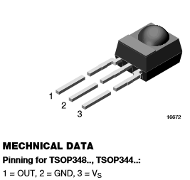
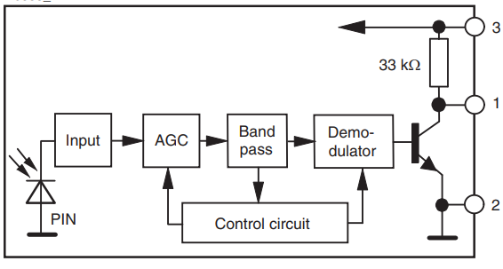
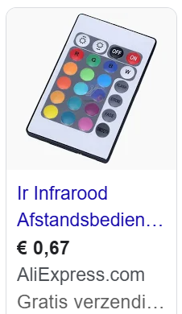
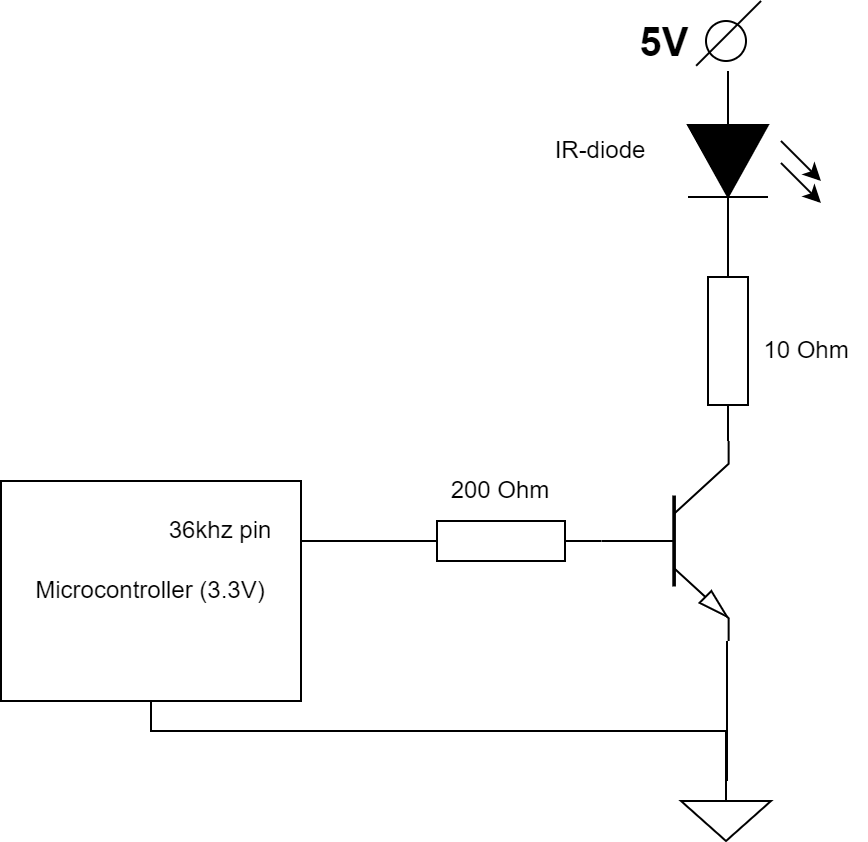

# Infrarood communicatie

We zijn allemaal bekend met infrarood communicatie. Bijvoorbeeld van afstandsbedieningen van apparaten.

Communicatie kan ook met radiogolven (bluetooth, wifi, etc), maar infrarood heeft zijn voordelen:

1. **Energieverbruik** 
   Het verzenden van informatie kan met heel weinig energieverbruik. Daarom hoeven batterijen van IR afstandsbedieningen slechts eens in de zoveel jaar vervangen te worden.
2. **Breedbandig** 
   IR-licht heeft een veel hogere frequentie dan radiogolven. Daardoor kan er een veel hogere bandbreedte mee bereikt worden.
3. **Storingen** 
   IR communicatie veroorzaakt geen RF-storingen, en wordt ook niet gestoord door RF-storingen.
4. **Veiligheid** 
   IR communicatie werk alleen in het zichtveld. Daardoor blijft de data binnen de muren, of wordt alleen ontvangen door waar de IR-laser op gericht staat.
- Punt 3 is belangrijk in **medische** en **industriële** omgevingen.
- Alle punten zijn belangrijk voor **satteliet**-toepassingen. Ook daar worden IR-lasers toegepast, ook tussen sattelieten onderling.
- Punt 4 is belangrijk voor **militaire** toepassingen. Denk aan comminicatie tussen grondstation en drones en drones onderling.

## Protocol

Het verzenden van enen en nullen via infrarood gaat door een **infrarood led** (of laser) **aan en uit** te zetten. Misschien zou je denken dat de lengte van het het aanzetten gebruikt wordt om te bepalen of een een of een nul wordt overgezonden, maar dat is **niet** het geval. Dat zou immers te gevoelig zijn voor storingen van toevallige lichtbronnen.

## Hardware voor ontvangst

In plaats daarvan worden typisch bursts van korte pulsen met zekere frequentie gebruikt. Die kunnen met speciale hardware voor IR-ontvangst. We gebruiken daarvoor bijvoorbeeld een **TSOP**, zoals de TSOP4830:

[Dit is de datasheet van de TSOP4830](TSOP4830_datasheet.pdf)

Die filtert infrarode signal-bursts van 36 a 37kHz uit het licht dat het ontvangt, en maakt gedurende die periode zijn outputpin **laag**.

Kortom, een infrarood-burst zorgt ervoor dat de pin van je microcontroller die daarmee verbonden wordt, gedurende de tijd van die burst laag wordt getrokken.

### Internals

In de datasheet zie je een block-diagram voor de electronica die er in zit:

- Aan de linkerkant zie je een **fotodiode**, welke de binnenkomende lichtintensiteit omzet in een electrische spanning. 
- Die spanning wordt versterkt middels een AGC, ofwel een "**Automatic Gain Control**". Die zorgt ervoor dat het signaal precies genoeg wordt versterkt:
  - **Niet te weinig** versterken - anders komt het aan/uit van het signaal niet boven de "detectie-drempel" (in dit schema: voldoende basis-spanning van de transistor) waarmee je meet of het aan staat.
  - **Niet te veel** versterken - anders wordt (kleinere-) storing ook versterkt, en gaat dat ook boven de "detectie-drempel" uitkomen, waardoor het ten onrechte "aan" kan meten (de transistor staat dan ook aan wanneer ze uit zou moeten staan). 
- Na de versterking is er een **bandpass filter**, welke alleen signalen van rond de 36KHz doorlaat. Het filtert daarmee effectief alle andere (storende-) signalen eruit. Later dit semester behandelen we hoe je lowpass, highpass en bandpass filters kunt maken en hoe ze werken.
- De **demodulator** zorgt ervoor dat de uitgefilterde burst van wordt omgezet in een "glad/gemiddeld" signaal dat gedurende de burst hoog is (en dus de transistor aan zet).
- Het "**control circuit**" regelt aan de hand van het gemeten signaal dat uit de bandpass filter kom de versterking van de AGC (dat is een zogeheten "regellus" - we zien zoiets ook terug bij de PID-regeling, later dit semester). Kennelijk regelt het ook de demodulator bij, al heb ik geen idee wat.

## NEC protocol

Enfin, we krijgen dus op onze microcontroller een signaal binnen, waarmee we de lengte van de burst en de pauzes ertussen kunnen meten.

Maar **hoe** zijn die lengtes en pauzes **gerelateerd aan de informatie** (bits en bytes) die je wilt overzenden?

Die afspraak heet een "**communicatie-protocol**". Voor infrarood afstandsbedieningen is het meest voorkomende protocol het **NEC protocol**. Tijdens dit semester baseren we onze infrarood communicatie daarom op dat protcol.

Onderstaande afbeelding geeft dat protocol in meer detail weer:

In het **onderste deel** van het plaatje is ingezoomd op de bursts van licht-informatie die door de lucht gaat. De paaltjes staan daar op ongeveer (1/36Khz) seconde uit elkaar. 

Het **bovenste deel** van het plaatje is meer uitgezoomd - en afgevlakt. Het is de **inverse** van het signaal dat uit de TSOP komt (want die maakt de pin laag gedurende een burst).

## Hardware voor verzenden

### Goedkoop verkrijgbaar

Als je NEC-geëncodeerde infrarood signalen kunt decoderen, kun je je microcontroller-applicaties afstandsbestuurbaar maken met een van de vele beschikbare cheapo afstandbedieningen:

### Zelf maken

Als je bijvoorbeeld vanaf een microcontroller zelf infraroodsignalen wilt verzenden, kan dat met bijvoorbeeld het onderstaande schema:

- Aangezien de hoeveelheid stroom beperkt is die een microcontroller pin mag/kan leveren, is deze versterkt middels een **transistor** die **als schakelaar** is ingesteld. 
- De **basisweerstand** beperkt de stroom die de pin maximaal levert (kun je uitrekenen tot welk amperage?). 
  De **collectorweerstand** beperkt de maximale stroom die door de IR-diode wordt geschakeld (uitgaande van een junctiespanning van 1.5V voor die diode, kun je uitrekenen hoe groot die maximale stroom in dit geval is?).

#### Belangrijke tips:

- Zet zender en ontvanger **niet te dicht bij elkaar** (minimaal 8cm ertussen o.i.d., anders wordt de ontvanger "overvoerd").
- Programmeer het **36kHz** basissignaal **niet zelf** (dat kost nodeloos processor-tijd). Veel microcontrollers (zoals ESP32 en Arduino's) hebben ingebouwde hardware (zogenaamde **peripherals**) die je kunt gebruiken om een periodiek signaal te maken. Voor de ESP32 kun je het beste de klasse "**ClockPin**" uit de "**LaserGameUtils**" folder uit het **test_lasergame_2** project daarvoor gebruiken. Die klasse wrapt het gebruik van zo'n peripheral, waardoor het maken van een 36kHz signaal geen processortijd kost.