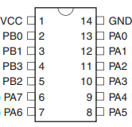

# Het gebruik van een programmer

Met een Arduino UNO en ESP32 ontwikkelbordjes kan je jouw gecompileerde code uploaden met een USB verbinding. Wil je een project dat klein, goedkoop of voor massaconsumptie geschikt is stap je waarschijnlijk snel over op een eigen hardware ontwerp. De gewenste functionaliteit kan je dan op de door jouw geselecteerde microcontroller uploaden met een programmer. 

Voor AVR microcontrollers gebruik je de AVRISP. Een ST-LINK/V2 kan je bijvoorbeeld voor STM8 en STM32 microcontrollers gebruiken. Naast het programmeren van je microcontorller kan je deze ook gebruiken voor hardware debugging.

## ATtiny24

In dit voorbeeld programmeren we een ATtiny24. We configureren een Arduino Uno zodat deze kan functioneren als een programmer.

**stap 1**
Voeg ondersteuning toe voor ATtiny24 aan de Arduino IDE. Onder File->Preferences voeg de volgende URL toe aan Additional Boards Manager: https://raw.githubusercontent.com/damellis/attiny/ide-1.6.x-boards-manager/package_damellis_attiny_index.json en herstart de IDE.

**stap 2**
Installeer de ATtiny Board Package onder Tools -> Board -> Boards Manager zoek naar attiny. Installeer Attiny by David. A Mellis en herstart de IDE.

**stap 3**
Neem een Arduino Uno. We maken deze gereed om als programmer te gebruiken. Kies onde File -> Examples -> 11. Arduino ISP -> Arduino ISP. Upload deze sketch naar je Arduino Uno.

**stap 4**
Zoek de datasheet van de ATtiny en kijk goed naar de pinout. Sluit de Arduino Uno als volgt aan op de ATtiny24:

Name | Physical Pin
--- | ---
VCC | 1 = Arduino 5v
GND | 14 = Arduino GND
RESET | 4 = Arduino pin 10
MOSI | 7 = Arduino pin 11
MISO | 8 = Arduino pin 12
SCK | 9 = Arduino pin 13

**klaar!** Je kunt nu een programma uploaden met de Atduino IDE naar de ATtiny microcontroller.

## Opdrachten

1) Maak je eerste "Hello World" (een knipperend ledje) voor de ATtiny. Laat dit werkend zien.
2) Maak een [50Hz detector](./50Hz_detector.md). Leg uit hoe dit werkt en waar je dit voor kunt gebruiken.
3) Maak een kerstliedje in [audio prakticum](./audio.md).
