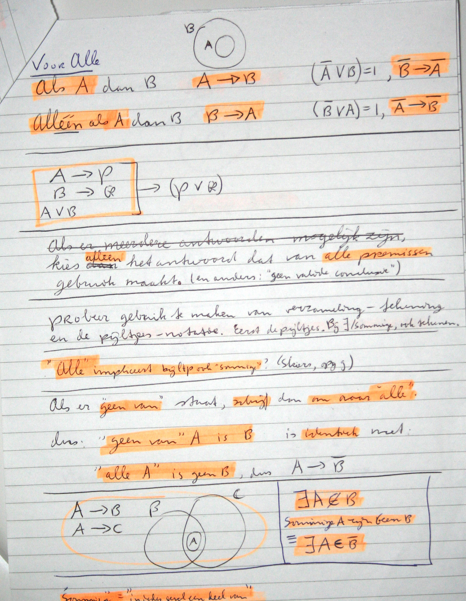

# Voorbereiding iq tests

Onderstaand is een setje foto's te vinden van voorbereiding voor een iq-test die ik ooit gemaakt heb. Voor een aantal typen vragen is het handig om een beetje geoefend te hebben in de manier van het erover nadenken.

Nu ik het teruglees, begrijp ik niet alles meer, maar destijds maakte het sense :-) .

