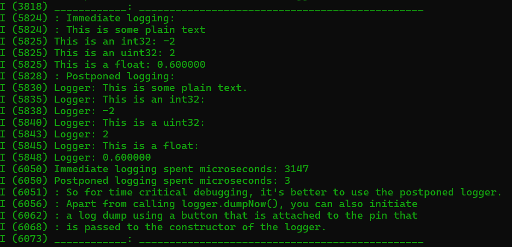

# ESP32-project opzet, ESP32-IDF, Arduino component en CleanRTOS installatie deel II <!-- omit in toc -->

<!-- TOC -->
- [Introductie](#introductie)
- [Arduino library voorbeelden](#arduino-library-voorbeelden)
	- [WifiScan.ino](#wifiscanino)
	- [AnalogRead.ino](#analogreadino)
- [Clean RTOS voorbeelden](#clean-rtos-voorbeelden)
	- [Introductie](#introductie-1)
	- [HelloWorld.ino](#helloworldino)
	- [TwoTasks.ino](#twotasksino)
	- [Flag.ino](#flagino)
	- [Logger.ino](#loggerino)
<!-- /TOC -->

# Introductie
In deze MD file gaan we aan de slag met een aantal voorbeelden voor de ESP32.  
We gaan ervanuit dat je de voorbeelden uitprobeert op een simpele ESP32 (ik heb het getest met de ESP32-WROOM-32D).

**Deze voorbeelden gaan er vanuit dat je de export.bat hebt uitgevoerd, het esp-target hebt geset en dat je ook al de CONFIG_FREERTOS_HZ op 1000 hebt gezet. Is dit niet het geval? Bekijk [hier](./ESP32-IDF-opzet-Windows.md) hoe je dat doet.**

# Arduino library voorbeelden

## WifiScan.ino

Kopieer de inhoud van `main_for_wifi_scan_ard_ide_with_nvs.cpp` naar `main.cpp`

```
├── main
│   ├──  CMakeLists.txt
│   ├──  CMakeLists_for_zigbee.txt
│   ├──  component.mk
│   ├──  idf_component.yml
│   ├──  idf_component_for_zigbee.yml
│   ├──  Kconfig.projbuild
│   ├──  main.cpp
│   ├──  main_for_wifi_scan_ard_ide_with_nvs.cpp
│   └──  main_normal_no_nvs_backup.cpp
```
Zoals je ziet in de `main.cpp` is het volgende voorbeeld geselecteerd:
```c++
// **** Arduino IDE Examples ****
#include <WifiScan.ino>
//#include <WiFiAccessPoint.ino>
//#include <AnalogRead.ino>
```
Run het voorbeeld met:
```bash
...\S3-Template>idf.py flash monitor
```

Dit zou het volgende moeten geven (maar dan met andere netwerken):


Gaaf he!!

## AnalogRead.ino

Kopieer de inhoud van `main_for_wifi_scan_ard_ide_with_nvs.cpp` naar `main.cpp`

Verander de `main.cpp` zodat het AnalogRead.ino voorbeeld is geselecteerd:
```c++
// **** Arduino IDE Examples ****
//#include <WifiScan.ino>
//#include <WiFiAccessPoint.ino>
#include <AnalogRead.ino>
```

AnalogRead.ino is te vinden in de dir: 
```bash
...\S3-Template\components\arduino-esp32\libraries\ESP32\examples\AnalogRead
```

Als we die openen zien we:

``` c++
void setup() {
  // initialize serial communication at 115200 bits per second:
  Serial.begin(115200);

  //set the resolution to 12 bits (0-4095)
  analogReadResolution(12);
}

void loop() {
  // read the analog / millivolts value for pin 2:
  int analogValue = analogRead(2);
  int analogVolts = analogReadMilliVolts(2);

  // print out the values you read:
  Serial.printf("ADC analog value = %d\n", analogValue);
  Serial.printf("ADC millivolts value = %d\n", analogVolts);

  delay(100);  // delay in between reads for clear read from serial
}
```

Run het voorbeeld met:
```bash
...\S3-Template>idf.py flash monitor
```

Klopt de output met wat je had verwacht?


# Clean RTOS voorbeelden

## Introductie
Wil je eerst een indruk krijgen van wat je allemaal kan met CleanRTOS? Bekijk het volgende: [Introductie CleanRTOS](../CleanRTOS/README.md)   
Je hoeft niet alles meteen te snappen, je kan ook eerst onderstaande voorbeelden bekijken (&runnen) en dan de introductie CleanRTOS bekijken.

## HelloWorld.ino

Kopieer de inhoud van `main_for_wifi_scan_ard_ide_with_nvs.cpp` naar `main.cpp`

verander de `main.cpp` zodat:
```c++
// **** Arduino IDE Examples ****
//#include <WifiScan.ino>
//#include <WiFiAccessPoint.ino>
//#include <AnalogRead.ino>
```
en bij:

```c++
// Selecteer onderstaand de .ino van je applicatie
// **** CleanRTOS Core Tests ****
#include <HelloWorld.ino>    					// For initial test.
//#include <TwoTasks.ino>
//#include <TenTasks.ino>						// Tip: Vergelijk dit voorbeeld met het Handler.ino voorbeeld!
//#include <Flag.ino>
//#include <Queue.ino>
//#include <Timer.ino>							// 5.1 test ok op c6/zigbee
//#include <MutexSection.ino>
//#include <Pool.ino>
//#include <HasFired.ino>
//#include <AllWaitables.ino>					// 5.1 test ok op c6/zigbee
```

HelloWorld.ino is te vinden in de dir: 
```bash
...\S3-Template\libs\CleanRTOS\examples\HelloWorld
```

Als we die openen zien we:
``` c++
// by Marius Versteegen, 2022

// The ino code has been moved to a header file such that it 
// can be inspected in non-Arduino IDE environments with 
// proper code highlighting and intellisense too.

#include "HelloWorld_ino.h"

// IMPORTANT: required for this example to work:
// if you are building from Arduino IDE, make sure to set 
// the build setting "Core Debug Level" to "info"
// and select baudrate=115200 in Serial Monitor.
```

Aha. Blijkbaar moeten we `HelloWorld_ino.h` openen:

``` c++
// by Marius Versteegen, 2023

#include <crt_CleanRTOS.h>        // This file includes crt_Config.h  You'll need to change defines there for a release build.

// All Tasks should be created in this main file.
#include "crt_HelloWorld.h"
namespace crt
{
	MainInits mainInits;            // Initialize CleanRTOS.
	HelloWorld helloWorld("HelloWorld", 2 /*priority*/, 4000 /*stackBytes*/, ARDUINO_RUNNING_CORE);
}

void setup()
{
	ESP_LOGI("checkpoint", "start of main");
}

void loop()
{
	vTaskDelay(1);// Nothing to do in loop - all example code runs in the 4 threads above.
}
```

Zoals je ziet werkt dit heel anders dan een programma zonder RTOS!!! 
We maken met 
```c++
	HelloWorld helloWorld("HelloWorld", 2 /*priority*/, 4000 /*stackBytes*/, ARDUINO_RUNNING_CORE);
```
een taak aan van de klasse HelloWorld.  

Laten we 'crt_HelloWorld.h' openen om te zien hoe de class HelloWorld eruit ziet.

```c++
// by Marius Versteegen, 2023

#pragma once
#include <crt_CleanRTOS.h>

// This file demonstrates the use of a single task.

namespace crt
{
	class HelloWorld : public Task
	{
	public:
		HelloWorld(const char *taskName, unsigned int taskPriority, unsigned int taskSizeBytes, unsigned int taskCoreNumber) :
			Task(taskName, taskPriority, taskSizeBytes, taskCoreNumber)
		{
			start(); // For simplicity, the task is started right away in it's constructor.
		}

	private:
		void main()
		{
			vTaskDelay(1000); // wait for other threads to have started up as well.

			while (true)
			{
				ESP_LOGI("HelloWorld", "Hello world!");
				vTaskDelay(1000);							// Wait 1000ms.
			}
		}
	}; // end class TestTimers
};// end namespace crt
```
Zoals je ziet in de main print hij 1 keer `Hello World!` naar de logger en daarna geeft hij de macht uit handen voor 1000 ticks.

Run het voorbeeld met:
```bash
...\S3-Template>idf.py flash monitor
```

Klopt de output met wat je had verwacht?


## TwoTasks.ino

Kopieer de inhoud van `main_for_wifi_scan_ard_ide_with_nvs.cpp` naar `main.cpp`

verander de `main.cpp` zodat:
```c++
// **** Arduino IDE Examples ****
//#include <WifiScan.ino>
//#include <WiFiAccessPoint.ino>
//#include <AnalogRead.ino>
```
en bij:

```c++
// Selecteer onderstaand de .ino van je applicatie
// **** CleanRTOS Core Tests ****
//#include <HelloWorld.ino>    					// For initial test.
#include <TwoTasks.ino>
//#include <TenTasks.ino>						// Tip: Vergelijk dit voorbeeld met het Handler.ino voorbeeld!
//#include <Flag.ino>
//#include <Queue.ino>
//#include <Timer.ino>							// 5.1 test ok op c6/zigbee
//#include <MutexSection.ino>
//#include <Pool.ino>
//#include <HasFired.ino>
//#include <AllWaitables.ino>					// 5.1 test ok op c6/zigbee
```

TwoTasks_ino.h is te vinden in de dir: 
```bash
...\S3-Template\libs\CleanRTOS\examples\TwoTasks
```

Als we die openen zien we:
``` c++
// by Marius Versteegen, 2023

#include <crt_CleanRTOS.h>        // This file includes crt_Config.h  You'll need to change defines there for a release build.

// All Tasks should be created in this main file.
#include "crt_TwoTasks.h"
namespace crt
{
	MainInits mainInits;            // Initialize CleanRTOS.
	SayHelloTask sayHelloTaskBert("Bert", 2 /*priority*/, 4000 /*stackBytes*/, ARDUINO_RUNNING_CORE, "Hello Ernie!");
	SayHelloTask sayHelloTaskErnie("Ernie", 2 /*priority*/, 4000 /*stackBytes*/, ARDUINO_RUNNING_CORE, "Hello Bert!");
}

void setup()
{
	ESP_LOGI("checkpoint", "start of main");
}

void loop()
{
	vTaskDelay(1);// Nothing to do in loop - all example code runs in the 2 threads above.
}
```


Zoals je ziet werkt dit heel anders dan een programma zonder RTOS!!! 
Bekijk het volgende filmpje : [CleanRTOS Task gebruik](https://www.youtube.com/watch?v=3W2uBrb0YAI)   
We maken met 
```c++
	SayHelloTask sayHelloTaskBert("Bert", 2 /*priority*/, 4000 /*stackBytes*/, ARDUINO_RUNNING_CORE, "Hello 
```
een taak aan van de klasse SayHelloTask.  
Hij maakt dus twee taken aan in het RTOS (sayHelloTaskBert en sayHelloTaskErnie)

Laten we 'crt_TwoTasks.h' openen om te zien hoe de class SayHelloTask eruit ziet.

```c++
// by Marius Versteegen, 2023

#pragma once
#include <crt_CleanRTOS.h>

namespace crt
{
	class SayHelloTask : public Task
	{
	private:
		const char* text = NULL;

	public:
		SayHelloTask(const char *taskName, unsigned int taskPriority, unsigned int taskSizeBytes, unsigned int taskCoreNumber, const char* text) :
			Task(taskName, taskPriority, taskSizeBytes, taskCoreNumber),text(text)
		{
			start(); // For simplicity, the task is started right away in it's constructor.
		}

	private:
		void main()
		{
			vTaskDelay(1000); // wait for other threads to have started up as well.

			while (true)
			{
				ESP_LOGI(Task::taskName,"%s",text);
				vTaskDelay(1000);							// Wait 1000ms.
			}
		}
	}; // end class TestTimers
};// end namespace crt
```
Zoals je ziet in de main print hij 1 keer `text` naar de logger en daarna geeft hij de macht uit handen voor 1000 ticks.

Run het voorbeeld met:
```bash
...\S3-Template>idf.py flash monitor
```

Klopt de output met wat je had verwacht?


## Flag.ino

Kopieer de inhoud van `main_for_wifi_scan_ard_ide_with_nvs.cpp` naar `main.cpp`

verander de `main.cpp` zodat:
```c++
// **** Arduino IDE Examples ****
//#include <WifiScan.ino>
//#include <WiFiAccessPoint.ino>
//#include <AnalogRead.ino>
```
en bij:

```c++
// Selecteer onderstaand de .ino van je applicatie
// **** CleanRTOS Core Tests ****
//#include <HelloWorld.ino>    					// For initial test.
//#include <TwoTasks.ino>
//#include <TenTasks.ino>						// Tip: Vergelijk dit voorbeeld met het Handler.ino voorbeeld!
#include <Flag.ino>
//#include <Queue.ino>
//#include <Timer.ino>							// 5.1 test ok op c6/zigbee
//#include <MutexSection.ino>
//#include <Pool.ino>
//#include <HasFired.ino>
//#include <AllWaitables.ino>					// 5.1 test ok op c6/zigbee
```

Flag.h is te vinden in de dir: 
```bash
...\S3-Template\libs\CleanRTOS\examples\Flag
```

Als we Flag_ino.h openen zien we:
``` c++
	FlagListener   flagListener("FlagListener", 2 /*priority*/, 4000 /*stackBytes*/, ARDUINO_RUNNING_CORE); // Don't forget to call its start() memeber during setup().
	FlagSetter     flagSetter  ("FlagSetter",   2 /*priority*/, 4000 /*stackBytes*/, ARDUINO_RUNNING_CORE, flagListener);
```
We hebben blijkbaar twee klassen!

Open 'crt_TestFlag.h'  om te zien hoe de twee klassen eruit zien.

Run het voorbeeld met:
```bash
...\S3-Template>idf.py flash monitor
```

Klopt de output met wat je had verwacht?

## Logger.ino

Kopieer de inhoud van `main_for_wifi_scan_ard_ide_with_nvs.cpp` naar `main.cpp`

verander de `main.cpp` zodat:
```c++
// **** Arduino IDE Examples ****
//#include <WifiScan.ino>
//#include <WiFiAccessPoint.ino>
//#include <AnalogRead.ino>
```
en bij:

```c++
// **** CleanRTOS Tools Tests ****
#include <Logger.ino>
//#include <Handler.ino>
//#include <ClockPin.ino>						// 5.1 test ok op c6/zigbee
```

Logger.h is te vinden in de dir: 
```bash
...\S3-Template\libs\CleanRTOS\examples\Logger
```

Run het voorbeeld met:
```bash
...\S3-Template>idf.py flash monitor
```

Dit geeft de volgende output:



Als we kijken naar `crt_TestLogger.h` :

```c++
				dumpStackHighWaterMarkIfIncreased(); 		// This function call takes about 0.25ms! It should be called while debugging only.

				ESP_LOGI("", "Immediate logging:");

				uint64_t beforeImmediateLogging = esp_timer_get_time();
				ESP_LOGI("", "This is some plain text");
				ESP_LOGI("This is an int32", "%" PRIi32, anInt);
				ESP_LOGI("This is an uint32", "%" PRIu32, aUint);
				ESP_LOGI("This is a float", "%f", aFloat);
				uint64_t afterImmediateLogging = esp_timer_get_time();

				ESP_LOGI("", "Postponed logging:");

				uint64_t beforePostPonedLogging = esp_timer_get_time();
				logger.logText("This is some plain text.");
				logger.logText("This is an int32:");
				logger.logInt32(anInt);
				logger.logText("This is a uint32:");
				logger.logUint32(aUint);
				logger.logText("This is a float:");
				logger.logFloat(aFloat);
				uint64_t afterPostponedLogging = esp_timer_get_time();

				logger.dumpNow();

				ESP_LOGI("Immediate logging spent microseconds", "%" PRIi32, (int32_t)(afterImmediateLogging - beforeImmediateLogging));
				ESP_LOGI("Postponed logging spent microseconds", "%" PRIi32, (int32_t)(afterPostponedLogging - beforePostPonedLogging));
				ESP_LOGI("", "So for time critical debugging, it's better to use the postponed logger.");

				ESP_LOGI("", "Apart from calling logger.dumpNow(), you can also initiate");
				ESP_LOGI("", "a log dump using a button that is attached to the pin that");
				ESP_LOGI("", "is passed to the constructor of the logger.");

				ESP_LOGI("____________", "_______________________________________________");

				anInt--;
				aUint++;
				aFloat += 0.3f;

				vTaskDelay(2000);  // wait 2s before next round of logs.
```
Dan zien we dat postponed loggen extreem veel sneller is. Let wel, `logger.dumpNow()` kost nog steeds veel tijd, dus gebruik die spaarzaam. Goed om te weten!


