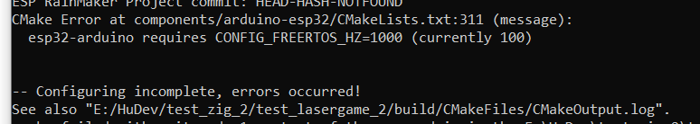
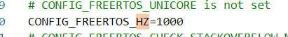
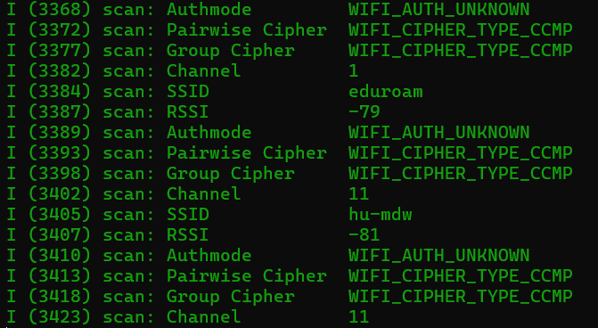
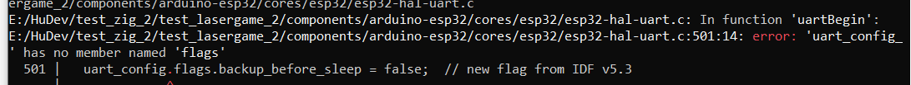
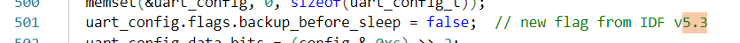
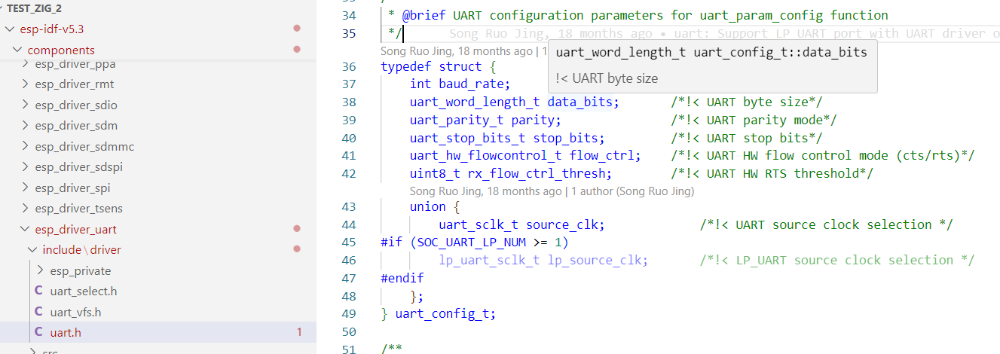
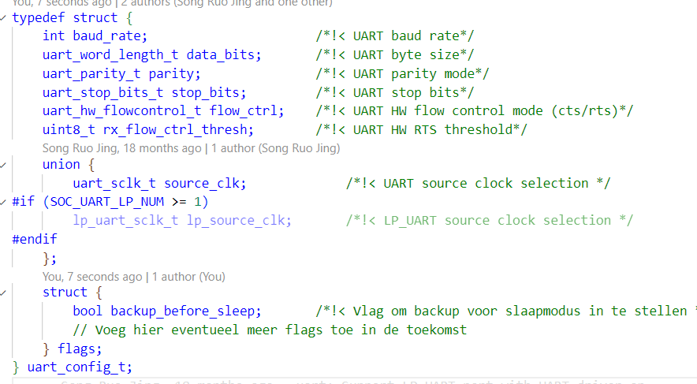
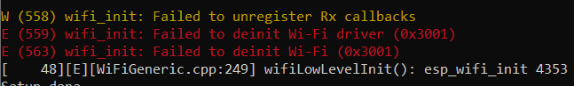

# ESP32-project opzet, ESP32-IDF, Arduino component en CleanRTOS installatie

## Bruikbare pinnen

Goed om te weten: van de meeste esp32 devkits zijn een stuk of 8 pinnen niet bruikbaar (zonder dat je een expert bent op esp32 gebied), omdat die voor interne taken / peripherals van de esp32 gebruikt kunnen worden. Een grappig voorbeeld is een esp32 devkit variant met extra veel pinnen. Echter, maar 1 of 2 van die extra pinnen zijn om dezelfde reden daadwerkelijk bruikbaar. Zoek dus altijd van tevoren goed uit welke pinnen van je ESP32 microcontroller je echt zonder kopzorgen kunt gebruiken.

## ESP32 introductie

Ik open een command prompt in admin mode en maak een folder aan voor dit experiment, en noem die: E:/espressif

[deze pagina](https://github.com/espressif/esp-idf) toont de aanbevolen versies van de ESP-IDF.

Nu (2025-02-19) is dit v5.4, dus type ik in een cmd window:

```bash
C:\Users\MyName> cd E:\espressif
C:\Users\MyName> e:
E:\espressif> git clone -b v5.4 --recursive https://github.com/espressif/esp-idf.git
E:\espressif> cd esp-idf
E:\espressif\esp-idf> install.bat
```

Dit duurt iets langer. Wacht af tot het helemaal geinstalleerd is. Anders ontbreken misschien nog tools/onderdelen en de volgende stappen gaan mis.

- Als het nu al fout gaat zou het kunnen zijn dat je de settings voor python verkeerd hebt staan. Zie [hier](./files/setting_up_envirment.md) voor een oplossing.  

Nu is het geinstalleerd.

Om de windows paden en alles voor de huidige sessie goed te zetten, moet je voortaan na het openen van je command (ook voortaan) eerst op deze plek "export.bat" aanroepen.

```bash
E:\espressif\esp-idf> export.bat
```

Nu alles goed staat, werkt de build-tool "idf.py"

```bash
E:\espressif\esp-idf> idf.py --version
```

retourneert nu als het goed is "ESP-IDF v5.4".

Het zou handig zijn als je niet steeds na het openen van de command-prompt eerst naar die directory hoeft te gaan en export.bat in te typen.

Liever maak je een snelkoppeling naar een command prompt die dat automatisch doet:

- RMB(rechtermuisknop) op bureaublad of elders -> nieuwe snelkoppeling
- Gebruik als commando/location of the item : `cmd.exe /k "E:\espressif\esp-idf\export.bat"`
- Kies als naam `ESP-IDF command prompt`.
- (optioneel) Open de shortcut, en pin hem aan je taskbar.

Okee, laten we even een snelle hello world test doen:

```bash
E:\espressif\esp-idf> cd E:\espressif\esp-idf\examples\get-started\hello_world
```

Je ziet de volgende files in de directory (en sub directory) staan:
```
├── main
│   ├── CMakeLists.txt
│   └── hello_world_main.c
├── CMakeLists.txt
├── pytest_hello_world.py       Wordt gebruikt om automatisch te testen.
├── README.md                   Dit is een gebruiksaanwijzing voor het project
└── sdkconfig.ci                Ook voor automatisch building en testen.
```

Enkel de twee CMakeLists.txt en de hello_world_main.c zijn nodig om het project te builden. 

## De eerste keer bouwen

.. maar voordat je de eerste keer goed kunt bouwen, moeten er 2 dingen gebeurd zijn:

- (eenmalig, voor "altijd") USB-communicatie drivers installeren voor het devkit boardje dat je gebruikt.

  > Als je al met de Arduino IDE of de Raspberry Pi PICO gewerkt hebt zijn deze misschien al geinstalleerd!

  De volgende komen vaak voor:
  
  - CP210x USB-to-UART driver (voor chips zoals CP2102/CP2104):  
     <https://www.silabs.com/developers/usb-to-uart-bridge-vcp-drivers>
  
  - FTDI USB-to-UART driver (voor boards met FTDI-chips):  
     <https://ftdichip.com/drivers/>
  
  - CH340/CH341 driver (voor sommige goedkope ESP32-boards):  
     <http://www.wch.cn/downloads/category/5.html>

- (eenmalig, per project) de juiste build-target instellen voor dit project. het volgende commando laat de keuze zien:

  ```bash
  ...\hello_world> idf.py --list-targets
  ```

- Vervolgens dus je microcontroller voor het project instellen. dus bijvoorbeeld voor een normale esp32: idf.py set-target esp32
  (de ingestelde esp32 zie je terug in de file sdkconfig, als je er in zoekt op "target")

- (elke keer, nadat je de microcontroller opnieuw in usb hebt geplugd):
  
  - Open de device manager. Kijk bij Ports(COM) welke com-port je devkit heeft.
    (in mijn voorbeeld blijkt dat COM8)

- elke (re-)build:
  
  ```bash
  ...\hello_world> idf.py -p COM8 flash monitor
  ```

De eerste keer dat je dit doet duurt het superlang om het te builden. Daarna gaat het gelukkig veel sneller. De toevoeging 'flash' zorgt dat het ook wordt geflasht en de toevoeging 'monitor' zorgt ervoor dat een programma-tje wordt gestart welke je kunt vergelijken met Serial Monitor van de Arduino IDE.

Als het goed is geeft het de volgende output: 
```
Hello world!
This is esp32 chip with 2 CPU core(s), WiFi/BTBLE, silicon revision v3.1, 2MB external flash
Minimum free heap size: 305356 bytes
Restarting in 10 seconds...
Restarting in 9 seconds...
Restarting in 8 seconds...
Restarting in 7 seconds...
Restarting in 6 seconds...
Restarting in 5 seconds...
Restarting in 4 seconds...
```
**Je kunt de monitor weer sluiten met: de "CTRL" + "]" toets-combinatie.**

Na het builden zie je dat er een directory en een file is bijgekomen in de directory: 
```
├── build
├── main
│   ├── CMakeLists.txt
│   └── hello_world_main.c
├── CMakeLists.txt
├── pytest_hello_world.py       
├── README.md                   
├── sdkconfig                   
└── sdkconfig.ci                
```

Je zult zien dat er voor het bouwen automatisch een `build` subfolder wordt aangemaakt. Die is enorm groot. Standaard worden echter alleen verschillen met de vorige code opnieuw gebouwd. Dat scheelt tijd. Soms gaat iets daarbij mis. Met `idf.py fullclean` kun je dan de oude build opruimen, zodat de volgende netjes weer van scratch begint.

Enfin, in het algemeen wil je behalve je hoofd-applicatie ook allerlei test-applicaties makkelijk kunnen bouwen en testen, zonder dat voor elk weer zo'n joekel van een build-directory wordt aangelegd.

## Nieuw project maken

Laten we eens zelf een nieuw project maken volgens het boekje.
We maken er eerst een folder voor aan (op willekeurige plek).
Ik kies:

```bash
...\hello_world> cd E:\espressif
E:\espressif> mkdir testproject
E:\espressif> cd testproject
E:\espressif> git clone https://github.com/espressif/esp-idf-template.git 
```

testen:

```bash
...\testproject\esp-idf-template> idf.py -p COM8 flash monitor 
```

> (met de spatiebalk kun je de flow uit de monitor stil zetten)

**Open de hello_world_main.c om te kijken wat het programma zou moeten doen:** 
```c++
#include <stdio.h>
#include "freertos/FreeRTOS.h"
#include "freertos/task.h"


void app_main(void)
{
    int i = 0;
    while (1) {
        printf("[%d] Hello world!\n", i);
        i++;
        vTaskDelay(5000 / portTICK_PERIOD_MS);
    }
}
```

De `vTaskDelay` is je eerste instructie van het RTOS (Real Time Operating System). Het is geen delay zoals je hem kent uit de arduino wereld, maar iets heel anders.  
 `vTaskDelay` betekent eigenlijk: **stoor me niet voor die aangegeven tijd, ga maar lekker iets anders doen...** Hier zie je al het eerste voorbeeld van de kracht van een OS, we zouden in die tijd de microcontroller iets anders **nutigs** kunnen laten doen! 

## S3-Template

Een handig uitgangspunt van je project is het onderstaande S3-Template project:

- Alles wordt gebouwd op dezelfde build folder, met dezelfde main file.
- De CleanRTOS libraries zijn toegevoegd, evenals enkele Arduino-IDE libraries.
- Het heeft voorbeeld applicaties in een apps subfolder, die het gebruik van [CleanRTOS](../CleanRTOS/README.md) demonstreren en hoe iets zowel gebouwd kan worden in Arduino-IDE als in ESP-IDF.
- Het heeft een ClockPin class - welke superhandig is voor het schrijven van frequency-chopped communicaties zoals IR-communicatie.
- Voor de liefhebber is er ook support voor ILI-touchscreen displays (alleen is dat nog niet compatibel met zigbee).

Okee, dat project zet ik ook maar in dezelfde folder, dus:

```bash
...> cd E:\espressif
E:\espressif> git clone https://github.com/HU-TI-DEV/S3-Template.git
E:\espressif> cd S3-Template
```

Als de S3-Template folder nog geen components subfolder bevat, maken we die.

```bash
...\S3-Template> mkdir components
...\S3-Template> cd components
```

Vervolgens clonen we de arduino-ide component die compatibel is met onze ESP-IDF versie:

```bash
...\S3-Template\components> git clone -b idf-release/v5.4 https://github.com/HU-TI-DEV/arduino-esp32.git
...\S3-Template\components> cd ..
...\S3-Template>
```

Nog even de huidige microcontroller instellen voor dit project, in mijn geval nu de normale esp32:

```bash
...\S3-Template> idf.py set-target esp32
```

Dat resulteert in een error:



Voor compatibiliteit met de Arduino IDE components moet de FreeRTOS periodieke timer op 1000 Hz worden ingesteld (zodat VTaskDelay(1) 1 ms duurt ipv 10ms).

Ik pas dat handmatig aan in de sdkconfig file:



Daarna is geen verdere actie nodig. Dus niet opnieuw set-target aan roepen - die vervangt sdkconfig weer terug..

>Mocht je vaak willen switchen tussen verschillende esp types (en dus vaker de set-taget aan moet roepen) kun je ook een `sdkconfig.defaults` aanmaken met de volgende inhoud:
```
  CONFIG_FREERTOS_HZ=1000 
```
>Dit zorgt ervoor dat het in de toekomst automatisch meegenomen wordt als je set-target aanroept. 


git clone -b idf-release/v5.4 https://github.com/HU-TI-DEV/arduino-esp32.git

Okee, verder met het project, bekijk de main folder in `...\S3-Template>`:

```
├── main
│   ├──  CMakeLists.txt
│   ├──  CMakeLists_for_zigbee.txt
│   ├──  component.mk
│   ├──  idf_component.yml
│   ├──  idf_component_for_zigbee.yml
│   ├──  Kconfig.projbuild
│   ├──  main.cpp
│   ├──  main_for_wifi_scan_ard_ide_with_nvs.cpp
│   └──  main_normal_no_nvs_backup.cpp
```
In de main zien we verschillende "main"s staan. Hij zal altijd de main.cpp uitvoeren.
De `main_normal_no_nvs_backup.cpp` is een kopie van de `main.cpp`.
De `main_for_wifi_scan_ard_ide_with_nvs.cpp` is nodig als je de wifi-gerelateerde samples van de arduino ide component (zoals WiFiScan.ino) wilt runnen. Je ziet dit ook in de comments van `main.cpp`. Het WiFiScan.ino voorbeeld heeft het nodig dat "nvs" (non volatile storage) geinitialiseerd is (in main.cpp) en geconfigureerd is. Voor nu gaan we dat even niet uitproberen. Mocht je dat wel willen dan moet je de inhoud van main_for_wifi_scan_ard_ide_with_nvs.cpp kopieeren naar `main.cpp`. Dan zul je ook de partition table (deze geeft aan hoe het geheugen is ingedeelt) en de sdconfig moeten veranderen (tip: vraag het chatgpt).

Laten we het standaard main voorbeeld builden en runnen:
```bash
...\Espressif\S3-Template>idf.py flash monitor
```
Als het goed is krijg je ongeveer het volgende te zien (afhankelijk van welke wifi netwerken er in de buurt zijn):




## (A) Als dit goed gaat: gefeliciteerd!

Nog wat algemene informatie over het idee achter S3-Template:

- Het is een gewoon esp32 project, met een slim gekozen folder structuur en main.cpp file.
  Het stelt je in staat om makkelijk vanaf één main.cpp file
  (en een sdkconfig, partition.csv file en met slechts één build folder)
  elk van je (test-applicaties) en examples te bouwen, inclusief die van de arduino-ide.
-  Voor wat betreft dat laatste voorkomt het dat je zelf het wiel opnieuw hoeft uit te vinden.
-  Eigen applicaties worden ook via ".ino" files geinclude, op dezelfde manier als arduino-ide examples. 
  Dat zorgt ervoor je het evt ook zou kunnen bouwen met arduino-ide ipv via de esp32-IDF.
  (zelf vind ik dat een leuke feature, omdat, als je bijvoorbeeld een library ontwikkelt (zoals CleanRTOS),
  dat je die zonder aanpassing van een letter code kunt publiceren als library die in de Arduino-IDE wereldwijd 
  gevonden en gebruikt kan worden).
- Zoals je wellicht opvalt, staat dat alles compleet los van CleanRTOS.
- CleanRTOS is gewoon een van de beschikbare libraries. Eentje die je kunt gebruiken als freertos wrapper.
  
## (B) Als dit resulteert in een error



Dat is iets wat nog niet is geupdate voor versie 5.3. Typsich nog zoiets dat je krijgt als je de laatste versie gebruikt. Wat dat betreft hadden we beter de voorlaatste versie van ESP-IDF kunnen gebruiken.

Enfin, in uart.h ontbreekt dus nog een flags variabele in de klasse uart_config_. We checken eerst in die esp32-hal-uart.c file even welk type hij verwacht.

In VSCode zien we op die regel:



`idf.py --version` retourneert `5.3`, en ik heb de 5.3. versie voor de arduino ide toestand geinstalleerd.

Het lijkt dus een nieuwe bug. Op stack overflow en google kan ik er niets over vinden. Enfin, dan voeg ik de ontbrekende members zelf maar even toe.

Via RMB (right mouse button) op die uart_config vraag ik VSCode "Go to declaration" om de klassedeclaratie te vinden.
Dit is em kennelijk:



Dus even zelf flags subdeel toevoegen:



Okee, de WifiScan applicatie runt nu, maar in de monitor verschijnt:



Vervolgens deze tip van stack overflow toegepast:

``unselect Wifi nvs enabled in menuconfig ,component config -> Wifi -> Wifi NVS Flash``

Vervolgens werkte het. De ene ESP32 vond meestal niets, en af en toe een zwak signaal. Dat komt omdat het er eentje is waar een antenne op geschroefd dient te worden. Een andere ESP32 (met ingebouwde antenne) vond een hele reeks providers.

Ook een aardige test (van CleanRTOS) kun je doen, door in main "#include <AllWaitables.ino>" uit te commentariëren en daarmee te bouwen.

> (Die test heeft een button met pulldown-weerstand nodig aan pin23).

Een andere leuke test, als je een ILI-touchscreen hebt aangesloten, kun je doen door in main uit te commentarieren: #include <TouchscreenButton.ino> of #include <TouchscreenButtonGroup.ino>

littleFS lijkt nog niet te werken. misschien idf53 compatible variant ervan installeren oid.

# Appendix format specifiers

Het kan zijn dat een deel van de code uit het project S3-Template nog niet helemaal werkt op esp-idf 5.3 of 5.4 (de code werd gemaakt in 4.4).

Als er nog iets aangepast moet worden, zijn het vermoedelijk format specifiers binnen de ELogV() of ELogi() commandos.

Dat blijkt dan wel uit de foutmeldingen.

Ik heb chatgpt 4.0 een mappings-tabel laten maken (er kunnen dus fouten in zitten):

| **Type**                 | **Format Specifier** |
| ------------------------ | -------------------- |
| `int`                    | `%d`                 |
| `unsigned int`           | `%u`                 |
| `long int`               | `%ld`                |
| `unsigned long int`      | `%lu`                |
| `long long int`          | `%lld`               |
| `unsigned long long int` | `%llu`               |
| `short int`              | `%hd`                |
| `unsigned short int`     | `%hu`                |
| `char`                   | `%c`                 |
| `unsigned char`          | `%hhu`               |
| `signed char`            | `%hhd`               |
| `float`                  | `%f`                 |
| `double`                 | `%lf`                |
| `long double`            | `%Lf`                |
| `int8_t`                 | `%" PRIi8 "`         |
| `uint8_t`                | `%" PRIu8 "`         |
| `int16_t`                | `%" PRIi16 "`        |
| `uint16_t`               | `%" PRIu16 "`        |
| `int32_t`                | `%" PRIi32 "`        |
| `uint32_t`               | `%" PRIu32 "`        |
| `int64_t`                | `%" PRIi64 "`        |
| `uint64_t`               | `%" PRIu64 "`        |
| `size_t`                 | `%zu`                |
| `ptrdiff_t`              | `%zd`                |
| `uintptr_t`              | `%zu`                |
| `intptr_t`               | `%zd`                |
| `void*` (pointer)        | `%p`                 |
| `string` (`char*`)       | `%s`                 |
