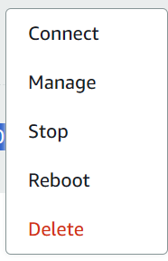

# Log Amazon AWS Lightsail

## 2023_12_17 - 3 maanden free tier (within bounds) gestart

Ik registreer mezelf als user.  

Ik creeer een **lightsail** instantie.   
Daarbij krijg ik **Frankfurt, Zone A** gesuggereerd. Die houd ik.

Verder selecteer ik Linux.  
Ik kies voor **OS Only**.

Ik kies voor **Ubuntu 22.04 LTS - Jammy**  
Amazon Linux 2023 werd aanbevolen, maar ik wil makkelijk kunnen verkassen naar een andere provider.

Ik laat het bij het default SSH key pair.  

Ik kies voor het **5 dollar per maand** plan:
**1GB RAM, 2 cpus, 40GB SSD, 2TB transfer**
Dwz alles behalve de cpus het dubbele van het plan voor 3.5 dollar per maand plan.  

Naam van de Lightsail resources:  
Ubuntu-1

( ik kan ook 99 invullen: dan worden er 99 aangemaakt (?!) - cool, maar dan ook 99 x 5 dollar per maand), natuurlijk  

Okee, de instance is aangemaakt:  
Volgens mij is het gewoon een (docker?) container die Linux draait, met de volgende ipv4 en ipv6 adressen:  
x.xxx.xxx.xxx    
xxx:xxxx:xxxx:xxxx:xxxx:xxxx:xxx:xxx  
(NB: ik betaal niet voor een vaste IP, dus dat kan theoretisch gaan varieren **(toevoeging 10 maanden later: het is nog steeds hetzelfde ip adres)**)  

Ik kan het volgende kiezen:  


Verder kan ik ook via een knopje de prompt openen:  


Via "Manage" zie ik:  


Bij de eerste tab kan ik mijn default SSH key "for this region (**Frankfurt**)" downloaden.  

Verder kan ik via een knop een SSH verbinding via de browser maken, of een eigen SSH client kiezen.  

Verder lees ik: als ik een enkele public key op meerdere instances configureer, kan ik dezelfde private key van dat key-paar gebruiken om ermee te connecten.  

## Inloggen
Na inloggen bevind je je in de ~ directory, oftewel de folder:  
/home/ubuntu

Het inloggen gaat via de brower of via SSH.
Laatstgenoemde kan via PuTTY, de command line of VSCode.
Ik probeer ze allemaal even.
### Via de browser
Dat kan direct via de Amazon Lightsail console login pagina.
Dat werkt niet super: grote letters, hij logt na enkele minuten weer uit.

### Via PuTTY
Als third party ssh clients wordt gesuggereerd: **PuTTY**, om met Linux instances te connecten via SSH. Dat installeer ik via de microsoft store.  

Okee, ik start **PuTTYgen**, en volg:  
[Lightsail | Global (amazon.com)](https://lightsail.aws.amazon.com/ls/docs/en_us/articles/lightsail-how-to-set-up-putty-to-connect-using-ssh)  

Dus Load de private key en klik **save private key**.  

Dan **Putty** starten.  
Voer het ip adres van de instance in.  
Ontvouw **Connection->SSH->Auth->Credentials**  
Kies daar de .ppk die met PuttyGen gegeneerd is.  
(D:\XXXX\LightSail_keys)  

Ik log in met de **default user name**s.  
Voor ubuntu instances is dat:  
**ubuntu**

Ik heb als wachtwoord ingesteld:  
**xxxxxx**

### Via de command line
```bash
ssh -i "D:\GoogleDrive\xxx\LightsailDefaultKey-eu-central-1.pem" ubuntu@x.xxx.xxx.xxxx
```

.. dat werkte niet, omdat het een private key die onbeschermd is, is. Je kunt de bestandsrechten aanpassen zodat alleen jij er toegang toe hebt:

Oplossing: kopieer het in een niet-gedeelde map op een lokale schijf (niet op onedrive of google drive dus)
Vervolgens eigen rechten toekennen en de overige verwijderen.

Zo zie je de huidige rechten:
administrator cmd prompt->

```bash
icacls "D:\Tmp\LightsailDefaultKey-eu-central-1.pem"
```

Zo voeg je die van jezelf toe:

```bash
icacls "D:\Tmp\LightsailDefaultKey-eu-central-1.pem" /inheritance:r /grant:r "%username%:F"
```

Zo haal je de overige weg:

```bash
icacls "D:\Tmp\LightsailDefaultKey-eu-central-1.pem" /remove "NT AUTHORITY\Authenticated Users"
.. etc..
```

Nu werkt het wel:

```bash
ssh -i "D:\Tmp\LightsailDefaultKey-eu-central-1.pem" ubuntu@x.xxx.xxx.xxx
```
### Via VSCode
Als het via de command line werkt, dan werkt het ook via VSCode.
Als je de Remote SSH extension geinstalleerd hebt, dan kun je als je VSCode opstart kiezen voor "Remote-SSH: Connect to Host..." -> Add new Host. Dan de gegevens van de bovenstaande ssh regel toevoegen aan een .ssh/config file:

```bash
Host lightsail
  HostName x.xxx.xxx.xxx
  User ubuntu
  IdentityFile D:/Tmp/LightsailDefaultKey-eu-central-1.pem
  ServerAliveInterval 60
  ServerAliveCountMax 120
```
De onderste twee regels zorgen ervoor dat de verbinding niet verbroken wordt: elke 60 seconden laat VSCode van zich horen. En dat maximaal 120 keer (dus 2 uur in totaal), voordat de verbinding verbroken wordt.

Als je na het toevoegen weer kiest voor "Remote-SSH: Connect to Host..." zie je als het goed is een host genaamd lightsail in het rijtje staan. Klik erop om te verbinden.

hmmm.... nu kan ik niet meer verbinden... het lijkt wel of mijn instance gebroken is.. 
...  vermoedelijk ben ik te veel actief geweest: in de metrics zie ik dat de lightsail server 20 minuten in 40% burst mode heeft gewerkt.
.. eens rebooten en wachten tot de metrics weer in "sustainable gebied" zitten ..
Ow .. nu is het ip-adres veranderd..
.. naar xx.xxx.xxx.xxx
Zucht..
.. Eindconclusie: De goedkope LightSail instance heeft te weinig cpu budget om de server-side component van VSCode te draaien terwijl je er via VSCode ingelogd bent. De beste optie voor LightSail blijft dus inloggen via ssh op de commandline.

## Docker installeren

Bon, nu ga ik **docker engine** installeren volgens:  
[Install Docker Engine on Ubuntu | Docker Docs](https://docs.docker.com/engine/install/ubuntu/)

Ik kies voor installatie mbv de apt repository.  
(NB: copy pasten uit onderstaande naar putty terminal werkt alleen als je het eerst naar een notepad kopieert)

```
# Add Docker's official GPG key:
sudo apt-get update
sudo apt-get install ca-certificates curl gnupg
sudo install -m 0755 -d /etc/apt/keyrings
curl -fsSL https://download.docker.com/linux/ubuntu/gpg | sudo gpg --dearmor -o /etc/apt/keyrings/docker.gpg
sudo chmod a+r /etc/apt/keyrings/docker.gpg

# Add the repository to Apt sources:
echo \
  "deb [arch=$(dpkg --print-architecture) signed-by=/etc/apt/keyrings/docker.gpg] https://download.docker.com/linux/ubuntu \
  $(. /etc/os-release && echo "$VERSION_CODENAME") stable" | \
  sudo tee /etc/apt/sources.list.d/docker.list > /dev/null
sudo apt-get update

# Install the docker packages:
sudo apt-get install docker-ce docker-ce-cli containerd.io docker-buildx-plugin docker-compose-plugin

# Verify that the Docker Engine installation is successful by running the hello-world image:
sudo docker run hello-world
```

De hello-world container draaide goed.

Nu blijkt dat git al geinstalleerd is.  
Dat gebruik ik om mijn docker containers over te halen.

Tijdelijke (3mnd geldige) git-token (als password te gebruiken):  
(naam xxx) (met alles aangevinkt)  
**Belangrijk: kopieer de code vanuit raw doc (CTRL+E) - anders werkt hij niet?!**

```
xxx_xxxxxxxxxxxxxxxxxxxxxxxxxxxxxxxxxxxxxx
```

Het blijkt dat docker-compose nog geinstalleer moet worden.  
(Achteraf gezien: ben ik waarschijnlijk hierboven vergeten)  
Ik kies voor:  

```bash
sudo apt  install docker-compose
```

[Automatic snapshots | Lightsail | Global (amazon.com)](https://lightsail.aws.amazon.com/ls/webapp/eu-central-1/instances/Ubuntu-1/networking)

In amazon lightsail, als ik Manage->Networking kies, kan ik firewall regels toevoegen.

Voor het gemak zet ik "ALL TCP", alle poorten open.

Op die Networking pagina zie ik overigens zowel de public ipv4 als de private ipv4.
