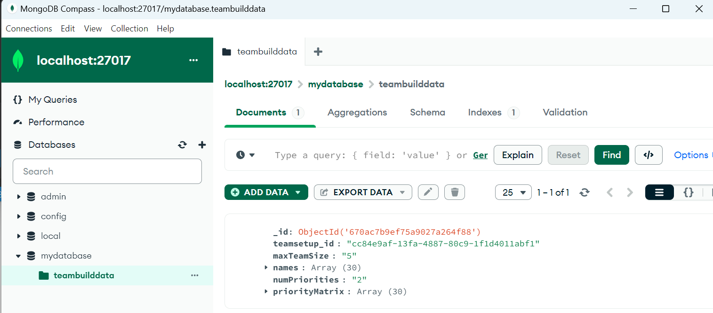

# Log opzetten van server en de voorbeeld Webapplicatie

## Waarom een server opzetten?

We willen ieder **individueel** een development server opzetten, zodat alle teamleden individueel aan de web-applicatie voor het team-project kunnen werken, en hun lokale versie kunnen debuggen, zonder dat de andere teamleden daardoor gehinderd worden.

## Waarom Ubuntu?

Ubuntu is een van de, of misschien wel de **meest gangbare** Linux variant van het moment. Daardoor is vrijwel alles wat je kunt bedenken ondersteund (bijvoorbeeld ook de gebruiksvriendelijke MongoDatabase, waar ik geen support voor vond op Debian).

## Waarom Ubuntu_22.04_LTS?

Om **incompatibiliteitsproblemen** met je teamleden te **voorkomen**, is het een goed idee dezelfde Linux distributie te gebruiken. De specifiek gebruikte docker images zijn immers vaak gelinkt aan specifieke linux distributies. De **voorbeeld webapplicatie** die je dit semester krijgt, is gebaseerd op Ubuntu_22.04_LTS. Door dezelfde distributie te gebruiken ben je ervan verzekerd dat je een goed werkend voorbeeld hebt.

## Ontwikkel server vs Productie server

Je wilt je webapplicatie normaal gesproken op **meerdere servers** tegelijk kunnen draaien. Zoals je gewend bent, kun je je software op verschillende machines **synchroniseren** door het gebruikt van **github**. Zo kun je op ontwikkel-servers testen en pushen, en op momenten dat je een productie wilt releasen op een productie-server pullen.

## WSL, Raspberry PI, cloud server

### WSL

Als je **windows11** hebt, is het handig om een Ubuntu_22.04_LTS instantie in WSL te maken die dient als **ontwikkelserver**. **WSL** staat voor **W**indows **S**ubsystem for **L**inux. Het laat je toe om binnen windows zoveel Linux (server-) instanties aan te maken als je maar wilt. 

In [log_WSL_instantie_van_Ubuntu_22_04_LTS_opzetten.md](./log_WSL_instantie_van_Ubuntu_22_04_LTS_opzetten.md) wordt beschreven hoe je de die installatie van Ubuntu_22.04_LTS in WSL kunt doen.

### Raspberry PI

Het mooie van **Ubuntu_22.04_LTS** is dat het (tegenwoordig) ook op RPI4 en RPI5 ondersteund is. Direct vanuit de **Raspberry PI installer** kun je kiezen voor die distributie (de **command line versie** volstaat - je hebt geen desktop nodig). Let er (net als bij Semester 2) op dat je via **ssh** kunt inloggen op die server. Eenmaal ingelogd op (de command line) kun je voor zover ik me herinner 1-op-1 de ervaringen volgen van [log_WSL_instantie_van_Ubuntu_22_04_LTS_opzetten.md](./log_WSL_instantie_van_Ubuntu_22_04_LTS_opzetten.md#docker-installeren) vanaf het kopje **Docker installeren**.

De centrale server (de **productie-server**) van je project-team zul je mogelijk op een Raspberry PI(4) maken.  Harm heeft geloof ik wat RPI4's liggen, maar ook wat intel-based machines waar het op geinstalleerd kan worden - dus vraag als team eerst even na welke server het wordt.

**Als je geen windows machine met windows 11 hebt** en wel een RPI4 of RPI5, is het een goed idee om zo je **persoonlijke** Ubuntu_22.04_LTS **ontwikkelserver** aan te maken.

### Cloud server

Met hetzelfde gemak zou je een AWS server kunnen aanmaken met dezelfde Linux distributie. Eentje van het type **Amazon Lightsail** is het eenvoudigst en goedkoopst (na de eerste gratis maand 8 euro per maand oid).[]() Daar kun je ook via ssh op inloggen. Dat werkt verder hetzelfde als met een Raspberry PI (alleen het ip nummer is een publiek bereikbare van amazon). Misschien een leuke oefening, maar verder **niet nodig dit semester**: onze klanten willen toevallig allemaal dat lokale servers worden gebruikt - geen cloud - om risico's op security issues te beperken. PS: mocht je de exercitie willen doen (Amazon vraagt daarvoor je creditcard gegevens), **pas dan goed op** (net als bij andere Cloud services van Google of Azure) dat je geen verkeerde knop drukt / abonnement afsluit. Zo'n foutje kan belachelijk veel per maand gaan kosten.  

Enfin, mocht je er mee willen experimenteren - in [log_Amazon_AWS_Lightsail.md](./log_Amazon_AWS_Lightsail.md) kun je mijn ervaring daarmee teruglezen.

## Server verder inrichten

**Zodra je een kale Ubuntu_22-04_LTS instantie op een van de 3 bovenstaande manieren hebt aangemaakt**, en er in bent ingelogd (via ssh, of indien via wsl: vanuit een powershell **met** administrator rights en een wsl-prompt), kun je **vervolgen** met installatie van wat verdere benodigdheden (zie **onderstaand**).

### Nameservers instellen

Zonder instellen van de nameservers van google kan het zijn dat updates e.d. traag of niet werken.

Controleer dus eerst of de **google nameservers** (8.8.8.8 en 8.8.4.4) insteld zijn:

- cat /etc/resolv.conf

Zo niet, dan zou je ze kunnen toevoegen met sudo nano, maar dat wil je niet elke keer nadat je inlogt opnieuw doen.

- Beter is dat eenmalig te regelen:
  
  ```bash
  sudo cp /etc/resolv.conf /etc/resolv.conf.backup
  sudo rm /etc/resolv.conf
  sudo nano /etc/resolv.conf
  dan toevoegen:
  nameserver 8.8.8.8
  nameserver 8.8.4.4
  sudo chattr +i /etc/resolv.conf
  ```
  
  Waarom zo:
- Met de rm wordt een symbolic link met die naam verwijderd.
- Met sudo nano wordt in die plaats een echte file met die naam aangemaakt.
- Met de laatste regel wordt het bestand onwijzigbaar (**i**mmutable) gemaakt (met zelfde commando, maar dan met -i is dat weer ongedaan te maken).

### update en upgrade

- sudo apt update  
- sudo apt upgrade

### git

Op AWS Lightsail bleek git al geinstalleerd. In de WSL en op de Raspberry PI doen we het zelf even:

- sudo apt install git

### python

- sudo apt install python3 python3-pip

Ik kies ervoor om "pakketten bij elkaar horende docker containers" in subdirectories van een folder genaamd "docker" in mijn home/username directory te zetten. Die bij elkaar horende containers kunnen dan vanuit de desbetreffende subfolders in een keer gestart of gestopt worden via een "docker-compose" commando.

### Docker subfolders

Om te beginnen voeg ik zo'n subfolder toe met de VoorbeeldWebApp_Gomoku van dit semester:     

- git clone https://github.com/HU-TI-DEV/VoorbeeldWebApp_Gomoku

Het is handig om die als referentie te bewaren.     
Verder is het handig als je **als team één enkele** (lege) repo aanmaakt, bijvoorbeeld "Rollatornavigatie", en die ook **cloned** in de docker folder. Je docker folder heeft dan dus twee subfolders: VoorbeeldWebApp_Gomoku en RollatorNavigatie.

De folder home/username/docker/VoorbeeldWebApp_Gomoku_ bevat dan een referentie-webapplicatie inclusief documentatie, iets gedocumenteerds en werkends waar je altijd naar kunt terugkijken.  
Lees [de documentatie in de bijbhorende readme](https://github.com/HU-TI-DEV/VoorbeeldWebApp_Gomoku/bl.ob/main/README.md)

In de folder home/username/docker/RollatorNavigatie kopieer je dan initieel de inhoud van VoorbeeldWebApps (behalve de folder .git)(bijvoorbeeld dmv copy-paste in de windows verkenner), en pusht die zodat het hele team het kan clonen.

De WebApplicatie in home/username/docker/RollatorNavigatie kun je dan met je team gaan **aanpassen / uitbreiden** zodat het het gewenste gedrag krijgt voor het project. Ten alle tijden zorg je ervoor dat je alleen iets pusht dat werkt, zodat je teamleden altijd een werkende versie kunnen pullen.

### Testen of het werkt

cd naar de folder VoorbeeldWebApp_Gomoku.  
als je daar ls intypt, zie je een docker-compose.yml file.
Die beschrijft welke containers er gestart moeten worden en hoe ze met elkaar verbonden zijn.
Start die containers met:

- docker-compose up --build -d   
  .. of zonder --build als je niet opnieuw wilt builden.  
  (de meest cleane build is met --no-cache, maar dat duurt veel langer)

Je kunt de status van de containers zien met:  

- docker ps

Je kunt de log van een container zien met:

- docker logs [container id]

Je kunt de containers stoppen met:  

- docker-compose down

Net zoals dat je soms bij embedded software middels een fullclean met een frisse lei begint, kun je dat ook doen met docker containers:

- docker-compose down
- docker-compose build --no-cache
- docker-compose up -d

Optioneel kun je eerst ook nog alle images verwijderen (die moeten dan allemaal opnieuw gedownload worden):

- docker-compose down --rmi all

Wacht even tot alle containers opgestart zijn.  
Als je **WSL** gebruikt, draait het op dezelfde machine als je windows desktop en kun je in je browser naar **localhost:5001/** gaan om te zien of de webapplicaties werken.

Als je remote bent ingelogd op een Rasberry PI of Amazon server, vervang je **localhost** door het ip nummer van die machine.

## Iets meer over docker containers

Docker containers zijn een soort **virtuele machines** die je kunt starten en stoppen (je kunt er ook weer in inloggen, middels ``docker exec -it <container_name> /bin/bash
``). Ze zijn echter veel **lichter** dan een virtuele machine, omdat ze geen eigen besturingssysteem hebben. Ze delen het besturingssysteem van de host machine. Daardoor kun je er veel meer van draaien dan virtuele machines. Ze zijn ook veel sneller op te starten en te stoppen dan virtuele machines.

Een docker container is een soort **image**. Een image is een soort **snapshot** van een besturingssysteem met daarop geinstalleerde software. Je kunt een image **starten** en **stoppen**. Als je een image start, krijg je een container. Een container is een **instantie** van een image. Je kunt meerdere containers van een image starten. Elke container heeft zijn eigen **file system** en **netwerk**. Containers kunnen met elkaar communiceren via het netwerk.

Een **docker-compose.yml** file beschrijft welke containers er gestart moeten worden en hoe ze met elkaar verbonden zijn. Je kunt met een **docker-compose** commando alle containers in een keer starten of stoppen. Je kunt ook (een deel van-) de beschrijvingen van die docker-containers zetten in een **Dockerfile**. Vanuit de docker-compose.yml file kun je dan verwijzen naar die Dockerfile. 

### Zelf een docker image maken

Het is in principe mogelijk om zelf een docker image te maken. Je installeert dan bijvoorbeeld vanaf een kale ubuntu image de software die je nodig hebt, en maakt daar een nieuwe image van. Je kunt dan die image op een andere machine starten, en je hebt dan dezelfde software als op de machine waar je de image van hebt gemaakt.

In het algemeen is het handiger om **bestaande images** te gebruiken. Er zijn heel veel images beschikbaar, bijvoorbeeld van ubuntu, python, nodejs, mongo, mysql, etc. Je kunt die images gebruiken om je software in te draaien.

Het enige wat je zelf hoeft te doen is een **docker-compose.yml** file te maken die beschrijft welke images je wilt starten en hoe ze met elkaar verbonden zijn, en specificeren welke folders je wilt **mounten** in de containers.

### mounten van volumes

Je kunt een folder van de host machine **mounten** in een container. Dat betekent dat binnen de container de files in de folder van de host machine beschikbaar zijn. Laatstgenoemde folder wordt dan een **volume** genoemd.
Je zet daar de **persistente data** in die je wilt bewaren als de container gestopt is. Bijvoorbeeld een **database** of de **code van een webapplicatie**.

## Werken via VSCode

Je server is in het algemeen dus een andere (virtuele-) machine, waar je "remote" inlogt. Het programmeren en debuggen met sudo nano is niet erg handig. Je kunt gelukkig ook je **VSCode** editor zo instellen dat je **remote** inlogt op die machine. Dat is handig, omdat je dan in je editor kunt werken, en je terminal en filebrowser ook in die machine draaien. Je kunt dan ook de **git** commando's in je editor gebruiken, en je kunt je code direct op de server debuggen.

### VSCode via SSH op Raspberry PI of andere PC

Dit is bijvoorbeeld handig als je op een **Raspberry PI** werkt. Je kunt dan in je editor werken alsof je lokaal op die machine werkt.  

Installeer in VSCode de Remote-SSH extension.

Na installatie zie ik bij die extension de volgende instructies:

1. Press `F1` and run the **Remote-SSH: Open SSH Host...** command.
2. Enter your user and host/IP in the following format in the input box that appears and press enter: `user@host-or-ip` or `user@domain@host-or-ip`
3. If prompted, enter your password (but we suggest setting up [key based authentication](https://aka.ms/vscode-remote/ssh/key-based-auth "https://aka.ms/vscode-remote/ssh/key-based-auth")).
4. After you are connected, use **File > Open Folder** to open a folder on the host.

Aanvankelijk waren er permission problemen.

Die waren opgelost na het aanpassen van de eigenaar van docker-compose.yml naar mezelf, de user marius:   

- sudo chown marius:marius docker-compose.yml

#### Probleempje met RPI4: kan niet meer ssh inloggen na een herstart

Na koppelen van een monitor bleek de oorzaak:   
Het was toch een kwestie van wachten tot het opstarten van de rpi4 voltooid is. Dat kan toch **enige minuten** duren.

## VSCode via SSH op Lightsail

Helaas werkt het niet met Amazon Lightsail. Het probleem is dat VSCode een server-side applicatie installeert, die wel wat cpu van je systeem vraagt. Amazon Lightsail is een goedkope server, en biedt daarvoor niet genoeg cpu budget. Het blijft wel mogelijk om via **ssh** in te loggen op de server, en dan in de terminal van je eigen machine te werken. Dat is echter niet zo handig als werken in je editor. Vandaar dat ontwikkelen op WSL of een lokale Raspberry PI de voorkeur heeft.

### VSCode via WSL

Als je op een **Windows 11** machine werkt, kun je ook via **WSL** inloggen op je **Ubuntu_22.04_LTS** machine. Je kunt dan in je editor werken alsof je lokaal op die machine werkt.

Installeer in VSCode daartoe de **Remote-WSL** extension.
Helaas heb ik daar geen log van bijgehouden. Dus dat is iets om zelf uit te zoeken.   
Relevante dingen die ik mer herinner zijn:  

- Als je in de wsl terminal van je linux subsystem zit, bijvoorbeeld in /home/marius, kun je daar **``code .``** intypen om de huidige folder in VSCode te openen in windows 11.
- Als je VSCode daarentegen vanuit windows 11 opent, kun je bij **recente folders** de WSL-linux folders zien en openen.
- Het is daarvoor wel nodig om ervoor te zorgen dat in VSCode de **Remote-WSL extension** op "**enabled**" staat.

## MongoDB

MongoDB is een **NoSQL** database. Het is een **document database**. Dat betekent dat je data opslaat in **documenten**. Een document is een soort **JSON** object. Je kunt dus op een overzichtelijke manier **nested** data opslaan. 

### MongoDB Compass

MongoDB Compass is een handige desktop applicatie waarmee je je MongoDB database kunt inspecteren. Bijvoorbeeld als je in teambidder een setup het gedaan, kun je met MongoDB Compass bekijken hoe de data als json file is opgeslagen:  



Om verbinding te maken met je database, kies je dan eerst:

- New Connection
- Advanced Connection Options
- Username/Password
- Username: mongodb  (zie docker-compose.yml)
- Password: mijn_geheime_mongodb_wachtwoord  (zie docker-compose.yml)
- Save & Connect
