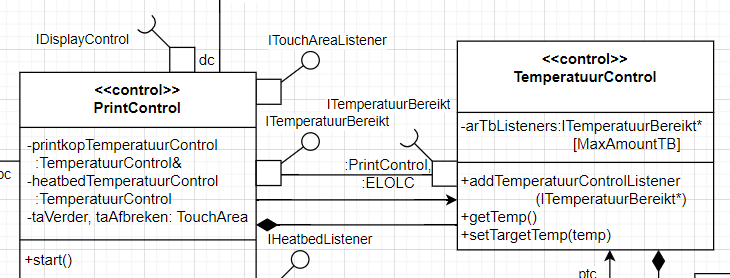

## Inleverformat

Het vereiste inleverformat van deze opdracht (evenals de overige) is hier te vinden:  
[Inleverformat voor Opdrachten, Draw.io](https://canvas.hu.nl/courses/44808/pages/inleverformat-voor-opdrachten-draw-dot-io?wrap=1)

## Uitgangspunt: Taaksamenvoeging
Ga voor deze opdracht uit van de **Taaksamenvoegingstabel** die je hebt gekregen als onderdeel van de uitwerkingen van de opdracht ts-3dprinter.

## Uitgangspunt: Object Model

Ga daarnaast uit van het object model **3dPrinter_Totaal-TS OM.png**, welke je hebt gekregen als onderdeel van de uitwerkingen van de opdracht om-3dprinter.

### A) Berichten vervallen

- Door de taaksamenvoegingen zijn een aantal berichten vervallen. Welke zijn dat en waarom?

Het object model is al deels omgezet naar een klassediagram: [cd_Totaal_opdr.drawio](./cd_Totaal_opdr.drawio)

### B) ``<<isActive>>``

- Vul op basis van voorgaande taaksamenvoeging het stereotype `<<isActive>>` toe op de juiste plaatsen in het klassediagram.

### C) Doorschuiven en relaties kiezen

- Bepaal de publieke operaties van de klassen **ModelDataBeheer** en **SDKaart** door de commando's langs de pijlen in het object model door te schuiven naar het einde van de pijlen, en vul ze in.
- Beargumenteer wat de meest geschikte relatie is tussen **ModelDataBeheer** en **SDKaart** en voeg die toe.

### Intermezzo over standard ports

#### Interfaces op de **uiteinden**

- Standard ports zijn eigenlijk een soort van zend en ontvangst-antennes: De zend-antennetjes hebben "holletjes", en de ontvangstantennes "bolletjes" (precies omgekeerd van wat je zou verwachten als je denkt aan man en vrouw).
- Het protocol van de informatie (de API) die wordt verzonden voldoet aan een zekere interface. De naam van die interface wordt genoteerd aan de uiteinden van de antennes.

Verder kun je nog iets **naast** de antennes noteren:

#### Naast de **Zend**antennes

- Een **lowercase** naam naast een **zend**-antenne staat voor een **reference variabele** (of verkorte alias ervan) die de betreffende klasse heeft met als type de interface van de antenne. Dus een niet-anonieme listener. Het maakt het **expliciet opnoemen** van een reference pijl of reference variabele in de zendende klasse **overbodig**.

  Bijvoorbeeld: je ziet in het klassediagram dat **HoofdMenuControl** een zend-antenne heeft van type `IDisplayControl` met daarnaast de naam `dc`. Dat impliceert dat **HoofdMenuControl** een reference variabele van het type `IDisplayControl` met de naam `displayControl` heeft (waarbij `dc` als alias voor `displayControl` wordt gebruikt).

- Een **dubbele punt**, gevolgd door alleen een **uppercase** naam naast een **zend**-antenne kan gebruikt worden om aan te geven naar welke klasse(n) (of verkorte alias ervan) de zendantenne zendt. Dit is een **optionele verduidelijking**.

  Kijk bijvoorbeeld hoe dit is toegepast bij de `ITemperatuurbereikt` zendantenne van **TemperatuurControl**. Daar zie je naast staan: `: PrintControl, : ELOLC`. `ELOLC` is een alias voor **ExtruderLadenOfLegenControl**. Je ziet dus snel en duidelijk aan die antenne van **TemperatuurControl** waar je zijn ontvangers kunt vinden.

- Een **combinatie** van bovenstaande kan in principe ook, maar **voegt meestal niet veel toe**: bij de zend-antenne van type `IDisplayControl` van **HoofdMenuControl** hadden we ook `dc:DisplayControl` kunnen zetten. Maar aan de alias `dc` (welke staat voor de variabelenaam `displayControl`) kunnen we eigenlijk ook al afleiden dat het wel een object van de klasse **DisplayControl** zal zijn.

#### Naast de **Ontvangst**antennes

- Een **lowercase** naam naast een ontvangst-antenne staat voor een (alias van een) reference variabele die wijst naar het object waarvan ontvangen wordt. In tegenstelling tot bij de zend-antenne vervangt dat **niet** de aanwezigheid van een reference variabele in de memberlijst van de klasse of een reference pijl. Het is dus slechts een **optionele verduidelijking**. Bijvoorbeeld `ptc` naast de ontvangstantenne van `ITemperatuurBereikt` geeft aan dat er wordt geluisterd naar de reference member `ptc`. Die reference member zelf wordt nog apart met een reference pijl aangeduid.

  (Reden: overzicht houden over de flow van informatie; informatie (aanroepen) volgen altijd de richting van de pijlen en/of antennes).

- Een **dubbele punt**, gevolgd door alleen een **uppercase** naam naast een **ontvangst**-antenne kan gebruikt worden om aan te geven van welke klasse(n) (of verkorte alias ervan) de ontvangstantenne ontvangt. Dit is een **optionele verduidelijking**, die doorgaans overbodig is.

  Een voorbeeld is te zien bij de ontvangstantenne van type `ITouchAreaListener` van **HoofdMenuControl**. Daar zie je `:TouchArea` staan, hetgeen laat zien dat er berichten vanuit de klasse **TouchArea** verwacht worden. Maar uit de naam `ITouchAreaListener` blijkt eigenlijk ook al dat je berichten uit de klasse **TouchArea** kunt verwachten.

- Een **combinatie** van bovenstaande kan in principe ook, maar **voegt meestal niet veel toe**.

### C) Meer doorschuiven, relaties kiezen en standard ports

- Bepaal de publieke operaties van de klassen **ExtruderLadenOfLegenControl** en **ExtruderControl** door de commando's langs de pijlen in het object model door te schuiven naar het einde van de pijlen, en vul ze in. Groepeer ze per interface (die groepen zijn er al; vul bij elkaar horende commando's in dezelfde groep in).
- Wat is het voordeel van groeperen per interface?
- Voeg de betreffende interfacenamen toe aan de uiteinden van de standard ports van **ExtruderLadenOfLegenControl**.
- Je ziet `ptc` en `hhc` als namen naast de standard ports staan. Maakt dat de reference pijlen met `ptc` en `hhc` niet overbodig?
- Vervang de relaties naar **ExtruderControl** door het juiste type.

### C) Listener pattern voor TouchDetector

**TouchArea** bedient zijn listeners, zoals **PrintControl**.  
**TouchArea** luistert op zijn beurt naar de **TouchDetector**.

- Vul de member variabelen en functies in de **TouchDetector** klasse in.
- Vul verder de extra klasse in die je nodig hebt voor het Listener pattern van **TouchDetector**.
- Link die extra klasse door middel van de juiste relaties met de juiste andere klassen.

### D) Standard ports toevoegen

De **StappenMotor** geeft via een listener pattern via de interface `IStappenMotorListener` het bericht `stappenKlaar(StappenMotor&)` door aan enkele andere klassen.

- Maak de bijbehorende relaties en overervingen duidelijk in het klassediagram door **StappenMotor** en die andere klassen op de juiste manier te voorzien van **standard ports**.
- **TemperatuurControl** praat via zijn `ITemperatuurbereikt` interface met verschillende andere klassen. Welke klassen zijn dat?

### E) Multiplicities

- Voor de **StappenMotor** composite-members van **PrintKopXYControl** is nog niet de juiste multiplicity aangegeven. Voeg die toe aan het uiteinde van de betreffende composite relatie.

### F) Named relations

In het klassediagram zie je veel named relations. Bijvoorbeeld de naam `msc` langs de composite relatie van **HoofdMenuControl** naar **ModelSelectControl**, om aan te geven dat **HoofdMenuControl** een member variabele van type **ModelSelectControl** heeft met de naam `msc`.  
En de naam `mdbh` naast de reference-relatie van **ModelSelectControl** naar **ModelDataBeheer**. Dat om aan te geven dat **ModelSelectControl** een reference variabele heeft van het type **ModelDataBeheer** met de naam `mdbh`.

- Wat is het voordeel van het gebruik van named relations (t.o.v. het alternatief: members in de klasse zelf tonen)?
- Wat is het nadeel?
- Waarom zijn de namen zo kort?
- Verplaats uit **PrintKopXYControl** de variabelen `stappenmotorX` en `stappenmotorY`, en gebruik in plaats daarvan named relations met respectievelijk de aliases `stmX` en `stmY`.
- Waarom is de multiplicity duiding voor die relatie in dit geval niet meer nodig? (Fix dat meteen even.)

### G) Overbodige lijnen?

In bovenstaande stukje zie je drie lijnen oversteken (dat blijft zo nadat je de variabelenamen naar de reference en compositie relaties hebt verplaatst).  
De bovenste lijn zou weggelaten kunnen worden, maar het zend-ontvangpaar staat impliciet nog steeds voor een lijn. Dus drie lijnen.

- Beargumenteer welke lijnen legaal zouden kunnen worden weggelaten en hoe.
- Beargumenteer waarom dat tot een nodeloos onduidelijk diagram zou leiden.

---

Let daarbij op deze [Criteria voor het Klassediagram](../../../../../leerdoelen/portfolio-items/klassendiagram.md)

## Canvas Opdracht
Lever de markdown met het resultaat van deze opdracht in op Canvas bij de opdracht "3D Printer Serie".