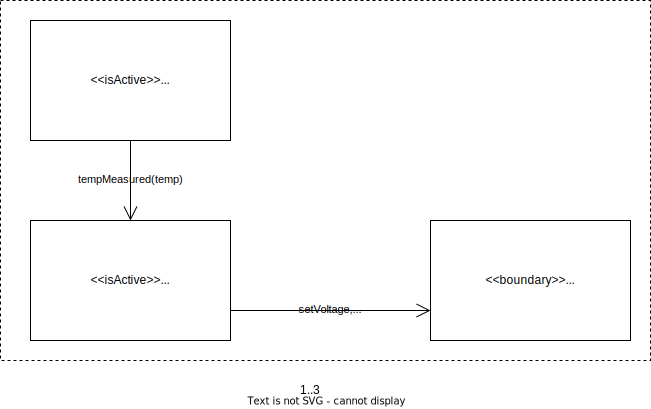

# Oefenopdracht Klassediagram Computer Fans

Beschouw het onderstaande object model voor de besturing van de ventilators van een pc:

## Klassediagram + Observer Pattern + Handler Pattern

Werk nu een **Klassediagram** uit op basis van dit Object Model. Gebruik de methode zoals voorgedaan in [Design like a Robot!](../../../../onderwijsmateriaal/readers/Design%20Like%20a%20Robot!.pdf). Maak daarbij de TempMeasurer klasse herbruikbaar door toepassing van het Observer Pattern (/ Listener Pattern). Verlaag ook het aantal benodigde taken voor diezelfde klasse door ook het Handler Pattern toe te passen.

Let daarbij op deze [criteria](../../../../leerdoelen/portfolio-items/klassediagram.md).
