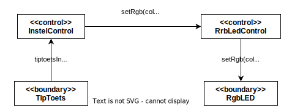

# Oefenopdracht Klassediagram Duivenschreck Instellen

Beschouw het onderstaande object model voor de use case "Instellen" van de duivenschreck:

## Klassediagram + Observer Pattern

Werk nu een **Klassediagram** uit op basis van dit Object Model. Gebruik de methode zoals voorgedaan in [Design like a Robot!](../../../../onderwijsmateriaal/readers/Design%20Like%20a%20Robot!.pdf). Maak daarbij de TipToets klasse herbruikbaar door toepassing van het Observer Pattern (/ Listener Pattern).

Let daarbij op deze [criteria](../../../../leerdoelen/portfolio-items/klassediagram.md).
