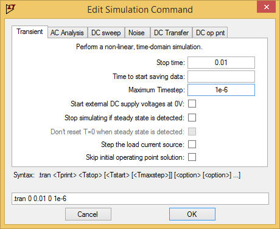

# LtSpice Oefenopdracht

- Installeer LtSpice
- Maak een spanningsdeler met weerstand (1k) en condensator (1uF).
- Stel de ingangsspanningsbron in op 2.5DC en 1V AC.
- Simuleer AC en DC. Verklaar wat je ziet.
- Upload link en commit-link naar de bijbehorende Canvas Oefenopdracht.

## In plaatjes:

