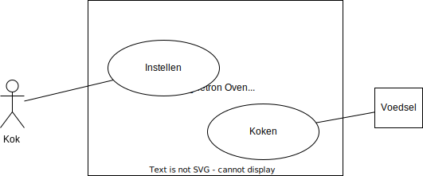

# Oefenopdracht Object Model + Object beschrijvingen Magnetronoven

We willen een Magnetronoven ontwerpen op basis van het volgende usecase diagram:

In onderstaande tabellen staan de usecases toegelicht:

## Usecases

| Naam         | Usecase Instellen                                                                                                                                                                                                                                                                                                                                                                                                       |
| ------------ | ----------------------------------------------------------------------------------------------------------------------------------------------------------------------------------------------------------------------------------------------------------------------------------------------------------------------------------------------------------------------------------------------------------------------- |
| Beschrijving | * Wacht tot de deur gesloten is.  * Wacht tot de kop "instellen" is ingedrukt * De display laat zien: "kies een tijd". * Via Tiptoetsen wordt een tijd ingevoerd, afgesloten met de knop "instellen". * De display laat zien: "kies een vermogen" * Via Tiptoetsen wordt een vermogen tussen de 0 en 2000 wattt ingetypt, afgesloten met de knop "instellen". * De usecase koken wordt gestart. |
| Preconditie  | De usecase koken is niet actief.                                                                                                                                                                                                                                                                                                                                                                                        |
| Postconditie | De usecase koken is actief.                                                                                                                                                                                                                                                                                                                                                                                             |
| Uitzondering | Als de deur wordt geopend, weer terug naar het begin.                                                                                                                                                                                                                                                                                                                                                                   |

| Naam         | Usecase Koken                                                                                                                                                                                                                       |
| ------------ | ----------------------------------------------------------------------------------------------------------------------------------------------------------------------------------------------------------------------------------- |
| Beschrijving | * Start de ingestelde countdowntijd. * Stel de magnetronstraler in op het ingestelde vermogen.  * De display laat de aftellende tijd zien. * Er klinkt een "ping" geluid * De magnetronstraler wordt uitgezet.  |
| Preconditie  | De deur is gesloten en de instelling is afgerond                                                                                                                                                                                    |
| Postconditie | Het product is opgewarmd.                                                                                                                                                                                                           |
| Uitzondering | Als de deur geopend wordt, wordt de magnetronstraler uitgezet, en stopt het aftellen. Zodra de deur weer gesloten is, wordt de magnetronstraler weer aangezet op het ingestelde vermogen en wordt het aftellen voortgezet.          |

## Object Model + Object beschrijvingen

Werk nu een **Objectmodel** met bijbehorende lijst van **Object beschrijvingen** uit op basis van die twee usecases. Gebruik de methode zoals voorgedaan in [Design like a Robot!](../../../../../onderwijsmateriaal/readers/Design%20Like%20a%20Robot!.pdf).

Let daarbij op deze [criteria](../../../../../leerdoelen/portfolio-items/object-model-met-lijst.md).