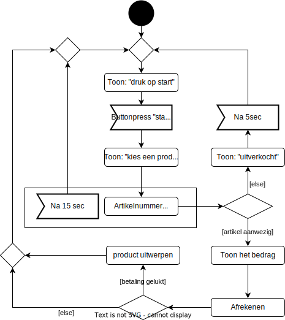

# Oefenopdracht Object Model + Object beschrijvingen Snoepautomaat

Beschouw het onderstaande activity diagram voor de use case "Snoep Verkopen" van het snoepautomaat:

## Object Model + Object beschrijvingen

Werk nu een **Objectmodel** met bijbehorende lijst van **Object beschrijvingen** uit op basis van dit activity diagram. Gebruik de methode zoals voorgedaan in [Design like a Robot!](../../../../onderwijsmateriaal/readers/Design%20Like%20a%20Robot!.pdf).

Let daarbij op deze [criteria](../../../../leerdoelen/portfolio-items/object-model-met-lijst.md).
