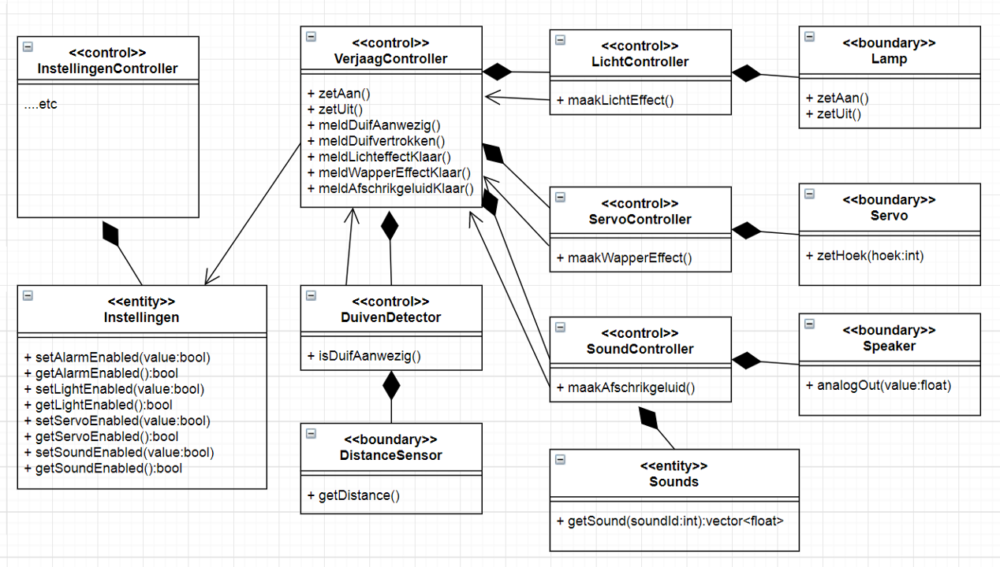
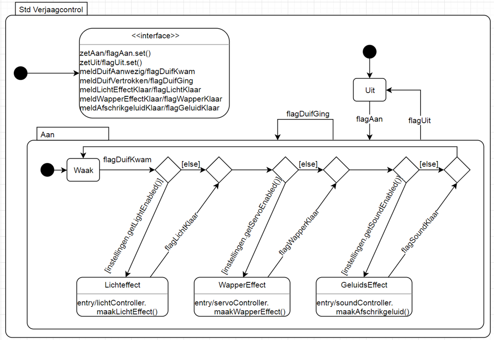

# Oefenopdracht STD naar Code - Duivenschreck VerjaagControl

Onderstaand is het klassediagram en STD van Duivenschreck VerjaagControl te vinden.

Zet nu deze std om in de code van klasse VerjaagControl, zoals in [Design like a Robot!](../../../../onderwijsmateriaal/readers/Design%20Like%20a%20Robot!.pdf) gedaan is met TrilControl.

(In Design Like a Robot wordt HuRTOS gebruikt. Voor deze opdracht mag je dat ook gebruiken. Maar met een paar kleine aanpassingen is het om te zetten in CleanRTOS. Dat is nuttig voor het ESP32 project en wordt dan ook van harte aanbevolen)

Let daarbij op deze [criteria](../../../../leerdoelen/portfolio-items/code.md).
