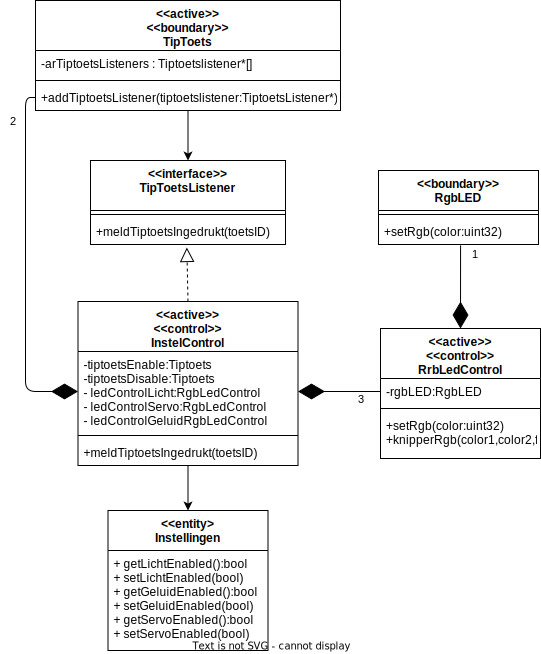

# Oefenopdracht State Transition Diagram Duivenschreck Instellen

Beschouw het onderstaande klasse diagram en de de use case "Instellen" van de duivenschreck:

| **Use case naam**   | *Instellen* |
|---------------------|-------------|
| **Doel**            | Instellen van het Duiven Schreck device |
| **Preconditie**      | De 3 rgb leds geven de actuele instelling weer voor licht, servo en geluid. |
| **Beschrijving**     | **0**. De 3 rgb leds geven de **actuele instelling** weer voor licht, servo en geluid.  **1**. Als op tip-toets **"enable"** wordt gedrukt, wordt het instellen **gestart**: de rgb-led voor **"licht"** gaat **geel knipperen**, en wordt gewacht op de volgende tip-toets aanslag.  **2**. Als op tip-toets **"enable"** wordt gedrukt, wordt de instelling **lichtEnabled** op **true** gezet, en wordt de rgb-led voor **"licht"** op **groen** gezet. Als daarentegen op **"disable"** wordt gedrukt, wordt de instelling **lichtEnabled** op **false** gezet, en de bijbehorende rgb-led op **rood**. Vervolgens gaat de volgende led (voor servo) geel knipperen.  **3**. De instelling voor de instellingen **servoEnabled** en **geluidEnabled** gaan op **soortgelijke manier**.  **4**. Na afloop van de keuze voor geluidEnabled: ga terug naar 0. |

## State Transition Diagram

Werk nu een **State Transition Diagram** voor de klasse InstelControl uit op basis van deze Klassediagram en usecase beschrijving. Gebruik de methode zoals voorgedaan in [Design like a Robot!](../../../../onderwijsmateriaal/readers/Design%20Like%20a%20Robot!.pdf). 

Let daarbij op deze [criteria](../../../../leerdoelen/portfolio-items/state-transition-diagram.md).
