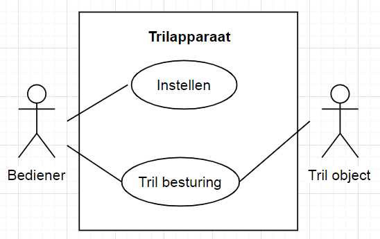

# Casus

### Inhoud
- [Casus](#casus)
    - [Inhoud](#inhoud)
- [De Casus: een Trilapparaat](#de-casus-een-trilapparaat)
  - [Toepassing:](#toepassing)
  - [Opbouw](#opbouw)
  - [Werking](#werking)
  - [Use Case Diagram](#use-case-diagram)
  - [Use Case Beschrijvingen](#use-case-beschrijvingen)
- [Vervolg: Todo - tekst die nog opgesplitst moet worden](#vervolg-todo---tekst-die-nog-opgesplitst-moet-worden)

# De Casus: een Trilapparaat
## Toepassing:
Het gaat om een all‐round ontwerp voor een trilapparaat. 
Het kan gebruikt worden 
- om een trilplaat te laten *bewegen*, 
- om zand te *scheiden* op korrelgrootte, 
- om zand van aardappels te *schudden*, 
en er zijn vast nog andere functies voor te bedenken.

## Opbouw
Het apparaat heeft :
- een tril‐toets,
- een plus‐toets, 
- een min‐toets, 
- een nood‐knop, 
- een display en 
- een electromagneet met daarbinnen een metalen pin met veer. 

## Werking
- De toetsen veren terug als je je vinger
terugtrekt.
- De noodknop moet je actief weer terug omhoog trekken. 
- Als de electromagneet aan staat, gaat de metalen pin naar het midden van de electromagneet.
- Als de electromagneet wordt uitgezet, trekt de veer de pin weer terug uit de electromagneet.

## Use Case Diagram

## Use Case Beschrijvingen
| Naam | Instellen |
| ----------- | ----------- |
| Beschrijving | De ingestelde trilfrequentie wordt op de display weergegeven. Met de plus en min knop kan dat getal aangepast worden. Het getal moet tussen de 1 en de 100 (Hz) blijven. Als na de laatste trilfrequentie‐aanpassing een minuut lang geen nieuwe trilfrequentie‐aanpassing volgde, wordt die laatste nieuwe trilfrequentie gelogd naar een remote database. Dat laatste kan enige seconden duren. |
| Uitzondering | Zodra de noodknop is ingeslagen kan de frequentie niet meer worden aangepast, en toont het display “Emergency Stop”. Zodra de noodknop weer is omhooggetrokken kan de bovenstaande use case weer hervat worden. |

| Naam | Trilbesturing |
| ----------- | ----------- |
| Preconditie | Als deze use case start, trilt het apparaat niet. |
| Beschrijving | Met het indrukken van de tril knop wordt het trillen in de actueel ingestelde trilfrequentie getoggeld. |
| Uitzondering | Zodra de noodknop is ingeslagen stopt het trillen, en wordt de trilknop genegeerd. Zodra de noodknop weer is omhooggetrokken kan deze use case weer hervat worden. |

# Vervolg: [Todo - tekst die nog opgesplitst moet worden](../design_robot/alle_tekst.md)