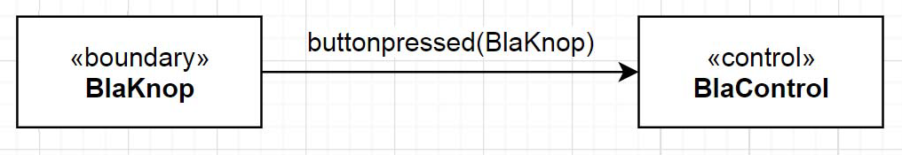

# Design Fase 1

### Inhoud
- [Design Fase 1](#design-fase-1)
    - [Inhoud](#inhoud)
- [Design Fase1:](#design-fase1)
  - [Object model met object beschrijvingen](#object-model-met-object-beschrijvingen)
  - [Wat is een Object model?](#wat-is-een-object-model)
  - [Wat is een object?](#wat-is-een-object)
  - [Welke stereotypen / categorieen objecten zijn er?](#welke-stereotypen--categorieen-objecten-zijn-er)
  - [Wat is een bericht?](#wat-is-een-bericht)
  - [Vervolg: Stappen Objectmodel maken](#vervolg-stappen-objectmodel-maken)

# Design Fase1:
## Object model met object beschrijvingen
De eerste fase bestaat uit het maken van een object model en parallel daaraan een lijst met object beschrijvingen.

## Wat is een Object model?
Voorbeeld van een Object Model
(PlantUML preview in mark down via Alt D)

@startuml
object BlaKnop
object "BlaControl" as bc
@enduml

Een object model is een weergave van objecten en de berichten die ze met elkaar uitwisselen.
- De objecten worden gerepresenteerd door rechthoeken met namen er in (BlaKnop en BlaControl).
- Boven de naam kan een “categorie”/stereotype  staan aangegeven (bijvoorbeeld <<boundary>>).
- De rechthoeken worden met pijlen met elkaar verbonden.
- De pijlen geven de richting van de berichten aan.
- Naast de pijlen staan de namen van de berichten.

## Wat is een object?
Een object is een stuk software met een bepaalde verantwoordelijkheid. Een softwarematig “ding”.

## Welke stereotypen / categorieen objecten zijn er?
Binnen CSM hoef je alleen te verifieren of een object van een van onderstaande stereotypen is:
- `<<boundary>>` Een boundary object is de grens van de software, en praat met de “buitenwereld”, dwz met de hardware. Voorbeelden zijn sensoren (knoppen, meetinstrumenten) ,actuatoren (motors, displays, speakers etc) en proxy objecten (remote
database proxy: een stuk software dat communiceert met een remote database).
- `<<control>>` Een control object coordineert een groep andere objecten. Het is een soort
“dirigent”.
- `<<entity>>` Een entity object encapsuleert data (in het algemeen via setters en getters of
read en write functies). Het is in het algemeen mooi om bij mekaar horende data te groeperen in een entity object. Vooral als die data als pakket zijn weg door het systeem vindt
(bijvoorbeeld samen wordt opgeslagen) of op een centrale plek moet staan die voor
meerdere objecten toegankelijk is.
- `Iets anders` Als een object niet in een van bovengenoemde categorien valt, hoef je er geen
stereotype voor in te vullen.

## Wat is een bericht?
Een bericht is iets wat het ene object tegen het andere object “zegt”. In het uiteindelijke
klassediagram wordt het bericht een functie. Een bericht kan een “payload” hebben. Die staat tussen
haakjes. In bovenstaand bijvoorbeeld, zegt het het object BlaKnop “buttonpressed(BlaKnop)“ tegen
BlaControl. Dus “er is een knop ingedrukt” en het ging om “BlaKnop”. Meerdere berichten kun je
langs dezelfde pijl weergeven door ze met comma te scheiden.

## Vervolg: [Stappen Objectmodel maken](../design_robot/stappen_objectmodel.md)