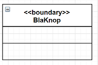

# Stappen Object model maken  <!-- omit in toc -->

### Inhoud  <!-- omit in toc -->

- [Zo maak je een object model](#zo-maak-je-een-object-model)
- [Praktische Tips](#praktische-tips)
- [Timers](#timers)
- [Vervolg](#vervolg)

## Zo maak je een object model

Het maken van een object model bestaat uit de volgende stappen:

1. Maak een controller object aan voor elke use case.

   a. Het aanmaken van een object gaat in 3 stappen:

        i. Voeg het toe aan het object model.
        ii. Geef het een eventueel geschikt stereotype (zie even verderop).
        iii. Voeg een beschrijving ervan toe aan de lijst met objecten.
        
2. Verwerk de use case beschrijvingen zin voor zin:

    a. Lees een zin.

    b. Bedenk welke “dingen” je systeem nodig heeft om te kunnen doen wat er staat. Vaak staan ze al in de zin als zelfstandige naamwoorden.

    c. Maak voor elk van die “dingen” een object aan (weer in 3 stappen):

        i. Voeg het toe aan het object model.
        ii. Geef het een eventueel geschikt stereotype (zie even verderop).
        iii. Voeg een beschrijving ervan toe aan de lijst met objecten.

    d. Ga na welk “ding” iets tegen welk “ander ding” “zegt” om de zin waar te maken.

    e. Zet wat er “wordt gezegd” als bericht langs een pijl vanuit het sprekende object naar het luisterende object.

## Praktische Tips

- Als je opdrachtgever het toelaat, gebruik dan tijdens het tekenen van je object model geen
rechthoeken, maar **gebruik klasse placeholders** (dat is eigenlijk niet officieel, maar bespaart dubbel werk wanneer je in een latere designfase je object model omzet in een
klassediagram):

- In **drawIO** kun je in het member‐veld en het functie‐veld een spatie invullen, dan kun je daar
later altijd nog ‐ na het omzetten van objectmodel naar klassediagram – de members en
functies invullen.
- Gebruik **geen spaties of speciale karakters** in de namen voor je objecten. Later worden die
namen immers de uitgangspunten voor de klasse namen.
- Gebruik **geen spaties of speciale karakters** in de namen voor je berichten of hun payload.
Later worden die namen immers de uitgangspunten van publieke operaties van je klassen.
- Voor use cases waarvan een **activity diagram** beschikbaar is, kun je de bovenstaande stappen (nog makkelijker‐) uitvoeren door stap voor stap door dat activity diagram te lopen (in plaats van zin voor zin door de use case beschrijving).

  In dit document gaan we even uit van het
**worst case** geval – dus dat er geen activity diagram beschikbaar is.

## Timers

Wel of geen object aanmaken voor een timer?

Timers zijn waitables zoals flags en channels. In het algemeen voegt het niet veel toe om waitable objecten expliciet in het object model op te nemen.
Tijdens het omzetten van het STD naar Code
volgt al op logische wijze welke waitables je moet aanmaken.

Okee, tot zover de theorie voor het maken van een object model. Now, let’s Due it!

## Vervolg

- [Todo - tekst die nog opgesplitst moet worden](../design_robot/alle_tekst.md)
