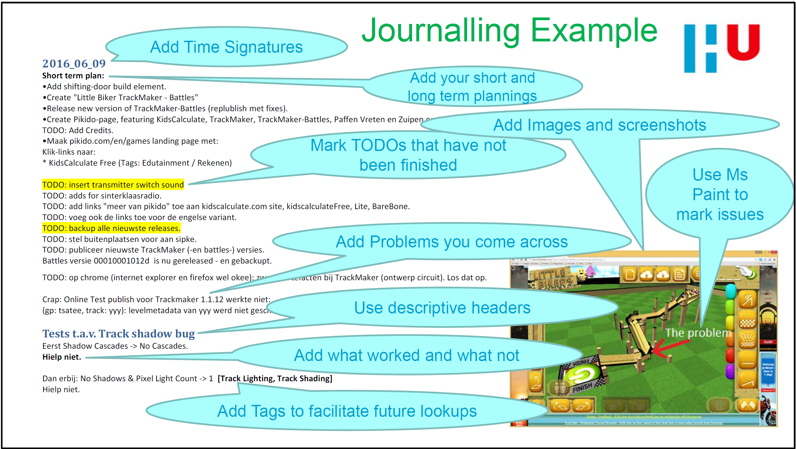

# Journaliseren

## Aanleiding

Het zou toch fantastisch zijn:

- Als je kunt **voortbouwen** op ervaringen uit het verleden, en zo steeds coolere dingen kunt bouwen.
- Als je **geen** belangrijke details **vergeet**.
- Als je het **wiel** niet steeds opnieuw hoeft uit te vinden.
- Als je **georganiseerde gedachten** en **workflow** hebt.
- Als je je **kopzorgen** kunt **minimaliseren**.

De oplossing daarvoor is: 

- **schrijf alles op**.
- .. op een dusdanige manier dat je het **snel kunt terugvinden**.

## Een document per Topic

Typisch maak je in een overzichtelijke **mappenstructuur** een persoonlijk **kennisdocument** aan **per topic** waar je mee bezig bent. Bijvoorbeeld met "/Programmeren/PythonErvaringen.md", of "/Electronica/Analoge_electronica.md", of "Projecten/S3_rollatornavigatie_logboek.md". Je legt daarin vast wat de revue passeert als je met de topic bezig bent. Zo'n "hack en slash" document waar je je gedachtengang in ordent noemen we ook wel een **logboek** of **journaal**.

## Tools om teksten snel terug te vinden

- **Copernic Desktop** werkt heel fijn op Windows (maar is niet gratis).
- **Master Seeker** werkt iets minder gebruiksvriendelijk, maar is wel gratis.

## Wat Journaliseren

- Noteer elke dag een nieuwe **time signature**. Bijvoorbeeld: 2018_08_21. Dan kun je makkelijker dingen terugvinden op tijd.
- Noteer / update je **persoonlijke** korte en langetermijn **planningen**.
- Noteer je **overwegingen**, **gedachtengangen** en **conclusies**.

## Hoe Journaliseren

- **Duidelijkheid** is king. Werk zoveel mogelijk met lijsten. Plak bij twijfel **plaatjes** en screenshots in je journaal.
- Ook **snelheid** is belangrijk. Je kunt **hack and slash** werken. Het belangrijkst is dat alles is terug te vinden. Het hoeft niet netjes. Een foto van wat handgeschreven formules of wat tekeningen is prima. 
- Voeg **tags** toe om toekomstig opzoeken te vergemakkelijken. Zet ze tussen [], zodat duidelijk is dat het tags zijn. Bijvoorbeeld [Servo, MGR996, PWM].

## Een Voorbeeld

Naast, of in plaats van per topic, kun je ook een algemeen journaal bijhouden waar je alles in plempt.

Onderstaand is een bladzijde te zien uit zo'n Journaal.

Onderstaand zijn nog wat voorbeelden van authentieke logboeken die ik maakte met esp32 als topic. Misschien dat een deel van de genoteerde problemen en oplossingen nog van pas kunnen komen:
[Wat oude logboeken over esp32(-IDF)](../onderwijsmateriaal/voorbeeld-oude-logboeken-esp32/) 