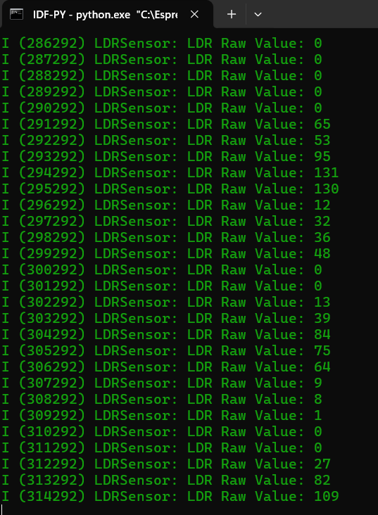

# R(GB) Leds

## Voorbereiding
- Bestudeer de eerste alinea van de wiki pagina over [photoresistors](https://en.wikipedia.org/wiki/Photoresistor).
- Bekijk het volgende filmpje:  
    https://www.youtube.com/watch?v=TiUzH0zFi2A
- Bestudeer de ADC functionaliteit van de [esp32](https://docs.espressif.com/projects/esp-idf/en/v4.1.1/api-reference/peripherals/adc.html).
- Bestudeer de functie xTaskCreatePinnedToCore in de [FreeRTOS](https://docs.espressif.com/projects/esp-idf/en/v4.3/esp32/api-reference/system/freertos.html) manual.

## Tijdens de les
Tijdens de les gaan we:
- naar de voorbeeld [code](../../software/CYD/LDR/) kijken. 
- de bronnen bestuderen bij [voorbereiding](#Voorbereiding). 
- aan de slag met de opdracht! 

**Opdracht LDR**
- aan de slag met de voorbeeld [code](../../software/CYD/LDR/).
- kopieer de hele directory naar je c:\espressif directory zodat je de volgende structuur krijgt (in ```c:\espressif```):
```
├── main
│   ├── main.cpp
│   ├── LDR.cpp
│   └── LDR.hpp
├── CMakeLists.txt
└── sdkconfig                
```

om het werkend te krijgen moet je:
- een CMakelists.txt in de main folder aanmaken en correct vullen.
- de LDR.cpp nog aanpassen. 
- test het weer door ```idf.py -p com8 flash monitor``` te runnen in de LDR folder. 
- De bedoeling is om het volgende resultaat te krijgen (dit lukt enkel als je je hand om je LDR sensor heen vouwd): 


Als het werkt:
- maak een foto van je output van je flash monitor.
- maak een pdf van je LDR.cpp

## Na de les
- werk verder aan de opdrachten als je het nog niet af hebt. 

## Canvas

Voor de opdracht is een canvas entry, namelijk:
- LDR

Bestudeer de canvas opdracht om te zien wat je precies moet inleveren. 


