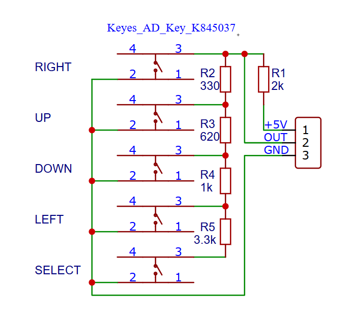

# Programma CYD Keypad

## Voorbereiding
- Lees over [Lambda's](https://learn.microsoft.com/en-us/cpp/cpp/lambda-expressions-in-cpp)
- Bestudeer het volgende schema:

- Wat gebeurt er met $OUT$ als 1 van de knoppen wordt ingedrukt?
- het schema hoort bij het volgende bordje:
  

   
## Tijdens de les
- aan de slag met de opdracht! 
  
**Opdracht Keypad**
- Experimenteer eerst met het bordje. Meet welke spanningen je krijgt als je een knopje indrukt. Klopt het met wat je verwacht/berekend had?
- Er is bij deze opdracht een template project. Vul de relevante code aan, de treshold values in de cpp en maak een correcte switch case in main.cpp.
- Geef voor elke knop die wordt ingedrukt de naam van de knop weer in een console output.   
- Zorg dat er relevant doxygen commentaar aan je code is toegevoegd. 

## Na de les
- Werk verder aan de opdrachten als je het nog niet af hebt. 
- Je kan deze code later gebruiken om een entity aan te sturen in je game-loop.

## Canvas

Voor de opdracht is een canvas entry, namelijk:
  - ESP32 ADC & Keypad

Bestudeer de canvas opdracht om te zien wat je precies moet inleveren. 

## Optioneel

- De adc.h library gebruikt in dit voorbeeld is `depricated` kan je de code aanpassen zodat dit ook werkt met de adc_onshot driver?