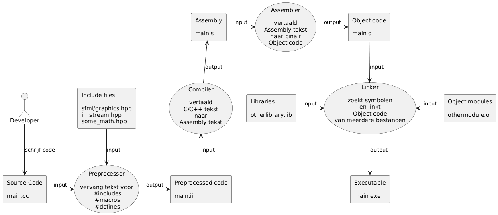

# Programma Buildchain

Dit kennisonderdeel geeft je een overzicht van de werkwijze van een C++ compiler toolchain.

Als iets in jouw Integrated Development Environment (bv VSCode met plugins) niet werkt helpt deze inzicht om de bron van problemen te vinden, of tenminste handmatig een 'workaround' te kunnen gebruiken om tot een werkende applicatie te komen.

* Links tot bronnen en meer informatie:

  * [TI-S4 presentatie "Een applicatie bouwen" (slidev bron)](https://github.com/HU-TI-DEV/TI-S4/blob/main/_slidev/les-infrastructuur-desktop-environment.md)

  * [TI-S4 presentatie "Een applicatie bouwen" (PDF export met tussenstappen)](https://github.com/HU-TI-DEV/TI-S4/blob/main/infrastructuur/desktop_environment/files/les-full-infrastructuur-desktop-environment.pdf)

  * [The four stages of the gcc compiler: preprocessor, compiler, assembler, linker.](https://medium.com/@gpradinett/the-four-stages-of-the-gcc-compiler-preprocessor-compiler-assembler-linker-3dec8714bb9c)

  * [A Dive to the Build Process - What Goes On When You Press the Play Button](https://zakuarbor.github.io/blog/building-code/)

* Scope

  Onderdelen van een eenvoudige C++ program build en hoe je de tussenproducten individueel kan bekijken/bewerken:

  * (+) Preprocessor
  * (+) Compiler
  * (+) Assembler
  * (+) Linker

  Kort genoemd

  * (+) objdump
  * (+) [Compiler Explorer](https://godbolt.org/)

* Buiten scope

  Dit zijn wijzers op onderwerpen/uitbreidingen die ook belangrijk en nuttig zijn:

  * (-) Gebruik van make en Makefiles (of andere build-orchestrators)
  * (-) Gebruik van ranlib en andere library tools
  * (-) Gebruik van map en symbol files voor informatie en debugging
  * (-) Oefening met objdump
  * (-) Opzetten van een system-independent toolchain in een container of op een remote system

## Overzicht

----

## Oefeningen (voor jezelf, zonder inlevering)

  * Check in een eigen project met meerdere bestanden wat preprocessor, compiler, assembler en linker als output geven.
    (Om de linker output in te zien gebruik je objdump.)

  * Gebruik de [Compiler Explorer](https://godbolt.org/) met een kjlein stukje code
    en kijk wat de compilers voor verschillende architecturen (bv AVR, x86, ARM) daarvan maken.

  * Welke Buildchains / Toolchains / IDEs heb je al geinstallerd?
    * Denk bijvoorbeeld aan Arduino IDE, Platform.io, ESP-IDF, VS2022.
    * Ken je systemen die net zoals een buildchain werken maar andere producten dan een uitvoerbaar programma maken?
      (Hint: GitHub-publishing van webpagina's, Slidev)

  * (Gevorderden:) Ga na hoe een van de toolchains/build systems die je gebruikt 'onder de kap' werkt:
    * Welke programma's worden in welke volgorde aangeroepen?
    * Welke (tussen)bestanden worden aangemaakt?
    * Welke support files (mapping file, processing logs) worden gemaakt of zijn beschikbaar?\
      Hoe kan je deze inschakelen en kiezen hoe uitgebreid de uitvoer is?
