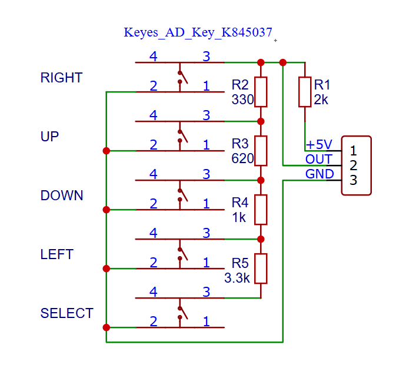
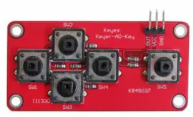

# Keypad

## Voorbereiding
- bestudeer het volgende schema:

- Wat gebeurt er met $OUT$ als 1 van de knoppen wordt ingedrukt?

- het schema hoort bij het volgende bordje:
  

   
## Tijdens de les
- aan de slag met de opdracht! 
  
**Opdracht Keypad**
- Maak een klasse (hpp & cpp) waarmee je de knoppen kunt uitlezen.  
- Zorg dat er relevant doxygen commentaar aan je code is toegevoegd. 

## Na de les
- werk verder aan de opdrachten als je het nog niet af hebt. 

## Canvas

Voor de opdracht is een canvas entry, namelijk:
  - ESP32 LDR & ADC & Keypad (deel 3)

Bestudeer de canvas opdracht om te zien wat je precies moet inleveren. 

