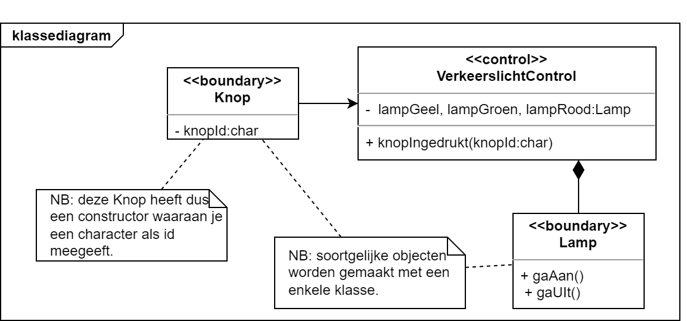
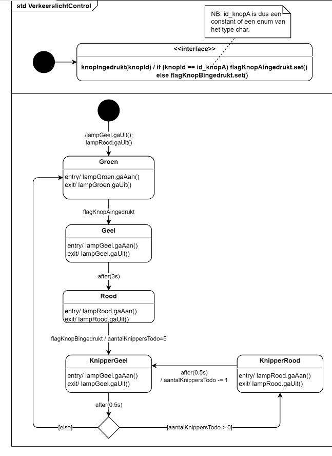

# Programma Klassediagram STD
In deze les willen we een klassediagram omzetten naar een STD (State Transition Diagram).

## Voorbereiding
- Lees blz 56 tm blz 59 van [Design like a robot!](../../onderwijsmateriaal/readers/Design%20Like%20a%20Robot!.pdf).
- Lees blz 11 en 12 van [Design like a Robot! rulebook](../../onderwijsmateriaal/readers/Design%20like%20a%20Robot!_rulebook.pdf)

## Use case Verkeerslicht

### Use case beschrijving
| Naam | Instellen |
| ----------- | ----------- |
| Samenvatting | Regeling van een (Duits) verkeerslicht op basis van twee voetgangers-knoppen. Het verkeerslicht heeft drie kleuren: groen – geel – rood.|
| Ratio | Deze regeling laat het verkeerslicht standaard op groen staan, wat de doorstroom van auto's bevordert.|
| Beschrijving | 1. Het verkeerslicht staat op groen. 2. Als knop A wordt ingedrukt wijzigt het verkeerslicht van kleur: van groen -> geel (3 seconden); van geel -> rood. Het licht blijft op rood staan. 3. Als knop B wordt ingedrukt gaat het licht knipperen: 5x van rood naar geel (0.5 s per kleur). Na 5 keer knipperen verandert de kleur naar groen.|
| Invariant | Er staat altijd maar 1 lamp tegelijk aan: ofwel rood, ofwel groen ofwel geel.|
| Uitzondering | ... |

## Klassediagram Verkeerslicht
Gegeven het volgende klassediagram:

## Van Klassediagram naar STD
Gebruik de tips uit de readers.

## STD diagram

## Tijdens en na de les
Deze les heb je nodig als voorbereiding op de Canvas oefenopdracht [Klassediagram Snoepautomaat](../../onderwijsmateriaal/opdrachten/oefenopdrachten/klassediagram-snoepautomaat/klassediagram-snoepautomaat.md)
Upload je resultaat naar de **Canvas oefenopdracht "KD Snoepautomaat"**. Bij een voldoende inlevering krijg je de uitwerkingen. Kijk jezelf daarmee na en vat samen wat je daarvan nog hebt opgestoken.