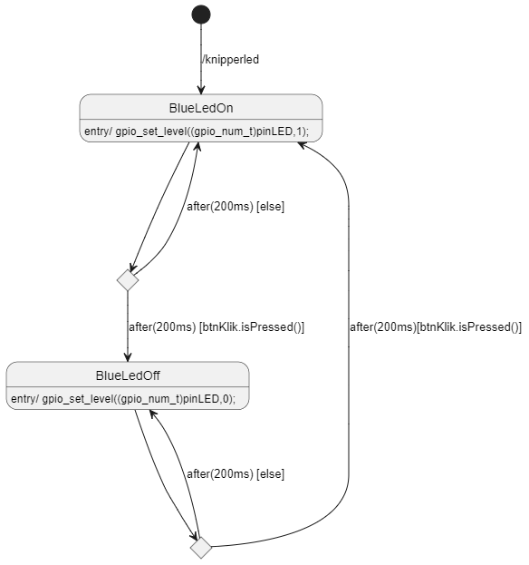
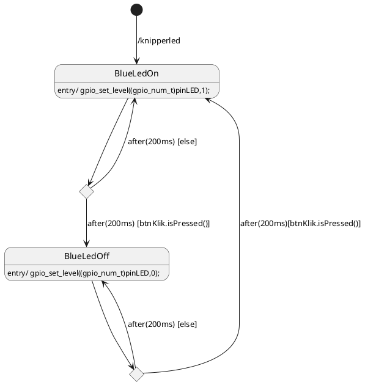

# Programma STD <-> code - I

Deze les staat het ontwerpen van een STD (State Transition Diagram) centraal. De naam zegt het al, het is een diagram dat laat zien in welke toestanden een taak zich kan bevinden. Daarnaast laat het zien onder welke voorwaarden een toestand kan overgaan in een andere toestand. Deze les gaat tevens over het vertalen van een STD naar CleanRTOS code.

## Voorbereiding

- Lees blz 48 tm blz 53 van [Design like a robot!](../../onderwijsmateriaal/readers/Design%20Like%20a%20Robot!.pdf) door.
- Kijk in de code van test_lasergame_2 -> apps -> KlikAanKlikUit

## Tijdens de les

Hoe gaan we va STD naar Code? Hiervoor gaan we de manual bekijken van "Design like a robot". Specifiek bladzijde 53:  


Hieronder in mark down:
1. Creeer een klasse die is afgeleid van de task van RTOS (in ons geval CRT).
2. Creeer een enum waarmee de toestanden geduid kunnen worden.
3. Voeg de member variabelen en references toe zoals aangegeven in het klassediagram.
(normaliter zijn die private).
4. Voeg een constructor toe die:
   -  De reference members initialiseert.
   -  Als de klasse een listener is, laat het eigen object zich als listener toevoegen aan de
objecten waar het naar luistert.
   -  Voeg de members die een Handler nodig hebben toe aan de betreffende Handler.
5. Maak voor elke STD interface een gelijknamige publieke functie aan. De code kun je 1 op 1
overnemen.
6. Implementeer de main() functie:
   - Creeer een switch statement dat springt naar de code voor de huidige toestand.
    - Voer daar als eerste de entry event code uit.
    - Vervolgens eventuele “do” code.
    - Wacht op het optreden van events:
auto evt = wait( een of meer waitables hier )
    - Interpreteer de event, en laat de bijbehorende guard, actie en/of transitie uitvoeren:
if(evt=flagButton){state = Idle;}

We gaan kijken hoe bovenstaande is verwezelijkt in de KlikAanKlikUit code. Dit is het STD:





Als we kijken naar de main: 


Dan zien we dat er twee files worden ge-include: 
```c++
#include "Button.h"
#include "KlikAanKlikUit.h"
```

In de main zelf zien we dat er twee dingen uit Clean RTOS (CRT) worden aangeroepen: 
```c++
crt::Button btnInput("InputButton", PIN_BTN, false);
crt::KlikAanKlikUit("KlikAanKlikUit", 2 /*priority*/, 0 /*RUNNING_CORE*/, PIN_LED, (crt::Button*)&btnInput);
```
KlikAanKlikUit is de taak die wordt geintialiseerd (als RTOS taak) met een bijbehorende prioriteit. 

Laten we nu gaan kijken naar het eerste deel van KlikAanKlikUit.h:


En het tweede deel:


### Aan de slag
DEEL I
-  Build en run KliKAanKlikUit.
   - Als je een ESP32-C6 gebruikt: zoek uit wat er moet worden veranderd om het daar te runnen.
- Wat gebeurt als je de knop indrukt?
- Wat verwacht je als bij het volgende stukje code de false waarde wordt verandert in een true?
```c++
crt::Button btnInput("InputButton", PIN_BTN, false);
```
  
DEEL II - We gaan een verkeerslicht nabouwen. <br>

```
Het verkeerslicht zal normaal op groen staan. Het heeft drie kleuren: groen – oranje/geel – rood. 
- 	Knopje A is verbonden met de knop van het voetgangerspad op de straat die er loodrecht op staat/loopt.
- 	Knopje B is verbonden met de knop van het voetgangerspad van de straat waar het stoplicht staat.
- 	Het verkeerslicht staat normaal op groen. Als op knopje A wordt gedrukt moet het verkeerslicht van groen -> oranje/geel (3 seconden) -> rood gaan. Dan moet hij op rood blijven staan.
- 	Als knopje B wordt ingedrukt moet hij (het is een duits verkeerslicht) van rood -> knipperend rood/geel gaan. Dus 5 x (oranje/geel (0.5 s) -> rood (0.5 s) -> en weer terug naar oranje).
- 	Uiteindelijk na die 5 keer knipperen moet hij naar groen gaan. 
``` 

<br>
De opdracht:   

1) Maak een STD van het verkeerslicht (mag in plantUML of in drawIO)  
2) Pas de stappen van blz 53 toe om je code aan te passen. Let op! Niet alle pinnen van de ESP32 kun je gebruiken. Zoek dat ook uit.  
3) Test je programma, laat de demo aan de docent zien.

Als je klaar bent sla dan je code & STD op. Bij programma STD <-> Code -II zul je deze variant ook moeten uploaden op canvas.


# Programma STD <-> code - II

## Voorbereiding

- Bestudeer van de volgende bron: [cleanrtos](../../infrastructuur/CleanRTOS/README.md) het stukje over flags. 

## Tijdens de les
De code van het stoplicht heeft 1 groot nadeel, het gebruikt eigenlijk niet het multitask karakter van het RTOS. Dat is niet zo erg voor simpele sequentiele taken maar als er meerdere dingen tegelijk moeten gebeuren is een andere oplossing handig.

Het probleem is dat de ontwerper van het stoplicht een extra functionaliteit wil. Hij wil een ambulance knop. Dit is een derde knop waarmee instantaan alle lichten van het verkeerslicht op rood gezet kunnen worden. 

Wat jullie gaan doen is het volgende:
- Het checken van de knoppen gaat in aparte tasks gebeuren.
- Of een knop is ingedrukt gaan jullie communiceren via flags met de task KlikAanKlikUit. 
  
### Aan de slag
  
Maak een ButtonTask.h aan. Gebruik de KlikAanKlikUit task als "Template". Hernoem KlikAanKlikUit als ButtonTask, totdat je zoiets krijgt::
```c++
- #pragma once
#include <crt_CleanRTOS.h>

// by Bart Bozon, 2025

namespace crt
{
	class ButtonTask : public Task{
		
		private:

		public:
			ButtonTask(const char *taskName, unsigned int taskPriority, unsigned int taskCoreNumber, const uint8_t pinButton, int timeBetweenReads)
				: Task(taskName, taskPriority, 3000, taskCoreNumber), pinButton(pinButton), timeBetweenReads(timeBetweenReads)
			{
                // HIER MOET JULLIE CODE KOMEN OM DE PIN TE INITIALISEREN
				ESP_LOGI(taskName, "start task");
				start();
			}

		private:
			void main()
			{

				// main function
				while (true)
				{
                    // HIER MOET JULLIE CODE KOMEN OM DE PIN TE LEZEN EN DE FLAG TE ZETTEN
					vTaskDelay(timeBetweenReads);
				}
		}
	}; // end class 
}; // end namespace CleanRTOS
```

We gaan met flags werken dus in de hoofdtask/klass(KlikAanKlikUit of Verkeerslicht) moeten we een flag initieren in de member/attributes sectie van de class:
```c++
	private:
        Flag flagKnopIngedrukt;
```
(let wel, misschien moeten we flags hebben per type knop?)

We moeten in de hoofdtask/class de volgende publieke functie aanmaken:
```c++
    void knopIngedrukt()
    {
        flagKnopIngedrukt.set();
    }
```

In de switch case kunnen we dan wachten op de vlag met:
```c++
			wait(flagKnopIngedrukt);
```
De hoofdtaak zal dan de macht aan het RTOS overgeven. Het RTOS houd in de gaten of die vlag wordt "geset". Als dat gebeurt wordt automatisch dan weer de hoofdtaak opgestart! De vlag wordt dan meteen gereset. 

Als we dan gaan naar de ButtonTask dan moeten we die laten weten dat hij een functie uit de hoofdklasse aan kan roepen om de vlag te zetten, voeg het volgende toe aan de member/attributes sectie van de class:
```c++
	private:
		KlikAanKlikUitControl& klikAanKlikUitControl;
```

In de constructor van de ButtonTask moeten we dan ook laten weten dat hij de andere klasse kan aanroepen:

```c++
ButtonTask(const char *taskName, unsigned int taskPriority, unsigned int taskCoreNumber, const uint8_t pinButton, int timeBetweenReads,KlikAanKlikUitControl& klikAanKlikUitControl)			: Task(taskName, taskPriority, 3000, taskCoreNumber), pinButton(pinButton), timeBetweenReads(timeBetweenReads),klikAanKlikUitControl(klikAanKlikUitControl)
```

Dan kunnen we de vlag zetten (in de switch case) met:
```c++
			klikAanKlikUitControl.knopIngedrukt();
```

- pas de ButtonTask code aan zodat je een pin kunt uitlezen.
- kopieer het oude STD naar een nieuwe.
- pas het STD aan zodat het de nieuwe opdracht reflecteert.
- maak de code zo dat de knoppen via aparte tasks worden uitgelezen. Implementeer ook de ambulance functionaliteit. 

### Canvas
Upload je werk naar canvas. Zie de canvas opdracht hoe je dat precies moet doen.

# Programma STD <-> code - III

Maak individueel de oefenopdracht [STD Duivenschreck InstelControl](../../onderwijsmateriaal/opdrachten/oefenopdrachten/std-duivenschreck-instelcontrol/std-duivenschreck-instelcontrol.md). Upload je resultaat naar de bijbehorende **Canvas oefenopdracht**.  
 Bij een serieuze effort krijg je de uitwerkingen. Kijk jezelf daarmee na en vat samen wat je daarvan nog hebt opgestoken.

