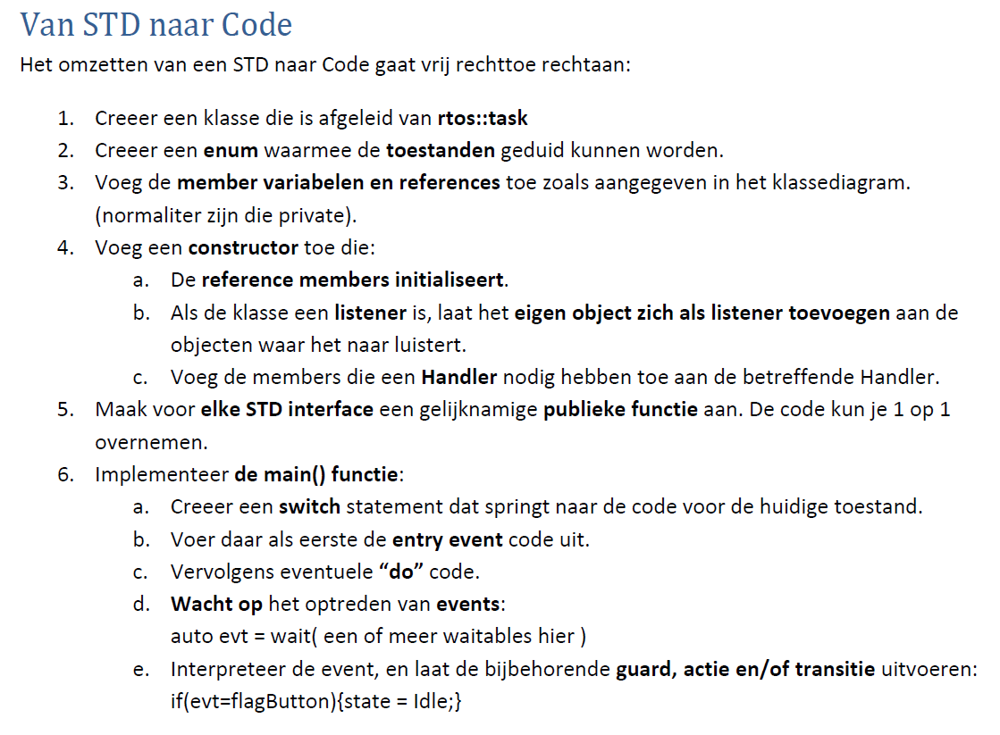
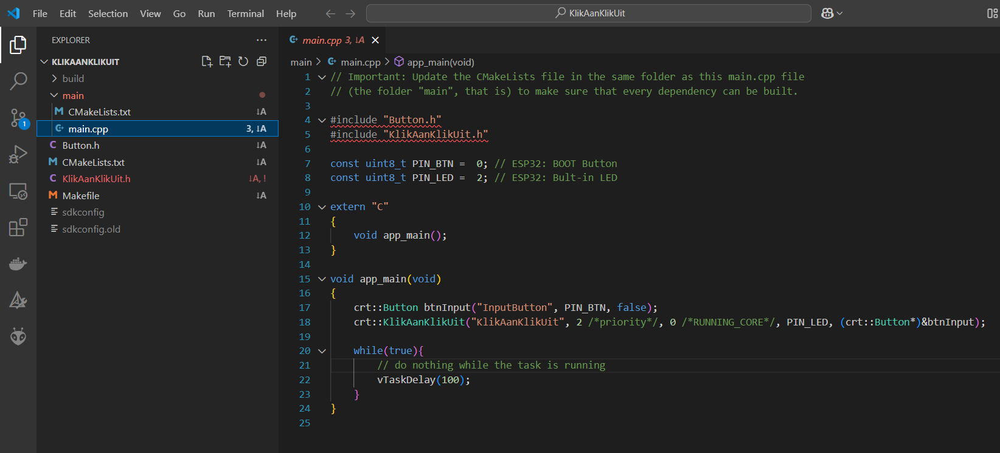
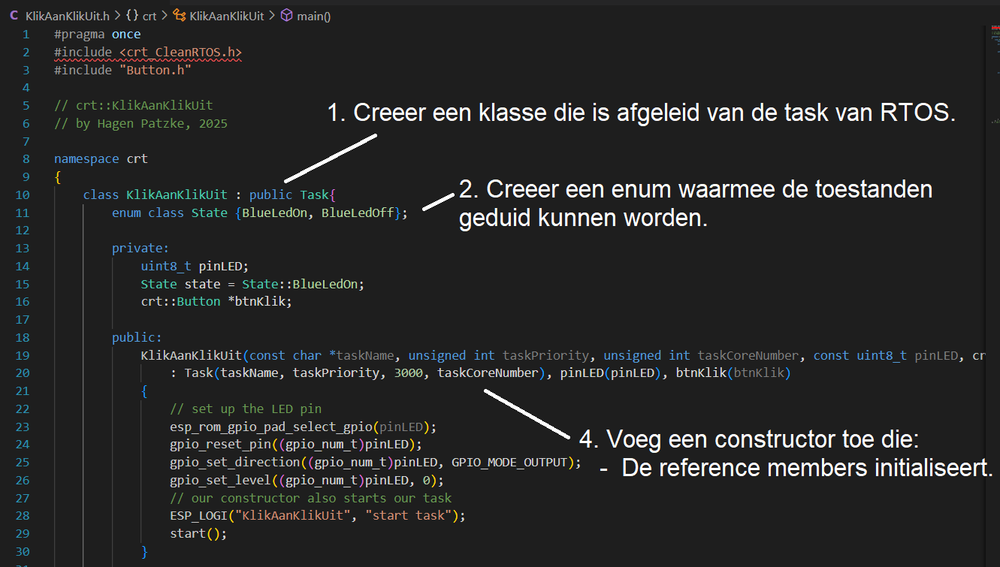
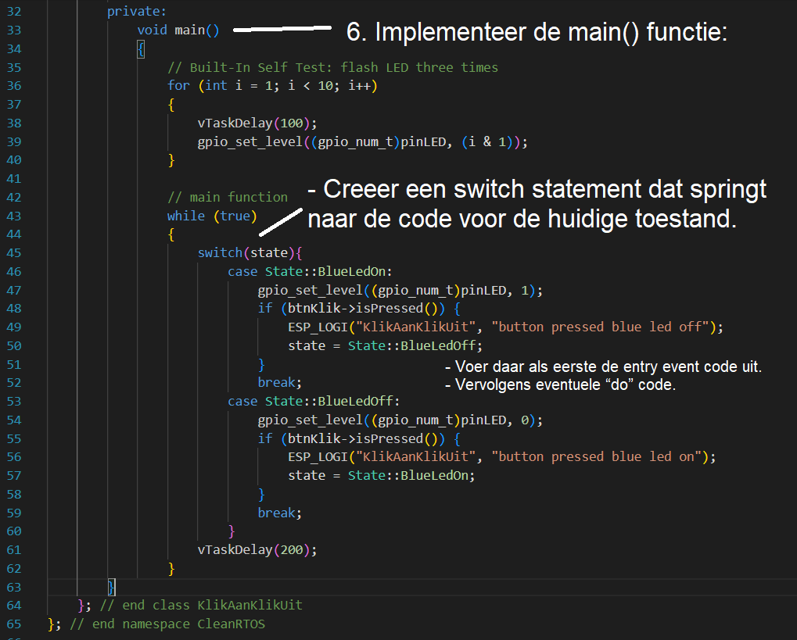

# Programma STD <-> code - I

Deze les staat het ontwerpen van een STD (State Transition Diagram) centraal. De naam zegt het al, het is een diagram dat laat zien in welke toestanden een taak zich kan bevinden. Daarnaast laat het zien onder welke voorwaarden een toestand kan overgaan in een andere toestand. Deze les gaat tevens over vertalen naar CleanRTOS code.

## Voorbereiding

- Lees blz 47 tm blz 52 van [Design like a robot!](../../onderwijsmateriaal/readers/Design%20Like%20a%20Robot!.pdf) door.
- Check het [State Transition Diagram (STD) van KlikAanKlikUit](../../onderwijsmateriaal/opdrachten/oefenopdrachten/std-klik-aan-klik-uit/KlikAan-KlikUit-1.png).
- Kijk in de code van test_lasergame_2 -> apps -> KlikAanKlikUit

## Tijdens de les

Van STD naar Code. Hiervoor gaan we de manual bekijken van "Design like a robot". Specifiek bladzijde 53:  



Hieronder in mark down:
1. Creeer een klasse die is afgeleid van de task van RTOS (in ons geval CRT).
2. Creeer een enum waarmee de toestanden geduid kunnen worden.
3. Voeg de member variabelen en references toe zoals aangegeven in het klassediagram.
(normaliter zijn die private).
4. Voeg een constructor toe die:
   -  De reference members initialiseert.
   -  Als de klasse een listener is, laat het eigen object zich als listener toevoegen aan de
objecten waar het naar luistert.
   -  Voeg de members die een Handler nodig hebben toe aan de betreffende Handler.
5. Maak voor elke STD interface een gelijknamige publieke functie aan. De code kun je 1 op 1
overnemen.
6. Implementeer de main() functie:
   - Creeer een switch statement dat springt naar de code voor de huidige toestand.
    - Voer daar als eerste de entry event code uit.
    - Vervolgens eventuele “do” code.
    - Wacht op het optreden van events:
auto evt = wait( een of meer waitables hier )
    - Interpreteer de event, en laat de bijbehorende guard, actie en/of transitie uitvoeren:
if(evt=flagButton){state = Idle;}

We gaan kijken hoe bovenstaande is verwezelijkt in de KlikAanKlikUit code. 
Als we kijken naar de main: 



Dan zien we dat er twee files worden ge-include: 
```c++
#include "Button.h"
#include "KlikAanKlikUit.h"
```

In de main zelf zien we dat er twee dingen uit Clean RTOS (CRT) worden aangeroepen: 
```c++
crt::Button btnInput("InputButton", PIN_BTN, false);
crt::KlikAanKlikUit("KlikAanKlikUit", 2 /*priority*/, 0 /*RUNNING_CORE*/, PIN_LED, (crt::Button*)&btnInput);
```
KlikAanKlikUit is de taak die wordt geintialiseerd (als RTOS taak) met een bijbehorende prioriteit. 

Laten we nu gaan kijken naar het eerste deel van KlikAanKlikUit.h:



En het tweede deel:




### Aan de slag
DEEL I
-  Build en run KliKAanKlikUit.
   - Als je een ESP32-C6 gebruikt: zoek uit wat er moet worden veranderd om het daar te runnen.
- Wat gebeurt als je de knop indrukt?
- Wat verwacht je als bij het volgende stukje code de false waarde wordt verandert in een true?
```c++
crt::Button btnInput("InputButton", PIN_BTN, false);
```


DEEL II


- Welke onderdelen missen in het State Transition Diagram?
- Wat kan je minimaal toevoegen in het STD en de code om het bruikbaar werkend te krijgen?

### Optioneel

- Maak een map 'test' aan en schrijf unit-tests voor KlikAanKlikUit en Button.
- Als we willen dat een lange druk op de knop de LED alleen een keer omschakeld
  - Wat moeten we in het State Transition Diagram veranderen?
  - Hoe kunnen we dit door toeveogingen alleen in de klas KlikAanKlikUit implementeren?
  - Hoe kunnen we dit door toeveogingen alleen in de klas Button implementeren?


# Programma STD <-> code - II


# Programma STD <-> code - III

Maak individueel de oefenopdracht [STD Duivenschreck InstelControl](../../onderwijsmateriaal/opdrachten/oefenopdrachten/std-duivenschreck-instelcontrol/std-duivenschreck-instelcontrol.md). Upload je resultaat naar de bijbehorende **Canvas oefenopdracht**. Bij een serieuze effort krijg je de uitwerkingen. Kijk jezelf daarmee na en vat samen wat je daarvan nog hebt opgestoken.

