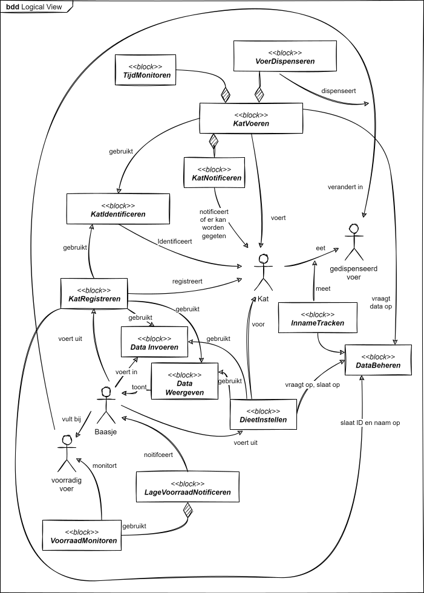

# Functionele Decompositie

Een functionele decompositie geeft weer hoe de verschillende functies van het systeem kunnen worden opgesplitst in deelfuncties. Onderstaand is een voorbeeld gegeven van een functionele decompositie van een kattenvoermachine. Merk de volgende eigenschappen op:

- De blokken geven zuiver de functies weer, dus wat het systeem doet. Wat in hardware dan wel in software geimplementeerd zal gaan worden is hier nog niet van belang.

- Typisch zijn de (toplevel-) functies afkomstig van de eerder opgestelde Functionele Requirements. Het is dan even puzzelen daarmee om er een helder samenhangend onderzicht zoals het onderstaande van te maken.

- Compositie relaties kun je op dezelfde manier gebruiken als bij klassediagrammen: Je kunt ermee aangeven dat een bepaalde functie onderdeel is van een hoger niveau functie.

- Net als bij klassen - als een functie gebruikt wordt door meerdere andere functies, dan gebruik je geen composition maar een gewone dependency relatie.

- Alle gebruikte relaties hebben een richting. Het woord naast een relatie is een werkwoord in 3e persoon. Het duidt aan wat hetgeen aan de bron van de relatie staat doet met wat er aan het uiteinde van staat. 

- Naast de functies staan ook de actoren in het diagram, zodat ook hun relaties met elkaar en met de functies aangegeven kunnen worden.

Voorbeelden:

- De functie voerdispenseren geeft aan dat het apparaat voer kan dispenseren. Welke hardware of software daarbij komt kijken, wordt in het midden gelaten.

- Voerdispenseren was een eerder opgestelde Functionele Requirement. Bij deze functionele decompositie wordt zijn plaats in het geheel duidelijk.

- De functie LageVoorraadNotificeren maakt gebruik van de functie VoorraadMonitoren. Omdat er geen andere functies zijn die van VoorraadMonitoren gebruik maken, maken we er een compositie relatie van.

- De functies KatIdentificeren wordt door meerdere andere functies gebruikt. Vandaar dat de relaties naar KatIdentificeren niet van het type compositie relatie zijn.

- De kat eet gedispenseerd voer. Hoeveel, dat wordt gemeten door de functie InnameTracken.
