# Modelleren met plantUML

- [Modelleren met plantUML](#modelleren-met-plantuml)
  - [Introductie](#introductie)
  - [Key driver chart](#key-driver-chart)
  - [System context diagram](#system-context-diagram)
  - [Use case diagram](#use-case-diagram)
  - [Activity diagram](#activity-diagram)
  - [Functional decompositie:](#functional-decompositie)
  - [Object model](#object-model)
  - [Klassediagram](#klassediagram)
  - [STD](#std)
  - [Appendix](#appendix)

## Introductie
[PlantUML](https://plantuml.com/) is opensource software waarmee je allerlei diagrammen kunt maken en visualiseren.

Voor een snelle & korte introductie bekijk de volgende video's:
- [intro plantUML](https://www.youtube.com/watch?v=_dEhja6kkEA)
- [intro usecases met plantUML](https://www.youtube.com/watch?v=O_pnAClBPPc)

Hieronder kleine demo's hoe je de verschillende modellen in plantUML kunt maken. 

## Key driver chart
https://plantuml.com/er-diagram                         
Entities and attributes  
TODO

## System context diagram
Voor het diagram gaan we een ander diagram type misbruiken, de [usecase diagrammen](https://plantuml.com/use-case-diagram)

Voor uitleg zie het volgende filmpje: [intro context diagram met plantUML](https://www.youtube.com/watch?v=aH3LPgT-mRM)

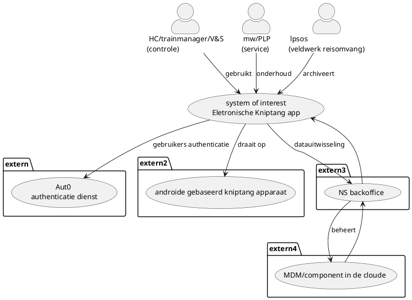
```plantuml
@startuml
skinparam actorStyle awesome

: HC/trainmanager/V&S\n(controle):  as a1
: mw/PLP\n(service): as a2
: lpsos\n(veldwerk reisomvang): as a3

(system of interest\nEletronische Kniptang app) as u1

package extern {
    (Aut0 \nauthenticatie dienst) as u2
}

package extern2 {
    (androide gebaseerd kniptang apparaat) as u3
}

package extern3 {
    (NS backoffice) as u4
}
package extern4 {
    (MDM/component in de cloude) as u5
}

a1--> u1 : gebruikt
a2--> u1 : onderhoud
a3--> u1 : archiveert
u1--> u2 : gebruikers authenticatie
u1--> u3 : draait op
u1--> u4 : datauitwisseling
u4--> u1
u4--> u5 : beheert
u5--> u4

@enduml
```
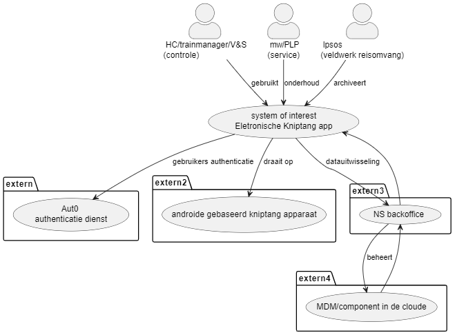

## Use case diagram
Meer informatie over usecases in plantUML kun je [hier]
(https://plantuml.com/use-case-diagram) vinden.

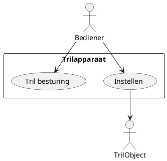
```plantuml
@startuml

rectangle Trilapparaat {
usecase "Instellen" as UC1
usecase "Tril besturing" as UC2
}
Bediener --> UC1
Bediener --> UC2
UC1 --> TrilObject

@enduml
```
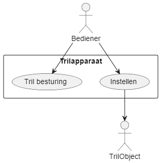

## Activity diagram
https://plantuml.com/activity-diagram-beta

## Functional decompositie:
nog niets iets goeds voor gevonden. TODO

## Object model
Meer informatie over object modellen in plantUML kun je [hier]
(https://plantuml.com/object-diagram) vinden.

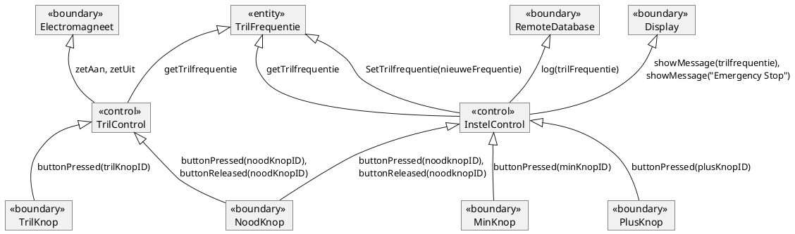
```plantuml
@startuml

hide attributes

object "<<entity>> \nTrilFrequentie" as O1
object "<<control>> \nTrilControl" as O2
object "<<boundary>> \nElectromagneet" as O3
object "<<control>> \nInstelControl" as O4
object "<<boundary>> \nRemoteDatabase" as O5
object "<<boundary>> \nPlusKnop" as O6
object "<<boundary>> \nMinKnop" as O7
object "<<boundary>> \nNoodKnop" as O8
object "<<boundary>> \nDisplay" as O9
object "<<boundary>> \nTrilKnop" as O10

O1 <|-- O4 : getTrilfrequentie
O1 <|-- O4 : SetTrilfrequentie(nieuweFrequentie)
O5 <|-- O4 : log(trilFrequentie)
O4 <|-- O6 : buttonPressed(plusKnopID)
O4 <|-- O7 : buttonPressed(minKnopID)
O9 <|-- O4 : showMessage(trilfrequentie), \nshowMessage("Emergency Stop")
O4 <|-- O8 : buttonPressed(noodknopID), \nbuttonReleased(noodknopID)
O1 <|-- O2 : getTrilfrequentie
O2 <|-- O10 : buttonPressed(trilKnopID)
O3 <|-- O2 : zetAan, zetUit
O2 <|-- O8 :  buttonPressed(noodKnopID),\nbuttonReleased(noodKnopID)
@enduml
```

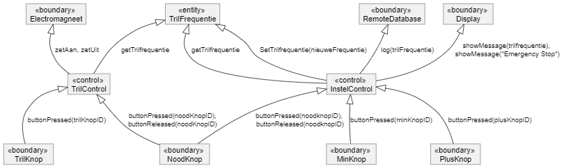

## Klassediagram
Meer informatie over klassediagrammen in plantUML kun je [hier]
(https://plantuml.com/class-diagram) vinden.

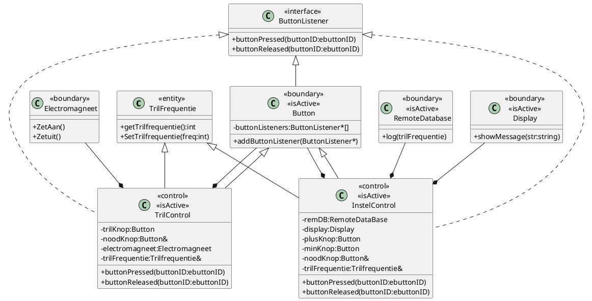
```plantuml
@startuml
skinparam classAttributeIconSize 0

class "<<entity>> \nTrilFrequentie" as c1
c1 : +getTrilfrequentie():int
c1 : +SetTrilfrequentie(freq:int)
class "<<control>>\n<<isActive>>\nTrilControl" as c2
c2 : -trilKnop:Button
c2 : -noodKnop:Button&
c2 : -electromagneet:Electromagneet
c2 : -trilFrequentie:Trilfrequentie&
c2 : +buttonPressed(buttonID:ebuttonID)
c2 : +buttonReleased(buttonID:ebuttonID)
class "<<boundary>> \nElectromagneet" as c3
c3  : +ZetAan()
c3 : +Zetuit()
class "<<control>>\n<<isActive>>\nInstelControl" as c4
c4 : -remDB:RemoteDataBase
c4 : -display:Display
c4 : -plusKnop:Button
c4 : -minKnop:Button
c4 : -noodKnop:Button&
c4 : -trilFrequentie:Trilfrequentie&
c4 : +buttonPressed(buttonID:ebuttonID)
c4 : +buttonReleased(buttonID:ebuttonID)
class "<<boundary>>\n<<isActive>>\nRemoteDatabase" as c5
c5 : +log(trilFrequentie)
class "<<boundary>>\n<<isActive>>\nDisplay" as c9
c9 : +showMessage(str:string)
class "<<boundary>>\n<<isActive>>\nButton" as c12
c12 : -buttonListeners:ButtonListener*[]
c12 : +addButtonListener(ButtonListener*)
class "<<interface>> \nButtonListener" as c13
c13 : +buttonPressed(buttonID:ebuttonID)
c13 : +buttonReleased(buttonID:ebuttonID)

c1 <|-- c4 
c5 --* c4 
c9 --* c4 
c3 --* c2
c1 <|-- c2 
c12 --* c4
c12 --* c2
c13 <|-- c12
c13 <|.. c2
c13 <|.. c4
c12 <|-- c2
c12 <|-- c4
@enduml
```

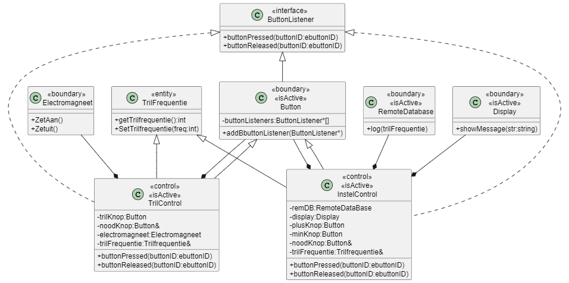

## STD
Meer informatie over STD's in plantUML kun je [hier]
(https://plantuml.com/state-diagram) vinden.

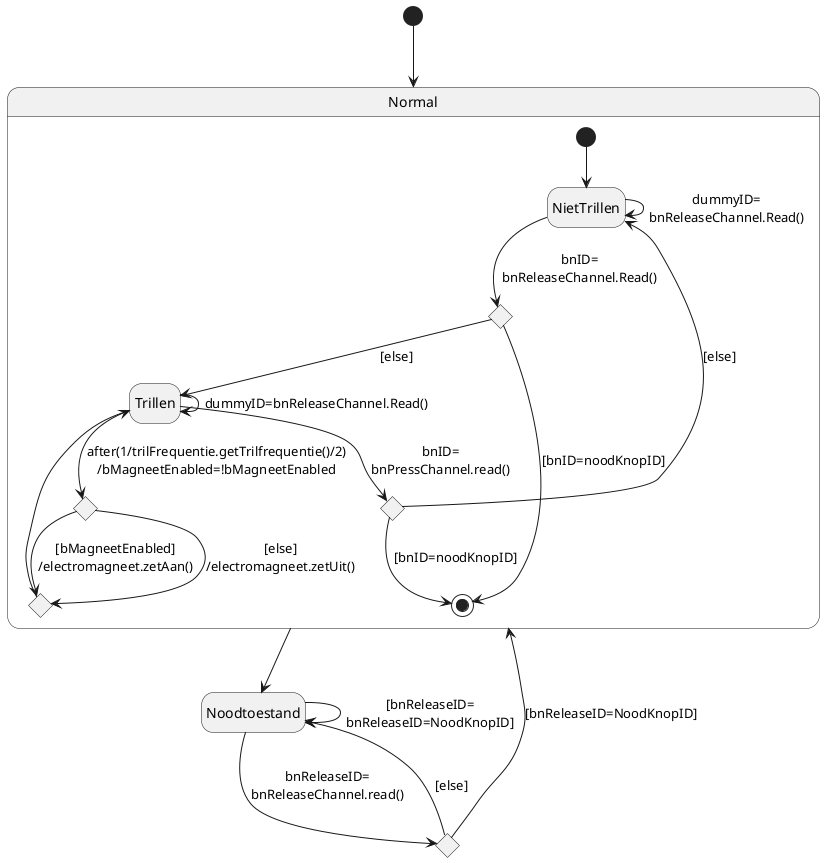
```plantuml
@startuml
hide empty description

[*] --> Normal

Normal --> Noodtoestand
state c5 <<choice>>
Noodtoestand --> c5 : bnReleaseID=\nbnReleaseChannel.read()
c5 --> Noodtoestand : [else]
c5 --> Normal : [bnReleaseID=NoodKnopID]
Noodtoestand --> Noodtoestand : [bnReleaseID=\nbnReleaseID=NoodKnopID]

state Normal {

state "NietTrillen" as nietTrillen
state "Trillen" as Trillen
state c4 <<choice>> 
state c1 <<choice>>
state c3 <<choice>>
state c2 <<choice>>

[*] --> nietTrillen
nietTrillen --> c1 : bnID=\nbnReleaseChannel.Read()
nietTrillen --> nietTrillen: dummyID=\nbnReleaseChannel.Read()
c1-->Trillen : [else]  
c1--> [*] : [bnID=noodKnopID]
Trillen --> c2 : bnID=\nbnPressChannel.read()
c2--> [*] : [bnID=noodKnopID]
c2--> nietTrillen : [else]
Trillen ----> Trillen : dummyID=bnReleaseChannel.Read()
Trillen --> c3 : after(1/trilFrequentie.getTrilfrequentie()/2)\n/bMagneetEnabled=!bMagneetEnabled
c3 --> c4 : [else]\n/electromagneet.zetUit()
c3 --> c4 : [bMagneetEnabled]\n/electromagneet.zetAan()
c4--> Trillen 
} 
@enduml
```

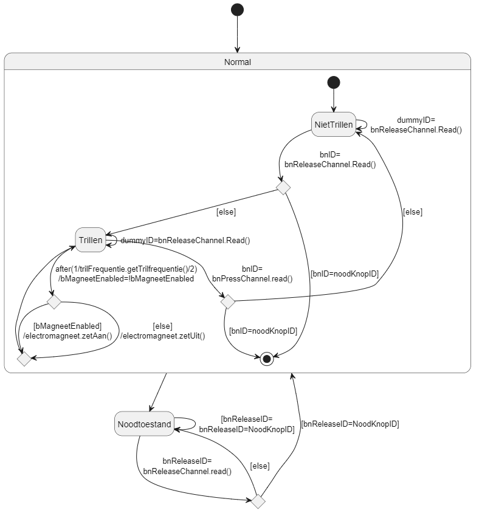

## Appendix

Alle modellen die in de reader gebruikt worden:

```plantuml
@startuml

rectangle Trilapparaat {
usecase "Instellen" as UC1
usecase "Tril besturing" as UC2
}
Bediener --> UC1
Bediener --> UC2
UC1 --> TrilObject

@enduml
```

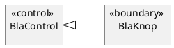
```plantuml
@startuml

left to right direction
object "<<boundary>> \nBlaKnop" as O1
object "<<control>> \nBlaControl" as O2

O2 <|-- O1

@enduml
```

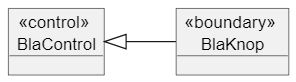

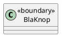
```plantuml
@startuml

class "<<boundary>> \nBlaKnop" as c1

@enduml
```

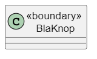

```plantuml
@startuml

hide attributes

object "TrilControl" as O2
object "InstelControl" as O4

@enduml
```

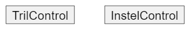

```plantuml
@startuml

hide attributes

object "<<control>> \nTrilControl" as O2
object "<<control>> \nInstelControl" as O4

@enduml
```

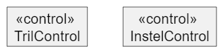

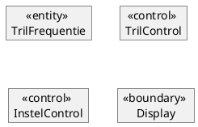
```plantuml
@startuml

hide attributes

object "<<entity>> \nTrilFrequentie" as O1
object "<<control>> \nTrilControl" as O2
object "<<control>> \nInstelControl" as O4
object "<<boundary>> \nDisplay" as O9

@enduml
```

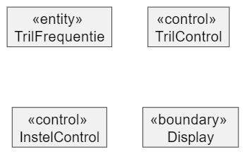

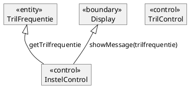
```plantuml
@startuml

hide attributes

object "<<entity>> \nTrilFrequentie" as O1
object "<<control>> \nTrilControl" as O2
object "<<control>> \nInstelControl" as O4
object "<<boundary>> \nDisplay" as O9

O1 <|-- O4 : getTrilfrequentie
O9 <|-- O4 : showMessage(trilfrequentie)

@enduml
```

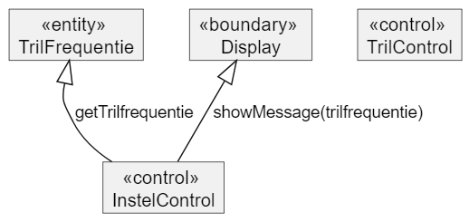

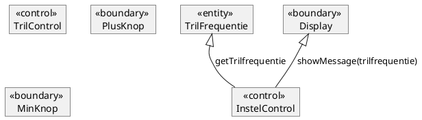
```plantuml
@startuml

hide attributes

object "<<entity>> \nTrilFrequentie" as O1
object "<<control>> \nTrilControl" as O2
object "<<control>> \nInstelControl" as O4
object "<<boundary>> \nPlusKnop" as O6
object "<<boundary>> \nMinKnop" as O7
object "<<boundary>> \nDisplay" as O9

O1 <|-- O4 : getTrilfrequentie
O9 <|-- O4 : showMessage(trilfrequentie)

@enduml
```

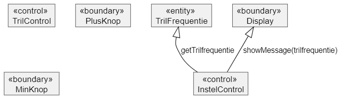

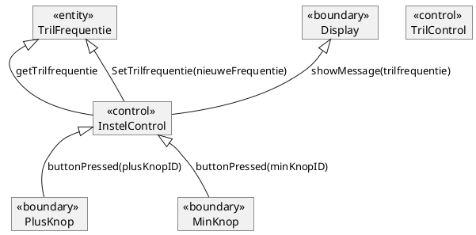
```plantuml
@startuml

hide attributes

object "<<entity>> \nTrilFrequentie" as O1
object "<<control>> \nTrilControl" as O2
object "<<control>> \nInstelControl" as O4
object "<<boundary>> \nPlusKnop" as O6
object "<<boundary>> \nMinKnop" as O7
object "<<boundary>> \nDisplay" as O9

O1 <|-- O4 : getTrilfrequentie
O1 <|-- O4 : SetTrilfrequentie(nieuweFrequentie)
O4 <|-- O6 : buttonPressed(plusKnopID)
O4 <|-- O7 : buttonPressed(minKnopID)
O9 <|-- O4 : showMessage(trilfrequentie)

@enduml
```

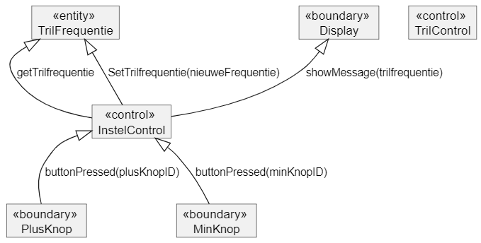

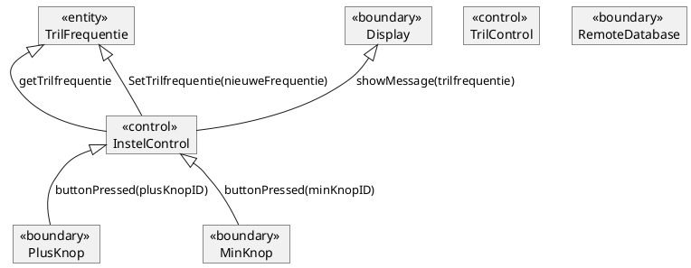
```plantuml
@startuml

hide attributes

object "<<entity>> \nTrilFrequentie" as O1
object "<<control>> \nTrilControl" as O2
object "<<control>> \nInstelControl" as O4
object "<<boundary>> \nRemoteDatabase" as O5
object "<<boundary>> \nPlusKnop" as O6
object "<<boundary>> \nMinKnop" as O7
object "<<boundary>> \nDisplay" as O9

O1 <|-- O4 : getTrilfrequentie
O1 <|-- O4 : SetTrilfrequentie(nieuweFrequentie)
O4 <|-- O6 : buttonPressed(plusKnopID)
O4 <|-- O7 : buttonPressed(minKnopID)
O9 <|-- O4 : showMessage(trilfrequentie)

@enduml
```

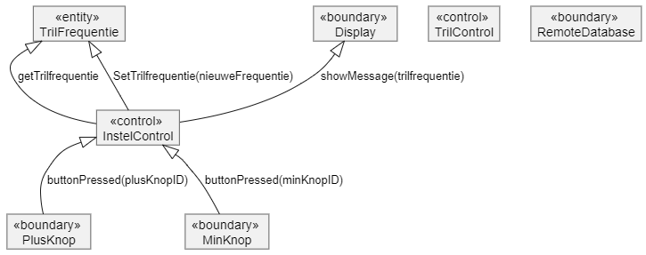

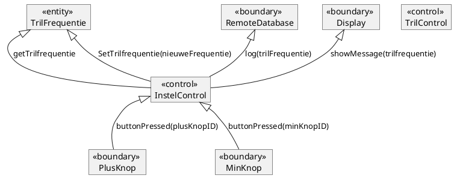
```plantuml
@startuml

hide attributes

object "<<entity>> \nTrilFrequentie" as O1
object "<<control>> \nTrilControl" as O2
object "<<control>> \nInstelControl" as O4
object "<<boundary>> \nRemoteDatabase" as O5
object "<<boundary>> \nPlusKnop" as O6
object "<<boundary>> \nMinKnop" as O7
object "<<boundary>> \nDisplay" as O9

O1 <|-- O4 : getTrilfrequentie
O1 <|-- O4 : SetTrilfrequentie(nieuweFrequentie)
O5 <|-- O4 : log(trilFrequentie)
O4 <|-- O6 : buttonPressed(plusKnopID)
O4 <|-- O7 : buttonPressed(minKnopID)
O9 <|-- O4 : showMessage(trilfrequentie)

@enduml
```

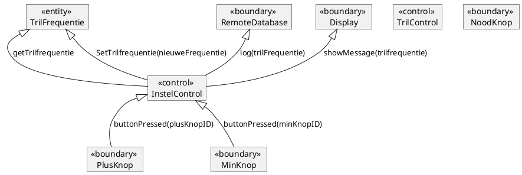
```plantuml
@startuml

hide attributes

object "<<entity>> \nTrilFrequentie" as O1
object "<<control>> \nTrilControl" as O2
object "<<control>> \nInstelControl" as O4
object "<<boundary>> \nRemoteDatabase" as O5
object "<<boundary>> \nPlusKnop" as O6
object "<<boundary>> \nMinKnop" as O7
object "<<boundary>> \nNoodKnop" as O8
object "<<boundary>> \nDisplay" as O9

O1 <|-- O4 : getTrilfrequentie
O1 <|-- O4 : SetTrilfrequentie(nieuweFrequentie)
O5 <|-- O4 : log(trilFrequentie)
O4 <|-- O6 : buttonPressed(plusKnopID)
O4 <|-- O7 : buttonPressed(minKnopID)
O9 <|-- O4 : showMessage(trilfrequentie)

@enduml
```
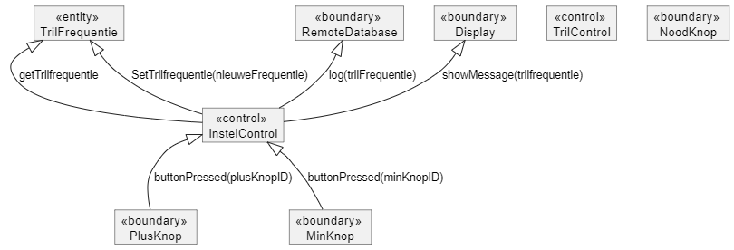

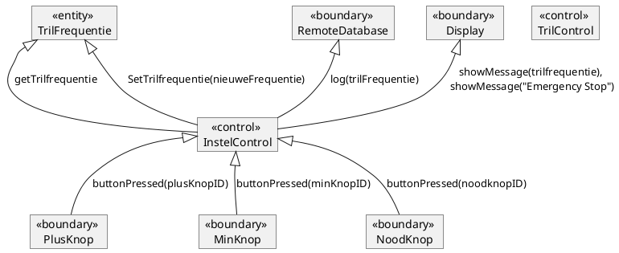
```plantuml
@startuml

hide attributes

object "<<entity>> \nTrilFrequentie" as O1
object "<<control>> \nTrilControl" as O2
object "<<control>> \nInstelControl" as O4
object "<<boundary>> \nRemoteDatabase" as O5
object "<<boundary>> \nPlusKnop" as O6
object "<<boundary>> \nMinKnop" as O7
object "<<boundary>> \nNoodKnop" as O8
object "<<boundary>> \nDisplay" as O9

O1 <|-- O4 : getTrilfrequentie
O1 <|-- O4 : SetTrilfrequentie(nieuweFrequentie)
O5 <|-- O4 : log(trilFrequentie)
O4 <|-- O6 : buttonPressed(plusKnopID)
O4 <|-- O7 : buttonPressed(minKnopID)
O9 <|-- O4 : showMessage(trilfrequentie), \nshowMessage("Emergency Stop")
O4 <|-- O8 : buttonPressed(noodknopID)
@enduml
```

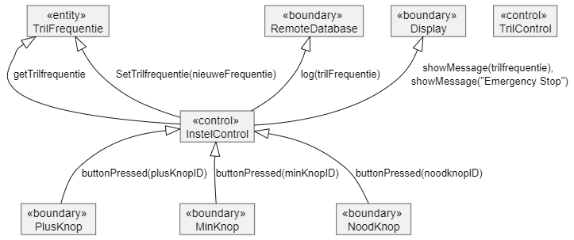

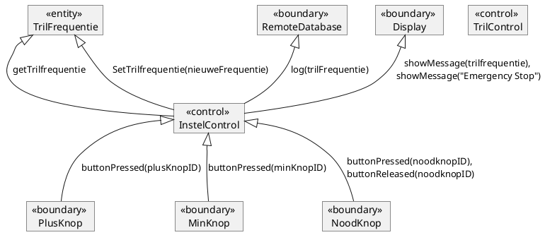
```plantuml
@startuml

hide attributes

object "<<entity>> \nTrilFrequentie" as O1
object "<<control>> \nTrilControl" as O2
object "<<control>> \nInstelControl" as O4
object "<<boundary>> \nRemoteDatabase" as O5
object "<<boundary>> \nPlusKnop" as O6
object "<<boundary>> \nMinKnop" as O7
object "<<boundary>> \nNoodKnop" as O8
object "<<boundary>> \nDisplay" as O9

O1 <|-- O4 : getTrilfrequentie
O1 <|-- O4 : SetTrilfrequentie(nieuweFrequentie)
O5 <|-- O4 : log(trilFrequentie)
O4 <|-- O6 : buttonPressed(plusKnopID)
O4 <|-- O7 : buttonPressed(minKnopID)
O9 <|-- O4 : showMessage(trilfrequentie), \nshowMessage("Emergency Stop")
O4 <|-- O8 : buttonPressed(noodknopID), \nbuttonReleased(noodknopID)
@enduml
```

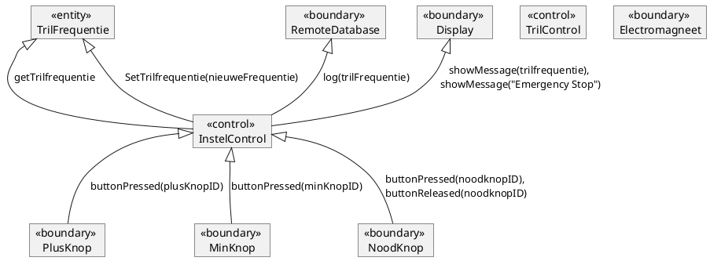
```plantuml
@startuml

hide attributes

object "<<entity>> \nTrilFrequentie" as O1
object "<<control>> \nTrilControl" as O2
object "<<boundary>> \nElectromagneet" as O3
object "<<control>> \nInstelControl" as O4
object "<<boundary>> \nRemoteDatabase" as O5
object "<<boundary>> \nPlusKnop" as O6
object "<<boundary>> \nMinKnop" as O7
object "<<boundary>> \nNoodKnop" as O8
object "<<boundary>> \nDisplay" as O9

O1 <|-- O4 : getTrilfrequentie
O1 <|-- O4 : SetTrilfrequentie(nieuweFrequentie)
O5 <|-- O4 : log(trilFrequentie)
O4 <|-- O6 : buttonPressed(plusKnopID)
O4 <|-- O7 : buttonPressed(minKnopID)
O9 <|-- O4 : showMessage(trilfrequentie), \nshowMessage("Emergency Stop")
O4 <|-- O8 : buttonPressed(noodknopID), \nbuttonReleased(noodknopID)
@enduml
```

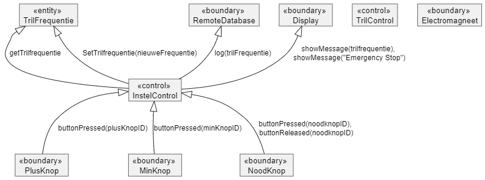

```plantuml
@startuml

hide attributes

object "<<entity>> \nTrilFrequentie" as O1
object "<<control>> \nTrilControl" as O2
object "<<boundary>> \nElectromagneet" as O3
object "<<control>> \nInstelControl" as O4
object "<<boundary>> \nRemoteDatabase" as O5
object "<<boundary>> \nPlusKnop" as O6
object "<<boundary>> \nMinKnop" as O7
object "<<boundary>> \nNoodKnop" as O8
object "<<boundary>> \nDisplay" as O9

O1 <|-- O4 : getTrilfrequentie
O1 <|-- O4 : SetTrilfrequentie(nieuweFrequentie)
O5 <|-- O4 : log(trilFrequentie)
O4 <|-- O6 : buttonPressed(plusKnopID)
O4 <|-- O7 : buttonPressed(minKnopID)
O9 <|-- O4 : showMessage(trilfrequentie), \nshowMessage("Emergency Stop")
O4 <|-- O8 : buttonPressed(noodknopID), \nbuttonReleased(noodknopID)
O3 <|-- O2 : zetUit
@enduml
```

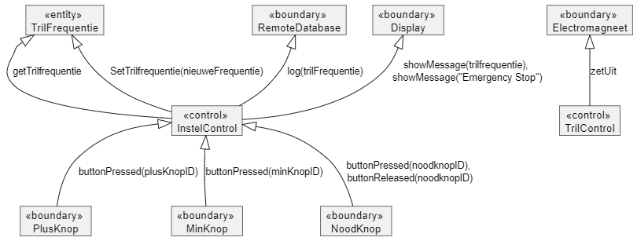

```plantuml
@startuml

hide attributes

object "<<entity>> \nTrilFrequentie" as O1
object "<<control>> \nTrilControl" as O2
object "<<boundary>> \nElectromagneet" as O3
object "<<control>> \nInstelControl" as O4
object "<<boundary>> \nRemoteDatabase" as O5
object "<<boundary>> \nPlusKnop" as O6
object "<<boundary>> \nMinKnop" as O7
object "<<boundary>> \nNoodKnop" as O8
object "<<boundary>> \nDisplay" as O9
object "<<boundary>> \nTrilKnop" as O10

O1 <|-- O4 : getTrilfrequentie
O1 <|-- O4 : SetTrilfrequentie(nieuweFrequentie)
O5 <|-- O4 : log(trilFrequentie)
O4 <|-- O6 : buttonPressed(plusKnopID)
O4 <|-- O7 : buttonPressed(minKnopID)
O9 <|-- O4 : showMessage(trilfrequentie), \nshowMessage("Emergency Stop")
O4 <|-- O8 : buttonPressed(noodknopID), \nbuttonReleased(noodknopID)
O3 <|-- O2 : zetUit
@enduml
```

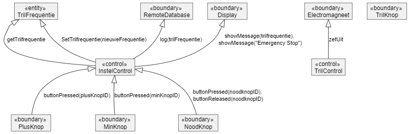

```plantuml
@startuml

hide attributes

object "<<entity>> \nTrilFrequentie" as O1
object "<<control>> \nTrilControl" as O2
object "<<boundary>> \nElectromagneet" as O3
object "<<control>> \nInstelControl" as O4
object "<<boundary>> \nRemoteDatabase" as O5
object "<<boundary>> \nPlusKnop" as O6
object "<<boundary>> \nMinKnop" as O7
object "<<boundary>> \nNoodKnop" as O8
object "<<boundary>> \nDisplay" as O9
object "<<boundary>> \nTrilKnop" as O10

O1 <|-- O4 : getTrilfrequentie
O1 <|-- O4 : SetTrilfrequentie(nieuweFrequentie)
O5 <|-- O4 : log(trilFrequentie)
O4 <|-- O6 : buttonPressed(plusKnopID)
O4 <|-- O7 : buttonPressed(minKnopID)
O9 <|-- O4 : showMessage(trilfrequentie), \nshowMessage("Emergency Stop")
O4 <|-- O8 : buttonPressed(noodknopID), \nbuttonReleased(noodknopID)
O1 <|-- O2 : getTrilfrequentie
O2 <|-- O10 : buttonPressed(trilKnopID)
O3 <|-- O2 : zetAan, zetUit
@enduml
```

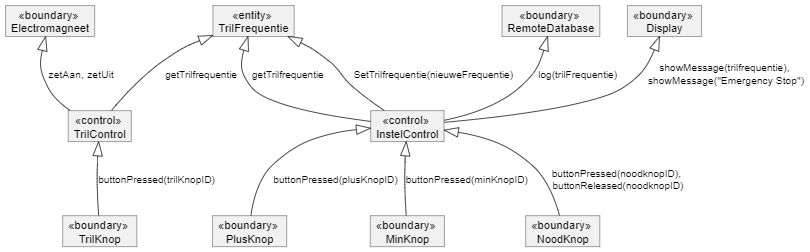

```plantuml
@startuml

hide attributes

object "<<entity>> \nTrilFrequentie" as O1
object "<<control>> \nTrilControl" as O2
object "<<boundary>> \nElectromagneet" as O3
object "<<control>> \nInstelControl" as O4
object "<<boundary>> \nRemoteDatabase" as O5
object "<<boundary>> \nPlusKnop" as O6
object "<<boundary>> \nMinKnop" as O7
object "<<boundary>> \nNoodKnop" as O8
object "<<boundary>> \nDisplay" as O9
object "<<boundary>> \nTrilKnop" as O10

O1 <|-- O4 : getTrilfrequentie
O1 <|-- O4 : SetTrilfrequentie(nieuweFrequentie)
O5 <|-- O4 : log(trilFrequentie)
O4 <|-- O6 : buttonPressed(plusKnopID)
O4 <|-- O7 : buttonPressed(minKnopID)
O9 <|-- O4 : showMessage(trilfrequentie), \nshowMessage("Emergency Stop")
O4 <|-- O8 : buttonPressed(noodknopID), \nbuttonReleased(noodknopID)
O1 <|-- O2 : getTrilfrequentie
O2 <|-- O10 : buttonPressed(trilKnopID)
O3 <|-- O2 : zetAan, zetUit
O2 <|-- O8 :  buttonPressed(noodKnopID)
@enduml
```

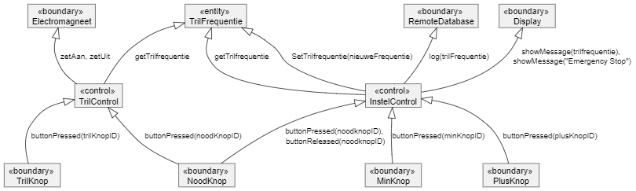

```plantuml
@startuml

hide attributes

object "<<entity>> \nTrilFrequentie" as O1
object "<<control>> \nTrilControl" as O2
object "<<boundary>> \nElectromagneet" as O3
object "<<control>> \nInstelControl" as O4
object "<<boundary>> \nRemoteDatabase" as O5
object "<<boundary>> \nPlusKnop" as O6
object "<<boundary>> \nMinKnop" as O7
object "<<boundary>> \nNoodKnop" as O8
object "<<boundary>> \nDisplay" as O9
object "<<boundary>> \nTrilKnop" as O10

O1 <|-- O4 : getTrilfrequentie
O1 <|-- O4 : SetTrilfrequentie(nieuweFrequentie)
O5 <|-- O4 : log(trilFrequentie)
O4 <|-- O6 : buttonPressed(plusKnopID)
O4 <|-- O7 : buttonPressed(minKnopID)
O9 <|-- O4 : showMessage(trilfrequentie), \nshowMessage("Emergency Stop")
O4 <|-- O8 : buttonPressed(noodknopID), \nbuttonReleased(noodknopID)
O1 <|-- O2 : getTrilfrequentie
O2 <|-- O10 : buttonPressed(trilKnopID)
O3 <|-- O2 : zetAan, zetUit
O2 <|-- O8 :  buttonPressed(noodKnopID),\nbuttonReleased(noodKnopID)
@enduml
```

```plantuml
@startuml
class "<<entity>> \nTrilFrequentie" as c1
class "<<control>> \nTrilControl" as c2
class "<<boundary>> \nElectromagneet" as c3
class "<<control>> \nInstelControl" as c4
class "<<boundary>> \nRemoteDatabase" as c5
class "<<boundary>> \nPlusKnop" as c6
class "<<boundary>> \nMinKnop" as c7
class "<<boundary>> \nNoodKnop" as c8
class "<<boundary>> \nDisplay" as c9
class "<<boundary>> \nTrilKnop" as c10

c1 <|-- c4 : getTrilfrequentie
c1 <|-- c4 : SetTrilfrequentie(nieuweFrequentie)
c5 <|-- c4 : log(trilFrequentie)
c4 <|-- c6 : buttonPressed(plusKnopID)
c4 <|-- c7 : buttonPressed(minKnopID)
c9 <|-- c4 : showMessage(trilfrequentie), \nshowMessage("Emergency Stop")
c4 <|-- c8 : buttonPressed(noodknopID), \nbuttonReleased(noodknopID)
c1 <|-- c2 : getTrilfrequentie
c2 <|-- c10 : buttonPressed(trilKnopID)
c3 <|-- c2 : zetAan, zetUit
c2 <|-- c8 :  buttonPressed(noodKnopID),\nbuttonReleased(noodKnopID)


@enduml
```

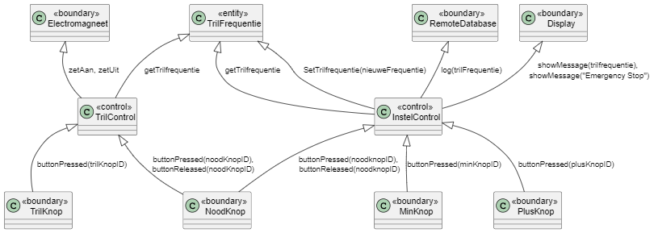

```plantuml
@startuml

skinparam classAttributeIconSize 0

class "<<entity>> \nTrilFrequentie" as c1
class "<<control>> \nTrilControl" as c2
class "<<boundary>> \nElectromagneet" as c3
class "<<control>> \nInstelControl" as c4
class "<<boundary>> \nRemoteDatabase" as c5
class "<<boundary>> \nPlusKnop" as c6
class "<<boundary>> \nMinKnop" as c7
class "<<boundary>> \nNoodKnop" as c8
class "<<boundary>> \nDisplay" as c9
class "<<boundary>> \nTrilKnop" as c10

c1 <|-- c4 
c1 <|-- c4 
c1 : +getTrilfrequentie():int
c1 : +SetTrilfrequentie(freq:int)
c5 <|-- c4 
c5 : +log(trilFrequentie)
c4 <|-- c6 
c4 : +buttonPressed(buttonID:ebuttonID)
c4 : +buttonReleased(buttonID:ebuttonID)
c4 <|-- c7 
c9 <|-- c4 
c9 : +showMessage(str:string)
c4 <|-- c8 
c2 <|-- c8 
c2 : +buttonPressed(buttonID:ebuttonID)
c2 : +buttonReleased(buttonID:ebuttonID)
c3 <|-- c2
c3  : +ZetAan()
c3 : +Zetuit()
c2 <|-- c10
c1 <|-- c2 
@enduml
```

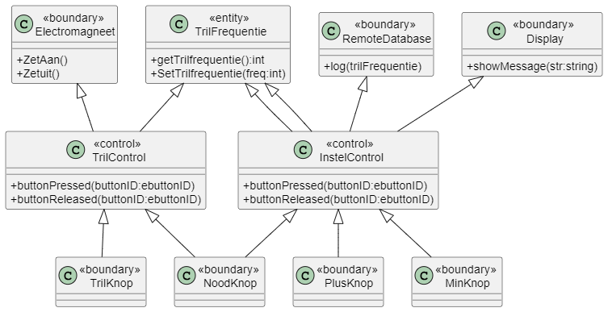

```plantuml
@startuml
skinparam classAttributeIconSize 0

class "<<entity>> \nTrilFrequentie" as c1
class "<<control>> \nTrilControl" as c2
class "<<boundary>> \nElectromagneet" as c3
class "<<control>> \nInstelControl" as c4
class "<<boundary>> \nRemoteDatabase" as c5
class "<<boundary>> \nPlusKnop" as c6
class "<<boundary>> \nMinKnop" as c7
class "<<boundary>> \nNoodKnop" as c8
class "<<boundary>> \nDisplay" as c9
class "<<boundary>> \nTrilKnop" as c10

c1 <|-- c4 
c1 : +getTrilfrequentie():int
c1 : +SetTrilfrequentie(freq:int)
c5 <|-- c4 
c5 : +log(trilFrequentie)
c4 <|-- c6 
c4 : +buttonPressed(buttonID:ebuttonID)
c4 : +buttonReleased(buttonID:ebuttonID)
c4 <|-- c7 
c9 <|-- c4 
c9 : +showMessage(str:string)
c4 <|-- c8 
c2 <|-- c8 
c2 : +buttonPressed(buttonID:ebuttonID)
c2 : +buttonReleased(buttonID:ebuttonID)
c3 <|-- c2
c3  : +ZetAan()
c3 : +Zetuit()
c2 <|-- c10
c1 <|-- c2 
@enduml
```

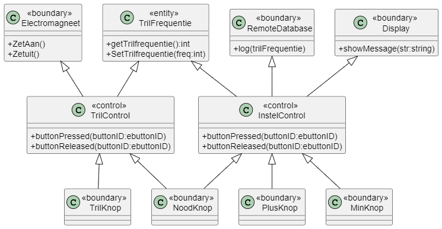

```plantuml
@startuml
skinparam classAttributeIconSize 0

class "<<entity>> \nTrilFrequentie" as c1
class "<<control>> \nTrilControl" as c2
class "<<boundary>> \nElectromagneet" as c3
class "<<control>> \nInstelControl" as c4
class "<<boundary>> \nRemoteDatabase" as c5
class "<<boundary>> \nNoodKnop" as c8
class "<<boundary>> \nDisplay" as c9
class "<<boundary>> \nTrilKnop" as c10
class "<<boundary>> \nInstelControlKnop" as c11

c1 <|-- c4 
c1 : +getTrilfrequentie():int
c1 : +SetTrilfrequentie(freq:int)
c5 <|-- c4 
c5 : +log(trilFrequentie)
c4 <|-- c11 
c4 : +buttonPressed(buttonID:ebuttonID)
c4 : +buttonReleased(buttonID:ebuttonID)
c9 <|-- c4 
c9 : +showMessage(str:string)
c4 <|-- c8 
c2 <|-- c8 
c2 : +buttonPressed(buttonID:ebuttonID)
c2 : +buttonReleased(buttonID:ebuttonID)
c3 <|-- c2
c3  : +ZetAan()
c3 : +Zetuit()
c2 <|-- c10
c1 <|-- c2 
@enduml
```

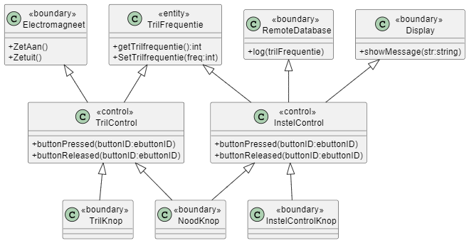

```plantuml
@startuml
skinparam classAttributeIconSize 0

class "<<entity>> \nTrilFrequentie" as c1
c1 : +getTrilfrequentie():int
c1 : +SetTrilfrequentie(freq:int)
class "<<control>> \nTrilControl" as c2
c2 : -trilKnop:TrilKnop 
c2 : -electromagneet:Electromagneet
c2 : +buttonPressed(buttonID:ebuttonID)
c2 : +buttonReleased(buttonID:ebuttonID)
class "<<boundary>> \nElectromagneet" as c3
c3  : +ZetAan()
c3 : +Zetuit()
class "<<control>> \nInstelControl" as c4
c4 : -remDB:RemoteDataBase
c4 : -display:Display
c4 : -plusKnop:InstelControlKnop
c4 : -minKnop:InstelControlKnop
c4 : +buttonPressed(buttonID:ebuttonID)
c4 : +buttonReleased(buttonID:ebuttonID)
class "<<boundary>> \nRemoteDatabase" as c5
c5 : +log(trilFrequentie)
class "<<boundary>> \nNoodKnop" as c8
class "<<boundary>> \nDisplay" as c9
c9 : +showMessage(str:string)
class "<<boundary>> \nTrilKnop" as c10
class "<<boundary>> \nInstelControlKnop" as c11

c1 <|-- c4 
c5 --* c4 
c4 <|-- c11 
c4 *-- c11
c9 --* c4 
c4 <|-- c8 
c2 <|-- c8 
c3 --* c2
c2 <|-- c10
c10 --* c2
c1 <|-- c2 
@enduml
```

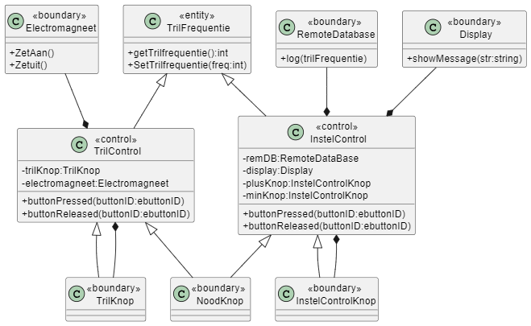

```plantuml
@startuml
skinparam classAttributeIconSize 0

class "<<entity>> \nTrilFrequentie" as c1
c1 : +getTrilfrequentie():int
c1 : +SetTrilfrequentie(freq:int)
class "<<control>> \nTrilControl" as c2
c2 : -trilKnop:TrilKnop 
c2 : -electromagneet:Electromagneet
c2 : -trilFrequentie:Trilfrequentie&
c2 : +buttonPressed(buttonID:ebuttonID)
c2 : +buttonReleased(buttonID:ebuttonID)
class "<<boundary>> \nElectromagneet" as c3
c3  : +ZetAan()
c3 : +Zetuit()
class "<<control>> \nInstelControl" as c4
c4 : -remDB:RemoteDataBase
c4 : -display:Display
c4 : -plusKnop:InstelControlKnop
c4 : -minKnop:InstelControlKnop
c4 : -trilFrequentie:Trilfrequentie&
c4 : +buttonPressed(buttonID:ebuttonID)
c4 : +buttonReleased(buttonID:ebuttonID)
class "<<boundary>> \nRemoteDatabase" as c5
c5 : +log(trilFrequentie)
class "<<boundary>> \nNoodKnop" as c8
c8 : -instelControl:InstelControl&
c8 : -trilControl:TrilControl&
class "<<boundary>> \nDisplay" as c9
c9 : +showMessage(str:string)
class "<<boundary>> \nTrilKnop" as c10
c10 : -trilControl:TrilControl&
class "<<boundary>> \nInstelControlKnop" as c11
c11 : -instelControl:InstelControl&

c1 <|-- c4 
c5 --* c4 
c4 <|-- c11 
c4 *-- c11
c9 --* c4 
c4 <|-- c8 
c2 <|-- c8 
c3 --* c2
c2 <|-- c10
c10 --* c2
c1 <|-- c2 
@enduml
```
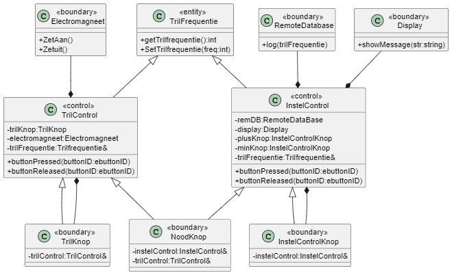

```plantuml
@startuml
skinparam classAttributeIconSize 0

class "<<entity>> \nTrilFrequentie" as c1
c1 : +getTrilfrequentie():int
c1 : +SetTrilfrequentie(freq:int)
class "<<control>> \nTrilControl" as c2
c2 : -trilKnop:Button
c2 : -electromagneet:Electromagneet
c2 : -trilFrequentie:Trilfrequentie&
c2 : +buttonPressed(buttonID:ebuttonID)
c2 : +buttonReleased(buttonID:ebuttonID)
class "<<boundary>> \nElectromagneet" as c3
c3  : +ZetAan()
c3 : +Zetuit()
class "<<control>> \nInstelControl" as c4
c4 : -remDB:RemoteDataBase
c4 : -display:Display
c4 : -plusKnop:Button
c4 : -minKnop:Button
c4 : -trilFrequentie:Trilfrequentie&
c4 : +buttonPressed(buttonID:ebuttonID)
c4 : +buttonReleased(buttonID:ebuttonID)
class "<<boundary>> \nRemoteDatabase" as c5
c5 : +log(trilFrequentie)
class "<<boundary>> \nDisplay" as c9
c9 : +showMessage(str:string)
class "<<boundary>> \nButton" as c12
c12 : -buttonListeners:ButtonListener*[]
c12 : +addButtonListener(ButtonListener*)
class "<<interface>> \nButtonListener" as c13
c13 : +buttonPressed(buttonID:ebuttonID)
c13 : +buttonReleased(buttonID:ebuttonID)

c1 <|-- c4 
c5 --* c4 
c9 --* c4 
c3 --* c2
c1 <|-- c2 
c12 --* c4
c12 --* c2
c13 <|-- c12
c13 <|.. c2
c13 <|.. c4

@enduml
```
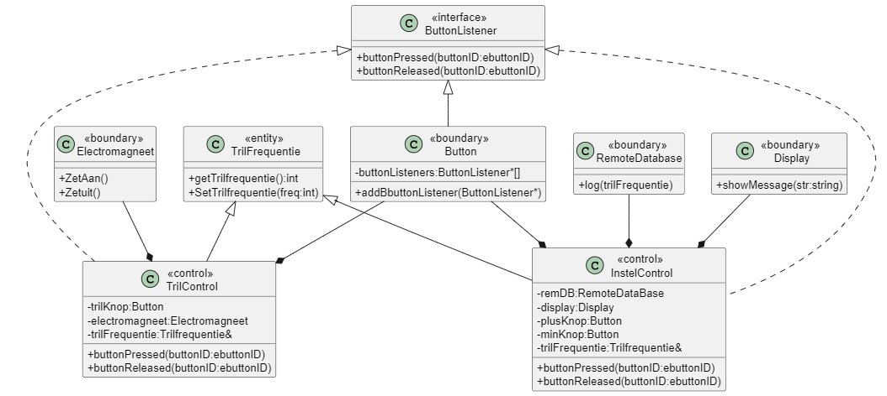

```plantuml
@startuml
skinparam classAttributeIconSize 0

class "<<entity>> \nTrilFrequentie" as c1
c1 : +getTrilfrequentie():int
c1 : +SetTrilfrequentie(freq:int)
class "<<control>> \nTrilControl" as c2
c2 : -trilKnop:Button
c2 : -noodKnop:Button&
c2 : -electromagneet:Electromagneet
c2 : -trilFrequentie:Trilfrequentie&
c2 : +buttonPressed(buttonID:ebuttonID)
c2 : +buttonReleased(buttonID:ebuttonID)
class "<<boundary>> \nElectromagneet" as c3
c3  : +ZetAan()
c3 : +Zetuit()
class "<<control>> \nInstelControl" as c4
c4 : -remDB:RemoteDataBase
c4 : -display:Display
c4 : -plusKnop:Button
c4 : -minKnop:Button
c4 : -noodKnop:Button&
c4 : -trilFrequentie:Trilfrequentie&
c4 : +buttonPressed(buttonID:ebuttonID)
c4 : +buttonReleased(buttonID:ebuttonID)
class "<<boundary>> \nRemoteDatabase" as c5
c5 : +log(trilFrequentie)
class "<<boundary>> \nDisplay" as c9
c9 : +showMessage(str:string)
class "<<boundary>> \nButton" as c12
c12 : -buttonListeners:ButtonListener*[]
c12 : +addButtonListener(ButtonListener*)
class "<<interface>> \nButtonListener" as c13
c13 : +buttonPressed(buttonID:ebuttonID)
c13 : +buttonReleased(buttonID:ebuttonID)

c1 <|-- c4 
c5 --* c4 
c9 --* c4 
c3 --* c2
c1 <|-- c2 
c12 --* c4
c12 --* c2
c13 <|-- c12
c13 <|.. c2
c13 <|.. c4
c12 <|-- c2
c12 <|-- c4
@enduml
```
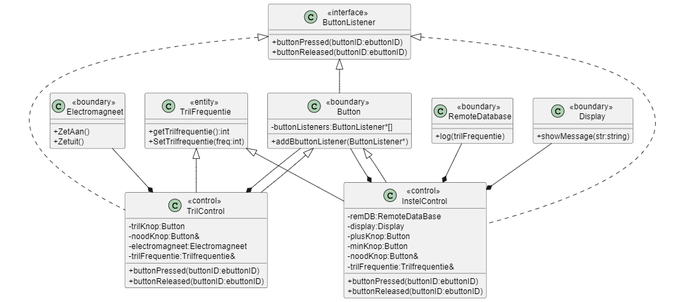

```plantuml
@startuml
skinparam classAttributeIconSize 0

class "<<entity>> \nTrilFrequentie" as c1
c1 : +getTrilfrequentie():int
c1 : +SetTrilfrequentie(freq:int)
class "<<control>>\n<<isActive>>\nTrilControl" as c2
c2 : -trilKnop:Button
c2 : -noodKnop:Button&
c2 : -electromagneet:Electromagneet
c2 : -trilFrequentie:Trilfrequentie&
c2 : +buttonPressed(buttonID:ebuttonID)
c2 : +buttonReleased(buttonID:ebuttonID)
class "<<boundary>> \nElectromagneet" as c3
c3  : +ZetAan()
c3 : +Zetuit()
class "<<control>>\n<<isActive>>\nInstelControl" as c4
c4 : -remDB:RemoteDataBase
c4 : -display:Display
c4 : -plusKnop:Button
c4 : -minKnop:Button
c4 : -noodKnop:Button&
c4 : -trilFrequentie:Trilfrequentie&
c4 : +buttonPressed(buttonID:ebuttonID)
c4 : +buttonReleased(buttonID:ebuttonID)
class "<<boundary>>\n<<isActive>>\nRemoteDatabase" as c5
c5 : +log(trilFrequentie)
class "<<boundary>>\n<<isActive>>\nDisplay" as c9
c9 : +showMessage(str:string)
class "<<boundary>>\n<<isActive>>\nButton" as c12
c12 : -buttonListeners:ButtonListener*[]
c12 : +addButtonListener(ButtonListener*)
class "<<interface>> \nButtonListener" as c13
c13 : +buttonPressed(buttonID:ebuttonID)
c13 : +buttonReleased(buttonID:ebuttonID)

c1 <|-- c4 
c5 --* c4 
c9 --* c4 
c3 --* c2
c1 <|-- c2 
c12 --* c4
c12 --* c2
c13 <|-- c12
c13 <|.. c2
c13 <|.. c4
c12 <|-- c2
c12 <|-- c4
@enduml
```

```plantuml
@startuml
skinparam classAttributeIconSize 0

class "<<entity>> \nTrilFrequentie" as c1
c1 : +getTrilfrequentie():int
c1 : +SetTrilfrequentie(freq:int)
class "<<control>>\n<<isActive>>\nTrilControl" as c2
c2 : -trilKnop:Button
c2 : -noodKnop:Button&
c2 : -electromagneet:Electromagneet
c2 : -trilFrequentie:Trilfrequentie&
c2 : +buttonPressed(buttonID:ebuttonID)
c2 : +buttonReleased(buttonID:ebuttonID)
class "<<boundary>> \nElectromagneet" as c3
c3  : +ZetAan()
c3 : +Zetuit()
class "<<control>>\n<<isActive>>\nInstelControl" as c4
c4 : -remDB:RemoteDataBase
c4 : -display:Display
c4 : -plusKnop:Button
c4 : -minKnop:Button
c4 : -noodKnop:Button&
c4 : -trilFrequentie:Trilfrequentie&
c4 : +buttonPressed(buttonID:ebuttonID)
c4 : +buttonReleased(buttonID:ebuttonID)
class "<<boundary>>\n<<isActive>>\nRemoteDatabase" as c5
c5 : +log(trilFrequentie)
class "<<boundary>>\n<<isActive>>\nDisplay" as c9
c9 : +showMessage(str:string)
class "<<boundary>>\nButton" as c12
c12 : -buttonListeners:ButtonListener*[]
c12 : +addButtonListener(ButtonListener*)
class "<<interface>> \nButtonListener" as c13
c13 : +buttonPressed(buttonID:ebuttonID)
c13 : +buttonReleased(buttonID:ebuttonID)
class "<<isActive>>\nButtonHandler" as c14
c14 : -buttons:Button*[]
c14 : +addButton(bn:Button*)

c1 <|-- c4 
c5 --* c4 
c9 --* c4 
c3 --* c2
c1 <|-- c2 
c12 --* c4
c12 --* c2
c13 <|-- c12
c13 <|.. c2
c13 <|.. c4
c12 <|-- c2
c12 <|-- c4
c14 <|.. c4
c14 <|.. c2
c12 <|-- c14
@enduml
```

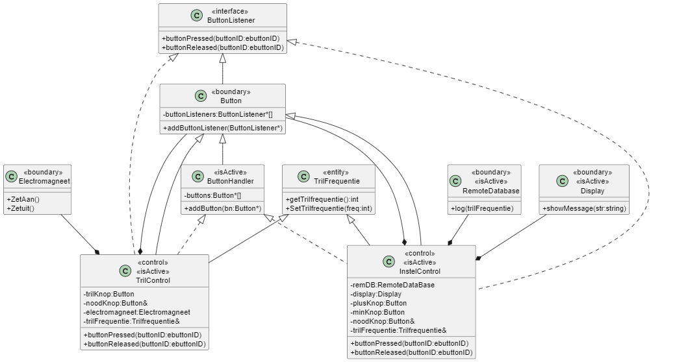

```plantuml
@startuml
skinparam classAttributeIconSize 0

class "<<entity>> \nTrilFrequentie" as c1
c1 : +getTrilfrequentie():int
c1 : +SetTrilfrequentie(freq:int)
class "<<control>>\n<<isActive>>\nTrilControl" as c2
c2 : -trilKnop:Button
c2 : -noodKnop:Button&
c2 : -electromagneet:Electromagneet
c2 : -trilFrequentie:Trilfrequentie&
c2 : +buttonPressed(buttonID:ebuttonID)
c2 : +buttonReleased(buttonID:ebuttonID)
class "<<boundary>> \nElectromagneet" as c3
c3  : +ZetAan()
c3 : +Zetuit()
class "<<control>>\n<<isActive>>\nInstelControl" as c4
c4 : -remDB:RemoteDataBase
c4 : -display:Display
c4 : -plusKnop:Button
c4 : -minKnop:Button
c4 : -noodKnop:Button&
c4 : -trilFrequentie:Trilfrequentie&
c4 : +buttonPressed(buttonID:ebuttonID)
c4 : +buttonReleased(buttonID:ebuttonID)
class "<<boundary>>\n<<isActive>>\nRemoteDatabase" as c5
c5 : +log(trilFrequentie)
class "<<boundary>>\n<<isActive>>\nDisplay" as c9
c9 : +showMessage(str:string)
class "<<boundary>>\nButton" as c12
c12 : -buttonListeners:ButtonListener*[]
c12 : +addButtonListener(ButtonListener*)
class "<<interface>> \nButtonListener" as c13
c13 : +buttonPressed(buttonID:ebuttonID)
c13 : +buttonReleased(buttonID:ebuttonID)
class "<<isActive>>\nButtonHandler" as c14
c14 : -buttons:Button*[]
c14 : +addButton(bn:Button*)

c1 <|-- c4 : 1 
c5 --* c4  : 1
c9 --* c4 : 1
c3 --* c2 : 1
c1 <|-- c2 : 1 
c12 --* c4 : 2
c12 --* c2  : 1
c13 <|-- c12 : *
c13 <|.. c2
c13 <|.. c4 
c12 <|-- c2 : 1
c12 <|-- c4 : 1 
c14 <|.. c4 : 1 
c14 <|.. c2 : 1
c12 <|-- c14 : * 
@enduml
```

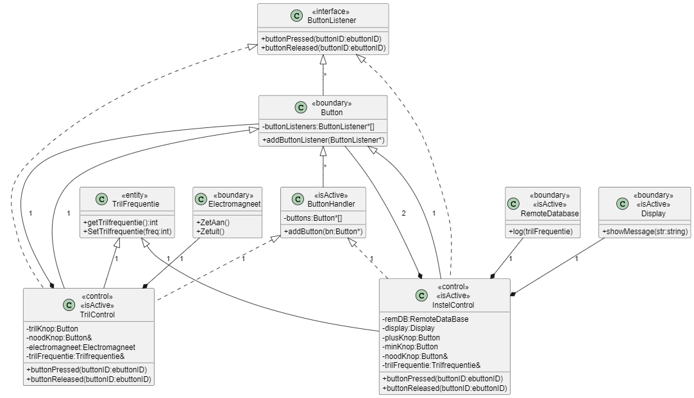

```plantuml
@startuml
hide empty description

[*] --> Normal

Normal --> Noodtoestand
state c5 <<choice>>
Noodtoestand --> c5 : bnReleaseID=\nbnReleaseChannel.read()
c5 --> Noodtoestand : [else]
c5 --> Normal : [bnReleaseID=NoodKnopID]
Noodtoestand --> Noodtoestand : [bnReleaseID=\nbnReleaseID=NoodKnopID]

state Normal {

state "NietTrillen" as nietTrillen
state "Trillen" as Trillen
state c4 <<choice>> 
state c1 <<choice>>
state c3 <<choice>>
state c2 <<choice>>

[*] --> nietTrillen
nietTrillen --> c1 : bnID=\nbnReleaseChannel.Read()
nietTrillen --> nietTrillen: dummyID=\nbnReleaseChannel.Read()
c1-->Trillen : [else]  
c1--> [*] : [bnID=noodKnopID]
Trillen --> c2 : bnID=\nbnPressChannel.read()
c2--> [*] : [bnID=noodKnopID]
c2--> nietTrillen : [else]
Trillen ----> Trillen : dummyID=bnReleaseChannel.Read()
Trillen --> c3 : after(1/trilFrequentie.getTrilfrequentie()/2)\n/bMagneetEnabled=!bMagneetEnabled
c3 --> c4 : [else]\n/electromagneet.zetUit()
c3 --> c4 : [bMagneetEnabled]\n/electromagneet.zetAan()
c4--> Trillen 
} 
@enduml
```

