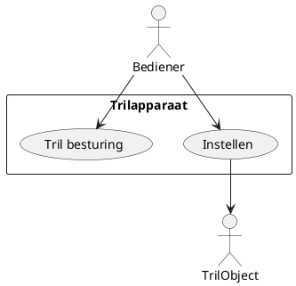
```plantuml
@startuml

rectangle Trilapparaat {
usecase "Instellen" as UC1
usecase "Tril besturing" as UC2
}
Bediener --> UC1
Bediener --> UC2
UC1 --> TrilObject

@enduml
```

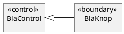
```plantuml
@startuml

left to right direction
object "<<boundary>> \nBlaKnop" as O1
object "<<control>> \nBlaControl" as O2

O2 <|-- O1

@enduml
```

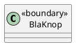
```plantuml
@startuml

class "<<boundary>> \nBlaKnop" as c1

@enduml
```

```plantuml
@startuml

hide attributes

object "TrilControl" as O2
object "InstelControl" as O4

@enduml
```

```plantuml
@startuml

hide attributes

object "<<control>> \nTrilControl" as O2
object "<<control>> \nInstelControl" as O4

@enduml
```

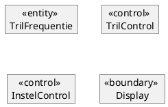
```plantuml
@startuml

hide attributes

object "<<entity>> \nTrilFrequentie" as O1
object "<<control>> \nTrilControl" as O2
object "<<control>> \nInstelControl" as O4
object "<<boundary>> \nDisplay" as O9

@enduml
```

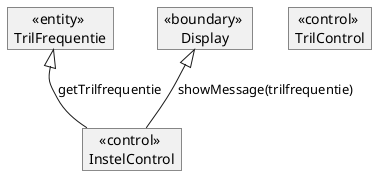
```plantuml
@startuml

hide attributes

object "<<entity>> \nTrilFrequentie" as O1
object "<<control>> \nTrilControl" as O2
object "<<control>> \nInstelControl" as O4
object "<<boundary>> \nDisplay" as O9

O1 <|-- O4 : getTrilfrequentie
O9 <|-- O4 : showMessage(trilfrequentie)

@enduml
```

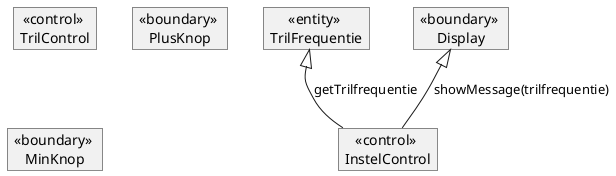
```plantuml
@startuml

hide attributes

object "<<entity>> \nTrilFrequentie" as O1
object "<<control>> \nTrilControl" as O2
object "<<control>> \nInstelControl" as O4
object "<<boundary>> \nPlusKnop" as O6
object "<<boundary>> \nMinKnop" as O7
object "<<boundary>> \nDisplay" as O9

O1 <|-- O4 : getTrilfrequentie
O9 <|-- O4 : showMessage(trilfrequentie)

@enduml
```

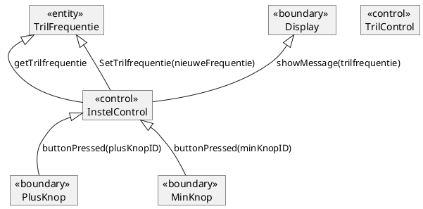
```plantuml
@startuml

hide attributes

object "<<entity>> \nTrilFrequentie" as O1
object "<<control>> \nTrilControl" as O2
object "<<control>> \nInstelControl" as O4
object "<<boundary>> \nPlusKnop" as O6
object "<<boundary>> \nMinKnop" as O7
object "<<boundary>> \nDisplay" as O9

O1 <|-- O4 : getTrilfrequentie
O1 <|-- O4 : SetTrilfrequentie(nieuweFrequentie)
O4 <|-- O6 : buttonPressed(plusKnopID)
O4 <|-- O7 : buttonPressed(minKnopID)
O9 <|-- O4 : showMessage(trilfrequentie)

@enduml
```

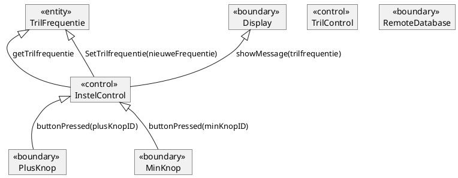
```plantuml
@startuml

hide attributes

object "<<entity>> \nTrilFrequentie" as O1
object "<<control>> \nTrilControl" as O2
object "<<control>> \nInstelControl" as O4
object "<<boundary>> \nRemoteDatabase" as O5
object "<<boundary>> \nPlusKnop" as O6
object "<<boundary>> \nMinKnop" as O7
object "<<boundary>> \nDisplay" as O9

O1 <|-- O4 : getTrilfrequentie
O1 <|-- O4 : SetTrilfrequentie(nieuweFrequentie)
O4 <|-- O6 : buttonPressed(plusKnopID)
O4 <|-- O7 : buttonPressed(minKnopID)
O9 <|-- O4 : showMessage(trilfrequentie)

@enduml
```

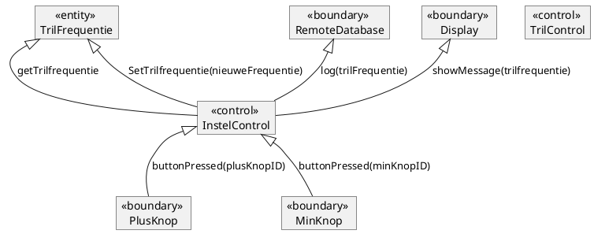
```plantuml
@startuml

hide attributes

object "<<entity>> \nTrilFrequentie" as O1
object "<<control>> \nTrilControl" as O2
object "<<control>> \nInstelControl" as O4
object "<<boundary>> \nRemoteDatabase" as O5
object "<<boundary>> \nPlusKnop" as O6
object "<<boundary>> \nMinKnop" as O7
object "<<boundary>> \nDisplay" as O9

O1 <|-- O4 : getTrilfrequentie
O1 <|-- O4 : SetTrilfrequentie(nieuweFrequentie)
O5 <|-- O4 : log(trilFrequentie)
O4 <|-- O6 : buttonPressed(plusKnopID)
O4 <|-- O7 : buttonPressed(minKnopID)
O9 <|-- O4 : showMessage(trilfrequentie)

@enduml
```

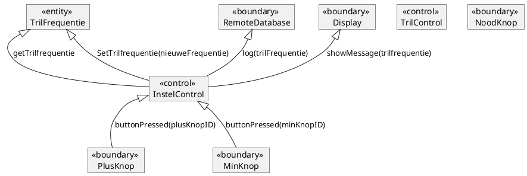
```plantuml
@startuml

hide attributes

object "<<entity>> \nTrilFrequentie" as O1
object "<<control>> \nTrilControl" as O2
object "<<control>> \nInstelControl" as O4
object "<<boundary>> \nRemoteDatabase" as O5
object "<<boundary>> \nPlusKnop" as O6
object "<<boundary>> \nMinKnop" as O7
object "<<boundary>> \nNoodKnop" as O8
object "<<boundary>> \nDisplay" as O9

O1 <|-- O4 : getTrilfrequentie
O1 <|-- O4 : SetTrilfrequentie(nieuweFrequentie)
O5 <|-- O4 : log(trilFrequentie)
O4 <|-- O6 : buttonPressed(plusKnopID)
O4 <|-- O7 : buttonPressed(minKnopID)
O9 <|-- O4 : showMessage(trilfrequentie)

@enduml
```

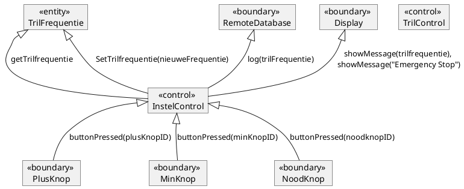
```plantuml
@startuml

hide attributes

object "<<entity>> \nTrilFrequentie" as O1
object "<<control>> \nTrilControl" as O2
object "<<control>> \nInstelControl" as O4
object "<<boundary>> \nRemoteDatabase" as O5
object "<<boundary>> \nPlusKnop" as O6
object "<<boundary>> \nMinKnop" as O7
object "<<boundary>> \nNoodKnop" as O8
object "<<boundary>> \nDisplay" as O9

O1 <|-- O4 : getTrilfrequentie
O1 <|-- O4 : SetTrilfrequentie(nieuweFrequentie)
O5 <|-- O4 : log(trilFrequentie)
O4 <|-- O6 : buttonPressed(plusKnopID)
O4 <|-- O7 : buttonPressed(minKnopID)
O9 <|-- O4 : showMessage(trilfrequentie), \nshowMessage("Emergency Stop")
O4 <|-- O8 : buttonPressed(noodknopID)
@enduml
```

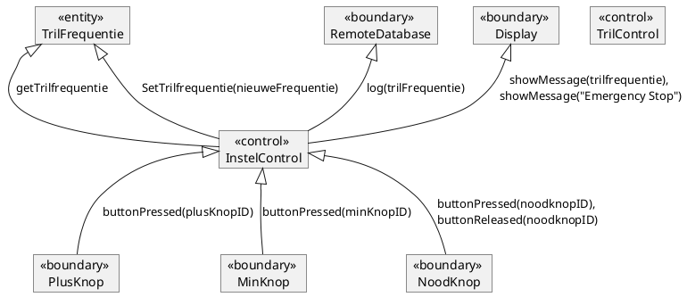
```plantuml
@startuml

hide attributes

object "<<entity>> \nTrilFrequentie" as O1
object "<<control>> \nTrilControl" as O2
object "<<control>> \nInstelControl" as O4
object "<<boundary>> \nRemoteDatabase" as O5
object "<<boundary>> \nPlusKnop" as O6
object "<<boundary>> \nMinKnop" as O7
object "<<boundary>> \nNoodKnop" as O8
object "<<boundary>> \nDisplay" as O9

O1 <|-- O4 : getTrilfrequentie
O1 <|-- O4 : SetTrilfrequentie(nieuweFrequentie)
O5 <|-- O4 : log(trilFrequentie)
O4 <|-- O6 : buttonPressed(plusKnopID)
O4 <|-- O7 : buttonPressed(minKnopID)
O9 <|-- O4 : showMessage(trilfrequentie), \nshowMessage("Emergency Stop")
O4 <|-- O8 : buttonPressed(noodknopID), \nbuttonReleased(noodknopID)
@enduml
```

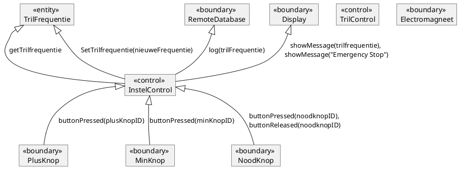
```plantuml
@startuml

hide attributes

object "<<entity>> \nTrilFrequentie" as O1
object "<<control>> \nTrilControl" as O2
object "<<boundary>> \nElectromagneet" as O3
object "<<control>> \nInstelControl" as O4
object "<<boundary>> \nRemoteDatabase" as O5
object "<<boundary>> \nPlusKnop" as O6
object "<<boundary>> \nMinKnop" as O7
object "<<boundary>> \nNoodKnop" as O8
object "<<boundary>> \nDisplay" as O9

O1 <|-- O4 : getTrilfrequentie
O1 <|-- O4 : SetTrilfrequentie(nieuweFrequentie)
O5 <|-- O4 : log(trilFrequentie)
O4 <|-- O6 : buttonPressed(plusKnopID)
O4 <|-- O7 : buttonPressed(minKnopID)
O9 <|-- O4 : showMessage(trilfrequentie), \nshowMessage("Emergency Stop")
O4 <|-- O8 : buttonPressed(noodknopID), \nbuttonReleased(noodknopID)
@enduml
```

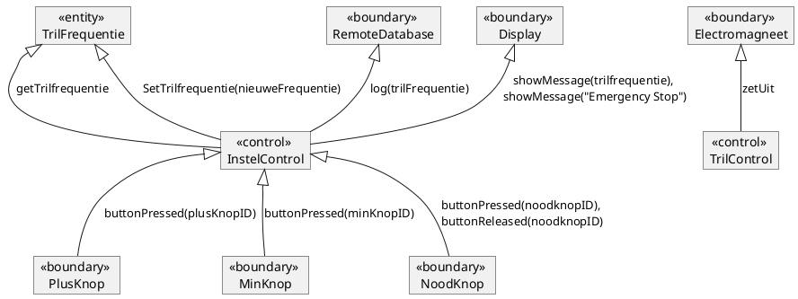
```plantuml
@startuml

hide attributes

object "<<entity>> \nTrilFrequentie" as O1
object "<<control>> \nTrilControl" as O2
object "<<boundary>> \nElectromagneet" as O3
object "<<control>> \nInstelControl" as O4
object "<<boundary>> \nRemoteDatabase" as O5
object "<<boundary>> \nPlusKnop" as O6
object "<<boundary>> \nMinKnop" as O7
object "<<boundary>> \nNoodKnop" as O8
object "<<boundary>> \nDisplay" as O9

O1 <|-- O4 : getTrilfrequentie
O1 <|-- O4 : SetTrilfrequentie(nieuweFrequentie)
O5 <|-- O4 : log(trilFrequentie)
O4 <|-- O6 : buttonPressed(plusKnopID)
O4 <|-- O7 : buttonPressed(minKnopID)
O9 <|-- O4 : showMessage(trilfrequentie), \nshowMessage("Emergency Stop")
O4 <|-- O8 : buttonPressed(noodknopID), \nbuttonReleased(noodknopID)
O3 <|-- O2 : zetUit
@enduml
```

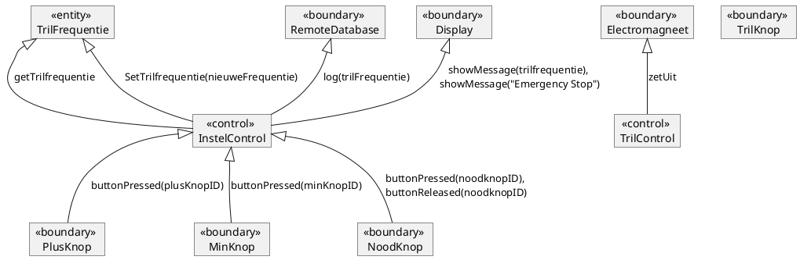
```plantuml
@startuml

hide attributes

object "<<entity>> \nTrilFrequentie" as O1
object "<<control>> \nTrilControl" as O2
object "<<boundary>> \nElectromagneet" as O3
object "<<control>> \nInstelControl" as O4
object "<<boundary>> \nRemoteDatabase" as O5
object "<<boundary>> \nPlusKnop" as O6
object "<<boundary>> \nMinKnop" as O7
object "<<boundary>> \nNoodKnop" as O8
object "<<boundary>> \nDisplay" as O9
object "<<boundary>> \nTrilKnop" as O10

O1 <|-- O4 : getTrilfrequentie
O1 <|-- O4 : SetTrilfrequentie(nieuweFrequentie)
O5 <|-- O4 : log(trilFrequentie)
O4 <|-- O6 : buttonPressed(plusKnopID)
O4 <|-- O7 : buttonPressed(minKnopID)
O9 <|-- O4 : showMessage(trilfrequentie), \nshowMessage("Emergency Stop")
O4 <|-- O8 : buttonPressed(noodknopID), \nbuttonReleased(noodknopID)
O3 <|-- O2 : zetUit
@enduml
```

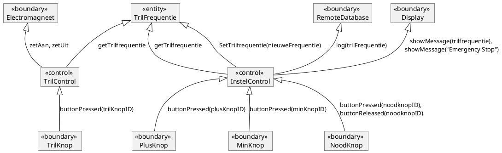
```plantuml
@startuml

hide attributes

object "<<entity>> \nTrilFrequentie" as O1
object "<<control>> \nTrilControl" as O2
object "<<boundary>> \nElectromagneet" as O3
object "<<control>> \nInstelControl" as O4
object "<<boundary>> \nRemoteDatabase" as O5
object "<<boundary>> \nPlusKnop" as O6
object "<<boundary>> \nMinKnop" as O7
object "<<boundary>> \nNoodKnop" as O8
object "<<boundary>> \nDisplay" as O9
object "<<boundary>> \nTrilKnop" as O10

O1 <|-- O4 : getTrilfrequentie
O1 <|-- O4 : SetTrilfrequentie(nieuweFrequentie)
O5 <|-- O4 : log(trilFrequentie)
O4 <|-- O6 : buttonPressed(plusKnopID)
O4 <|-- O7 : buttonPressed(minKnopID)
O9 <|-- O4 : showMessage(trilfrequentie), \nshowMessage("Emergency Stop")
O4 <|-- O8 : buttonPressed(noodknopID), \nbuttonReleased(noodknopID)
O1 <|-- O2 : getTrilfrequentie
O2 <|-- O10 : buttonPressed(trilKnopID)
O3 <|-- O2 : zetAan, zetUit
@enduml
```

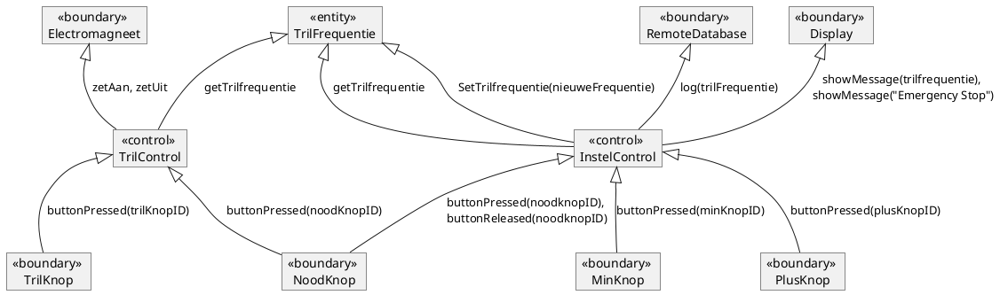
```plantuml
@startuml

hide attributes

object "<<entity>> \nTrilFrequentie" as O1
object "<<control>> \nTrilControl" as O2
object "<<boundary>> \nElectromagneet" as O3
object "<<control>> \nInstelControl" as O4
object "<<boundary>> \nRemoteDatabase" as O5
object "<<boundary>> \nPlusKnop" as O6
object "<<boundary>> \nMinKnop" as O7
object "<<boundary>> \nNoodKnop" as O8
object "<<boundary>> \nDisplay" as O9
object "<<boundary>> \nTrilKnop" as O10

O1 <|-- O4 : getTrilfrequentie
O1 <|-- O4 : SetTrilfrequentie(nieuweFrequentie)
O5 <|-- O4 : log(trilFrequentie)
O4 <|-- O6 : buttonPressed(plusKnopID)
O4 <|-- O7 : buttonPressed(minKnopID)
O9 <|-- O4 : showMessage(trilfrequentie), \nshowMessage("Emergency Stop")
O4 <|-- O8 : buttonPressed(noodknopID), \nbuttonReleased(noodknopID)
O1 <|-- O2 : getTrilfrequentie
O2 <|-- O10 : buttonPressed(trilKnopID)
O3 <|-- O2 : zetAan, zetUit
O2 <|-- O8 :  buttonPressed(noodKnopID)
@enduml
```

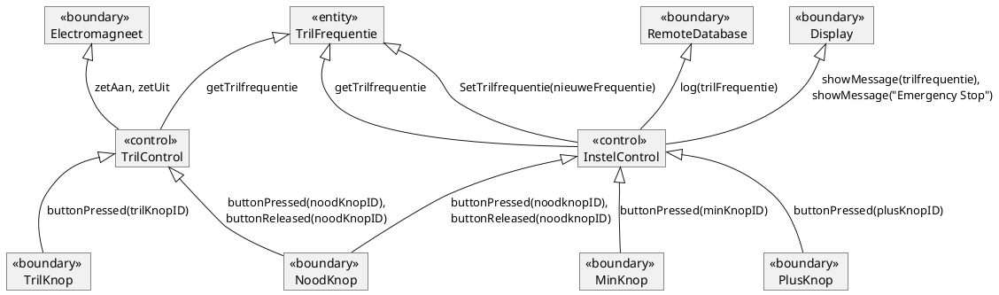
```plantuml
@startuml

hide attributes

object "<<entity>> \nTrilFrequentie" as O1
object "<<control>> \nTrilControl" as O2
object "<<boundary>> \nElectromagneet" as O3
object "<<control>> \nInstelControl" as O4
object "<<boundary>> \nRemoteDatabase" as O5
object "<<boundary>> \nPlusKnop" as O6
object "<<boundary>> \nMinKnop" as O7
object "<<boundary>> \nNoodKnop" as O8
object "<<boundary>> \nDisplay" as O9
object "<<boundary>> \nTrilKnop" as O10

O1 <|-- O4 : getTrilfrequentie
O1 <|-- O4 : SetTrilfrequentie(nieuweFrequentie)
O5 <|-- O4 : log(trilFrequentie)
O4 <|-- O6 : buttonPressed(plusKnopID)
O4 <|-- O7 : buttonPressed(minKnopID)
O9 <|-- O4 : showMessage(trilfrequentie), \nshowMessage("Emergency Stop")
O4 <|-- O8 : buttonPressed(noodknopID), \nbuttonReleased(noodknopID)
O1 <|-- O2 : getTrilfrequentie
O2 <|-- O10 : buttonPressed(trilKnopID)
O3 <|-- O2 : zetAan, zetUit
O2 <|-- O8 :  buttonPressed(noodKnopID),\nbuttonReleased(noodKnopID)
@enduml
```

