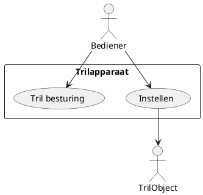
```plantuml
@startuml

rectangle Trilapparaat {
usecase "Instellen" as UC1
usecase "Tril besturing" as UC2
}
Bediener --> UC1
Bediener --> UC2
UC1 --> TrilObject

@enduml
```

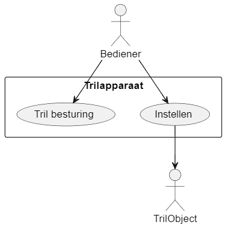

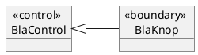
```plantuml
@startuml

left to right direction
object "<<boundary>> \nBlaKnop" as O1
object "<<control>> \nBlaControl" as O2

O2 <|-- O1

@enduml
```
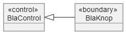

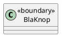
```plantuml
@startuml

class "<<boundary>> \nBlaKnop" as c1

@enduml
```

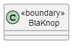

```plantuml
@startuml

hide attributes
hide methods
object "InstelControl" as O1
object "TrilControl" as O2

@enduml
```

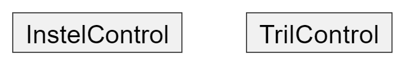

```plantuml
@startuml

hide attributes
hide methods
object "<<control>>\nInstelControl" as O1
object "<<control>>\nTrilControl" as O2

@enduml
```

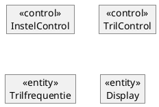
```plantuml
@startuml

hide attributes
hide methods
object "<<control>>\nInstelControl" as O1
object "<<control>>\nTrilControl" as O2
object "<<entity>>\nTrilfrequentie" as O3
object "<<entity>>\nDisplay" as O4

@enduml
```
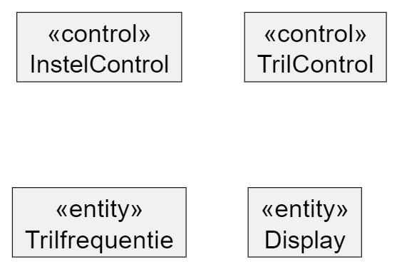

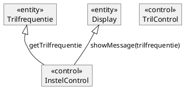
```plantuml
@startuml

hide attributes
hide methods
object "<<control>>\nInstelControl" as O1
object "<<control>>\nTrilControl" as O2
object "<<entity>>\nTrilfrequentie" as O3
object "<<entity>>\nDisplay" as O4

O3<|-- O1 : getTrilfrequentie
O4<|-- O1 : showMessage(trilfrequentie)

@enduml
```

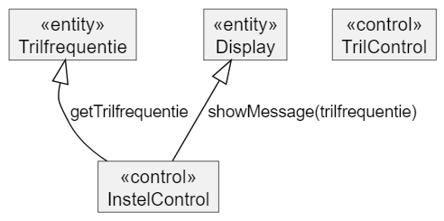

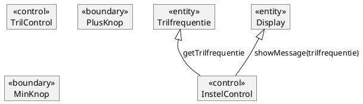
```plantuml
@startuml

hide attributes
hide methods
object "<<control>>\nInstelControl" as O1
object "<<control>>\nTrilControl" as O2
object "<<entity>>\nTrilfrequentie" as O3
object "<<entity>>\nDisplay" as O4
object "<<boundary>>\nPlusKnop" as O5
object "<<boundary>>\nMinKnop" as O6

O3<|-- O1 : getTrilfrequentie
O4<|-- O1 : showMessage(trilfrequentie)

@enduml
```

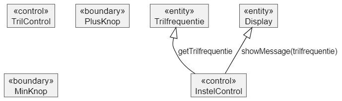