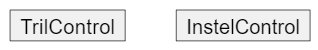


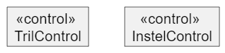


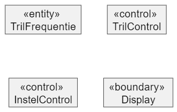


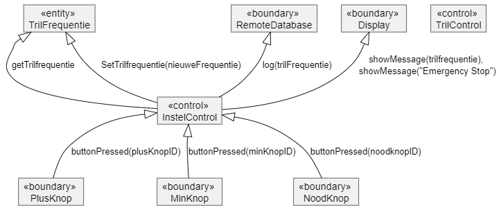


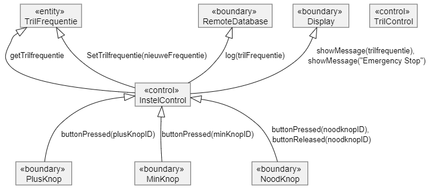


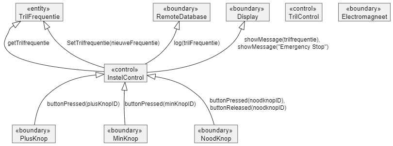


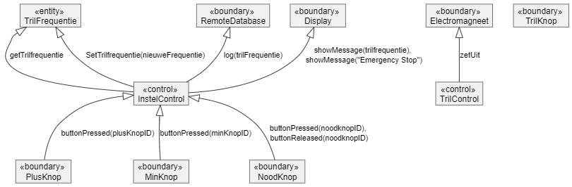


```plantuml
@startuml
class "<<entity>> \nTrilFrequentie" as c1
class "<<control>> \nTrilControl" as c2
class "<<boundary>> \nElectromagneet" as c3
class "<<control>> \nInstelControl" as c4
class "<<boundary>> \nRemoteDatabase" as c5
class "<<boundary>> \nPlusKnop" as c6
class "<<boundary>> \nMinKnop" as c7
class "<<boundary>> \nNoodKnop" as c8
class "<<boundary>> \nDisplay" as c9
class "<<boundary>> \nTrilKnop" as c10

c1 <|-- c4 : getTrilfrequentie
c1 <|-- c4 : SetTrilfrequentie(nieuweFrequentie)
c5 <|-- c4 : log(trilFrequentie)
c4 <|-- c6 : buttonPressed(plusKnopID)
c4 <|-- c7 : buttonPressed(minKnopID)
c9 <|-- c4 : showMessage(trilfrequentie), \nshowMessage("Emergency Stop")
c4 <|-- c8 : buttonPressed(noodknopID), \nbuttonReleased(noodknopID)
c1 <|-- c2 : getTrilfrequentie
c2 <|-- c10 : buttonPressed(trilKnopID)
c3 <|-- c2 : zetAan, zetUit
c2 <|-- c8 :  buttonPressed(noodKnopID),\nbuttonReleased(noodKnopID)


@enduml
```


```plantuml
@startuml

skinparam classAttributeIconSize 0

class "<<entity>> \nTrilFrequentie" as c1
class "<<control>> \nTrilControl" as c2
class "<<boundary>> \nElectromagneet" as c3
class "<<control>> \nInstelControl" as c4
class "<<boundary>> \nRemoteDatabase" as c5
class "<<boundary>> \nPlusKnop" as c6
class "<<boundary>> \nMinKnop" as c7
class "<<boundary>> \nNoodKnop" as c8
class "<<boundary>> \nDisplay" as c9
class "<<boundary>> \nTrilKnop" as c10

c1 <|-- c4 
c1 <|-- c4 
c1 : +getTrilfrequentie():int
c1 : +SetTrilfrequentie(freq:int)
c5 <|-- c4 
c5 : +log(trilFrequentie)
c4 <|-- c6 
c4 : +buttonPressed(buttonID:ebuttonID)
c4 : +buttonReleased(buttonID:ebuttonID)
c4 <|-- c7 
c9 <|-- c4 
c9 : +showMessage(str:string)
c4 <|-- c8 
c2 <|-- c8 
c2 : +buttonPressed(buttonID:ebuttonID)
c2 : +buttonReleased(buttonID:ebuttonID)
c3 <|-- c2
c3  : +ZetAan()
c3 : +Zetuit()
c2 <|-- c10
c1 <|-- c2 
@enduml
```


```plantuml
@startuml
skinparam classAttributeIconSize 0

class "<<entity>> \nTrilFrequentie" as c1
class "<<control>> \nTrilControl" as c2
class "<<boundary>> \nElectromagneet" as c3
class "<<control>> \nInstelControl" as c4
class "<<boundary>> \nRemoteDatabase" as c5
class "<<boundary>> \nPlusKnop" as c6
class "<<boundary>> \nMinKnop" as c7
class "<<boundary>> \nNoodKnop" as c8
class "<<boundary>> \nDisplay" as c9
class "<<boundary>> \nTrilKnop" as c10

c1 <|-- c4 
c1 : +getTrilfrequentie():int
c1 : +SetTrilfrequentie(freq:int)
c5 <|-- c4 
c5 : +log(trilFrequentie)
c4 <|-- c6 
c4 : +buttonPressed(buttonID:ebuttonID)
c4 : +buttonReleased(buttonID:ebuttonID)
c4 <|-- c7 
c9 <|-- c4 
c9 : +showMessage(str:string)
c4 <|-- c8 
c2 <|-- c8 
c2 : +buttonPressed(buttonID:ebuttonID)
c2 : +buttonReleased(buttonID:ebuttonID)
c3 <|-- c2
c3  : +ZetAan()
c3 : +Zetuit()
c2 <|-- c10
c1 <|-- c2 
@enduml
```

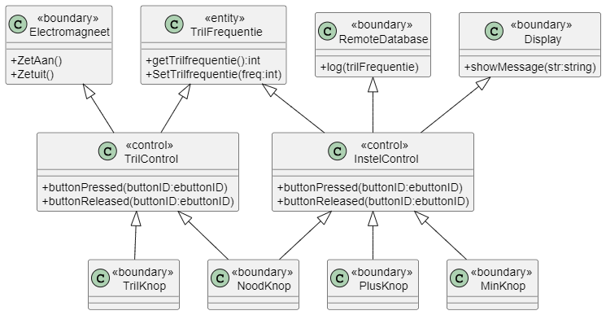


```plantuml
@startuml
skinparam classAttributeIconSize 0

class "<<entity>> \nTrilFrequentie" as c1
class "<<control>> \nTrilControl" as c2
class "<<boundary>> \nElectromagneet" as c3
class "<<control>> \nInstelControl" as c4
class "<<boundary>> \nRemoteDatabase" as c5
class "<<boundary>> \nNoodKnop" as c8
class "<<boundary>> \nDisplay" as c9
class "<<boundary>> \nTrilKnop" as c10
class "<<boundary>> \nInstelControlKnop" as c11

c1 <|-- c4 
c1 : +getTrilfrequentie():int
c1 : +SetTrilfrequentie(freq:int)
c5 <|-- c4 
c5 : +log(trilFrequentie)
c4 <|-- c11 
c4 : +buttonPressed(buttonID:ebuttonID)
c4 : +buttonReleased(buttonID:ebuttonID)
c9 <|-- c4 
c9 : +showMessage(str:string)
c4 <|-- c8 
c2 <|-- c8 
c2 : +buttonPressed(buttonID:ebuttonID)
c2 : +buttonReleased(buttonID:ebuttonID)
c3 <|-- c2
c3  : +ZetAan()
c3 : +Zetuit()
c2 <|-- c10
c1 <|-- c2 
@enduml
```

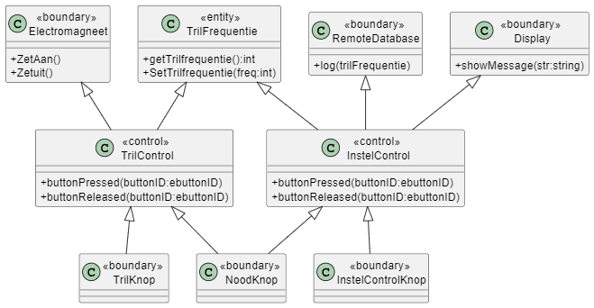

```plantuml
@startuml
skinparam classAttributeIconSize 0

class "<<entity>> \nTrilFrequentie" as c1
c1 : +getTrilfrequentie():int
c1 : +SetTrilfrequentie(freq:int)
class "<<control>> \nTrilControl" as c2
c2 : -trilKnop:TrilKnop 
c2 : -electromagneet:Electromagneet
c2 : +buttonPressed(buttonID:ebuttonID)
c2 : +buttonReleased(buttonID:ebuttonID)
class "<<boundary>> \nElectromagneet" as c3
c3  : +ZetAan()
c3 : +Zetuit()
class "<<control>> \nInstelControl" as c4
c4 : -remDB:RemoteDataBase
c4 : -display:Display
c4 : -plusKnop:InstelControlKnop
c4 : -minKnop:InstelControlKnop
c4 : +buttonPressed(buttonID:ebuttonID)
c4 : +buttonReleased(buttonID:ebuttonID)
class "<<boundary>> \nRemoteDatabase" as c5
c5 : +log(trilFrequentie)
class "<<boundary>> \nNoodKnop" as c8
class "<<boundary>> \nDisplay" as c9
c9 : +showMessage(str:string)
class "<<boundary>> \nTrilKnop" as c10
class "<<boundary>> \nInstelControlKnop" as c11

c1 <|-- c4 
c5 --* c4 
c4 <|-- c11 
c4 *-- c11
c9 --* c4 
c4 <|-- c8 
c2 <|-- c8 
c3 --* c2
c2 <|-- c10
c10 --* c2
c1 <|-- c2 
@enduml
```

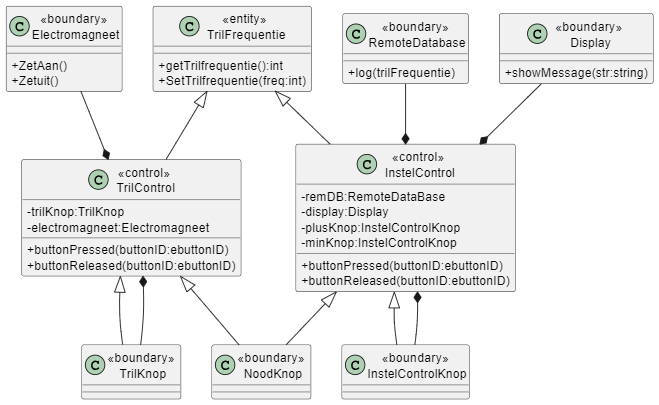

```plantuml
@startuml
skinparam classAttributeIconSize 0

class "<<entity>> \nTrilFrequentie" as c1
c1 : +getTrilfrequentie():int
c1 : +SetTrilfrequentie(freq:int)
class "<<control>> \nTrilControl" as c2
c2 : -trilKnop:TrilKnop 
c2 : -electromagneet:Electromagneet
c2 : -trilFrequentie:Trilfrequentie&
c2 : +buttonPressed(buttonID:ebuttonID)
c2 : +buttonReleased(buttonID:ebuttonID)
class "<<boundary>> \nElectromagneet" as c3
c3  : +ZetAan()
c3 : +Zetuit()
class "<<control>> \nInstelControl" as c4
c4 : -remDB:RemoteDataBase
c4 : -display:Display
c4 : -plusKnop:InstelControlKnop
c4 : -minKnop:InstelControlKnop
c4 : -trilFrequentie:Trilfrequentie&
c4 : +buttonPressed(buttonID:ebuttonID)
c4 : +buttonReleased(buttonID:ebuttonID)
class "<<boundary>> \nRemoteDatabase" as c5
c5 : +log(trilFrequentie)
class "<<boundary>> \nNoodKnop" as c8
c8 : -instelControl:InstelControl&
c8 : -trilControl:TrilControl&
class "<<boundary>> \nDisplay" as c9
c9 : +showMessage(str:string)
class "<<boundary>> \nTrilKnop" as c10
c10 : -trilControl:TrilControl&
class "<<boundary>> \nInstelControlKnop" as c11
c11 : -instelControl:InstelControl&

c1 <|-- c4 
c5 --* c4 
c4 <|-- c11 
c4 *-- c11
c9 --* c4 
c4 <|-- c8 
c2 <|-- c8 
c3 --* c2
c2 <|-- c10
c10 --* c2
c1 <|-- c2 
@enduml
```
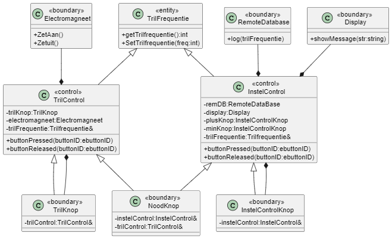

```plantuml
@startuml
skinparam classAttributeIconSize 0

class "<<entity>> \nTrilFrequentie" as c1
c1 : +getTrilfrequentie():int
c1 : +SetTrilfrequentie(freq:int)
class "<<control>> \nTrilControl" as c2
c2 : -trilKnop:Button
c2 : -electromagneet:Electromagneet
c2 : -trilFrequentie:Trilfrequentie&
c2 : +buttonPressed(buttonID:ebuttonID)
c2 : +buttonReleased(buttonID:ebuttonID)
class "<<boundary>> \nElectromagneet" as c3
c3  : +ZetAan()
c3 : +Zetuit()
class "<<control>> \nInstelControl" as c4
c4 : -remDB:RemoteDataBase
c4 : -display:Display
c4 : -plusKnop:Button
c4 : -minKnop:Button
c4 : -trilFrequentie:Trilfrequentie&
c4 : +buttonPressed(buttonID:ebuttonID)
c4 : +buttonReleased(buttonID:ebuttonID)
class "<<boundary>> \nRemoteDatabase" as c5
c5 : +log(trilFrequentie)
class "<<boundary>> \nDisplay" as c9
c9 : +showMessage(str:string)
class "<<boundary>> \nButton" as c12
c12 : -buttonListeners:ButtonListener*[]
c12 : +addBbuttonListener(ButtonListener*)
class "<<interface>> \nButtonListener" as c13
c13 : +buttonPressed(buttonID:ebuttonID)
c13 : +buttonReleased(buttonID:ebuttonID)

c1 <|-- c4 
c5 --* c4 
c9 --* c4 
c3 --* c2
c1 <|-- c2 
c12 --* c4
c12 --* c2
c13 <|-- c12
c13 <|.. c2
c13 <|.. c4

@enduml
```
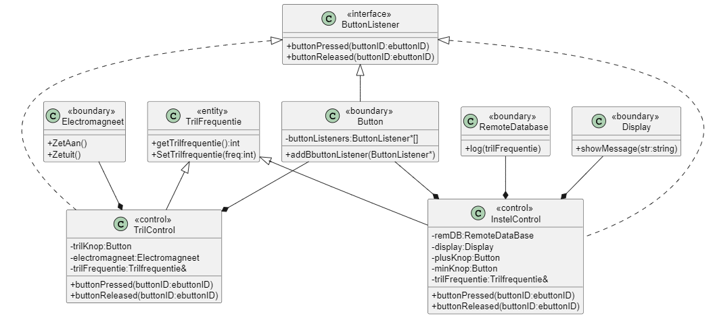

```plantuml
@startuml
skinparam classAttributeIconSize 0

class "<<entity>> \nTrilFrequentie" as c1
c1 : +getTrilfrequentie():int
c1 : +SetTrilfrequentie(freq:int)
class "<<control>> \nTrilControl" as c2
c2 : -trilKnop:Button
c2 : -noodKnop:Button&
c2 : -electromagneet:Electromagneet
c2 : -trilFrequentie:Trilfrequentie&
c2 : +buttonPressed(buttonID:ebuttonID)
c2 : +buttonReleased(buttonID:ebuttonID)
class "<<boundary>> \nElectromagneet" as c3
c3  : +ZetAan()
c3 : +Zetuit()
class "<<control>> \nInstelControl" as c4
c4 : -remDB:RemoteDataBase
c4 : -display:Display
c4 : -plusKnop:Button
c4 : -minKnop:Button
c4 : -noodKnop:Button&
c4 : -trilFrequentie:Trilfrequentie&
c4 : +buttonPressed(buttonID:ebuttonID)
c4 : +buttonReleased(buttonID:ebuttonID)
class "<<boundary>> \nRemoteDatabase" as c5
c5 : +log(trilFrequentie)
class "<<boundary>> \nDisplay" as c9
c9 : +showMessage(str:string)
class "<<boundary>> \nButton" as c12
c12 : -buttonListeners:ButtonListener*[]
c12 : +addBbuttonListener(ButtonListener*)
class "<<interface>> \nButtonListener" as c13
c13 : +buttonPressed(buttonID:ebuttonID)
c13 : +buttonReleased(buttonID:ebuttonID)

c1 <|-- c4 
c5 --* c4 
c9 --* c4 
c3 --* c2
c1 <|-- c2 
c12 --* c4
c12 --* c2
c13 <|-- c12
c13 <|.. c2
c13 <|.. c4
c12 <|-- c2
c12 <|-- c4
@enduml
```
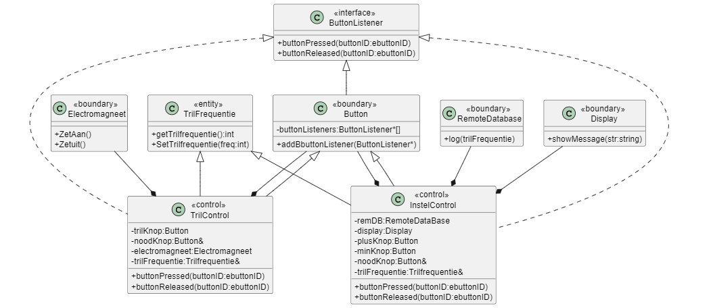