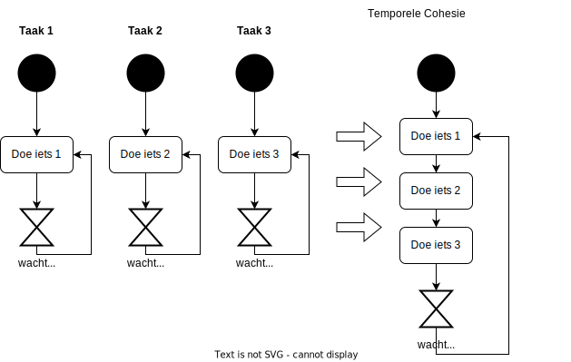
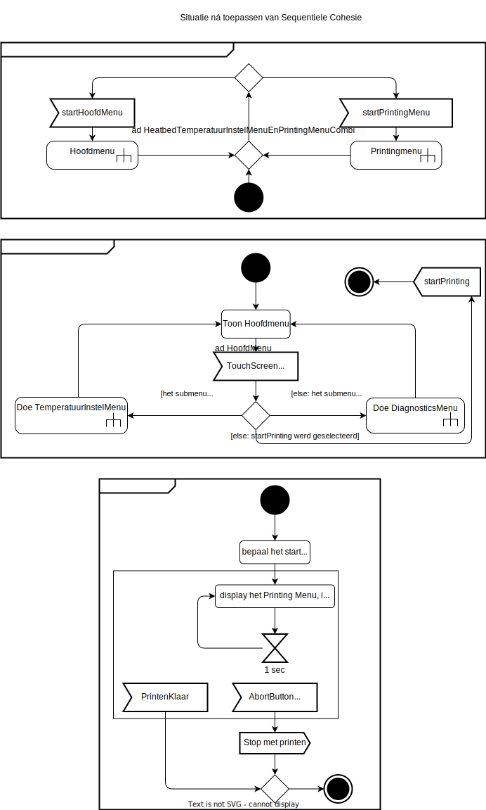

# Taaksamenvoeging

## Uitgangspunt: elk object een eigen taak

Na het maken van een object model is het initiële uitgangspunt dat elk object zijn eigen taak krijgt. Voor elk object is dan de scope van de code mooi beperkt tot de verantwoordelijkheden van dat ene object.

## Maar toch niet teveel taken - gulden middenweg

Echter, als er té veel taken worden aangemaakt, kan dat veel geheugen en ook task-switching overhead opleveren. Dat is weer op te lossen door taken samen te voegen, hetgeen dingen weer wat complexer maakt. Er is ergens een gulden middenweg, welke volgt uit de volgende uitgangspunten voor het samenvoegen van taken.

- Taken die met dezelfde periode iets doen (temporele cohesie), altijd samenvoegen: dat levert vrijwel geen extra complexiteit op.

- Indien nodig en mogelijk additionele taken samenvoegen op basis van control-cohesie of sequentiele cohesie.

### Waar ligt de grens?

Wel, dat hangt af van de microcontroller waar je voor designt.

- Ontwerp je voor de Arduino Due - dan kun je op basis van geheugen-, maar ook performance-constraints niet veel meer dan 7 taken aanmaken. (NB: taken hebben ieder hun eigen stack nodig.).

- Ontwerp je voor een ESP32, dan is geheugen meestal geen issue. Bij teveel taken kan de switching-overhead wat hoog worden, maar een hoeveelheid van enkele tientallen taken is normaal gesproken nog geen reden tot zorg.

## Drie typen van Taaksamenvoeging

Er zijn drie gronden op basis waarvan taken samengevoegd kunnen worden: Temporele Cohesie, Control Cohesie en Sequentiele Cohesie.  Onderstaand wordt elk van hen aan de hand van een voorbeeld toegelicht.

### Temporele Cohesie

Eenvoudige taken die met dezelfde periodetijd iets doen (dat heet temporele cohesie), kun je eenvoudig samennemen.

Onderstaand voorbeeld laat zien hoe met temporele cohesie het aantal taken verminderd kan worden.



Doe iets 1, 2, en 3 zijn "snelle" dingen die de respectievelijke taken elke 100ms moeten "doen". In plaats van daar 3 aparte taken voor te gebruiken, kun je het ook combineren in een enkele taak, waarbij elke 100ms die 3 snelle dingen gedaan worden.

Een mooie design-pattern om dat duidelijk en makkelijk te realiseren is het Handler-pattern (zie CleanRTOS Handler video).

**Pas daarom altijd sequentiele cohesie toe waar van toepassing.**

### Control Cohesie

Als een (slaaf-)taak slechts opdrachten uitvoert voor een enkele andere (master-)taak, waarbij die master altijd wacht tot de slaaf klaar is voordat hij zelf met andere dingen verder gaat, kun dat wat de slaaf doet, eenvoudig binnen de taak / thread van de master uitgevoerd worden. De slaaf heeft dan dus geen eigen taak nodig. We spreken dan van control cohesie. Onderstaand is een voorbeeld daarvan te zien.


In dit geval bestelt de Strava Taak een nieuwe gps detectie bij de GpsMeetTaak, wacht erop, en gaat weer verder. Omdat er geen andere opdrachtgevers zijn voor de GpsMeetTaak en de Strava Taak toch niets doet zolang de GpsMeetTaak actief is, doen beide taken eigenlijk niets gelijktijdig. Daarom kun je zonder noemenswaardige complexiteitspenalty het werk van de GpsMeetTaak uit laten voeren binnen de StravaTaak. 

#### Resultaat na samenvoeging

In de nieuwe activity diagram van de StravaTaak zie je de activiteit die oorspronkelijk werd uitgevoerd door de GpsMeetTaak nu in de samengestelde activity  "gps locatie meten". Als je het diagram van die samengestelde activity opent, zie je de bijbehorende activiteiten "wacht op 4 satteliet signalen" en "bereken daaruit de gps coordinaten" weer terug.

##### Wat betekent de samenvoeging voor de klassen, de code?

Strava en GpsMeting houden niet alleen hun eigen activity diagram, maar ook hun eigen klasse en code. Het overzicht dat object georienteerde partitionering ons heeft gebracht gaat daardoor niet verloren.

#### Code

De code was **oorspronkelijk**:

```c
// .. in de Strava klasse:
void nieuweGpsGelezen(const GpsLocatie& gpsLocatie)
{
    queueGpsLocatie.write(gpsLocatie);
}
void main()
{
  while(true){
    gpsMeter.meetGpsLocatie();        // bestel nieuwe meting
    gpsLocatie=queueGpsLocatie.read();// wacht op het resultaat
    database.slaOp(gpsLocatie);       // sla op in de database
  }
}

// .. en in de GpsMeter klasse:
void i2cByteRead(uint8_t byte)
{
    queueBytes.write(byte);
}
void meetGpsLocatie()
{
    flagMeetGpsLocatie.set();
}

void main()
{
  while(true){
    wait(flagMeetGpsLocatie);// Wacht op opdracht om gps locatie te meten
    i2c.readBytes(0x8a,3);   // zend bericht naar i2c bus om uit 
                             // register 0x8a 3 bytes te lezen
    x = queueBytes.read();   // wacht op antwoord van i2c bus
    y = queueBytes.read();
    z = queueBytes.read();
    strava.nieuweGpsGelezen(gpsLocatie(x,y,z));
  }  
}
```

Na taaksamenvoeging zou de code er zo uit kunnen zien:

```c
```c
// .. in de Strava klasse:
void nieuweGpsGelezen(const GpsLocatie& gpsLocatie)
{
    queueGpsLocatie.write(gpsLocatie);
}
void main()
{
  while(true){
    gpsLocatie=gpsMeter.meetGpsLocatie();
    slaOp(gpsLocatie);
  }
}

// .. en in de GpsMeter klasse:
GpsMeter::GpsMeter(Task* pTaskMaster):m_pTask(pTaskMaster){}

void i2cByteRead(uint8_t byte)
{
    m_pTask->queueBytes.write(byte);
}

GpsLocatie meetGpsLocatie()
{
    i2c.readBytes(0x8a,3);   // zend bericht naar i2c bus om uit 
                             // register 0x8a 3 bytes te lezen
    x = m_pTask->queueBytes.read();   // wacht op antwoord van i2c bus
    y = m_pTask->queueBytes.read();
    z = m_pTask->queueBytes.read();
    return gpsLocatie(x,y,z);
}
// .. geen main meer, want geen taak meer.
```

**Samenvatting het effect van Control Cohesie op de code**

- GpsMeter heeft geen eigen taak en dus geen main functie meer.

- De waitables voor de communicatie tussen master en slave (queueGpsLocatie en flagMeetGpsLocatie) zijn niet meer nodig.

- GpsMeter heeft nog wel waitables nodig voor communicatie met andere taken.  Die lopen nu via de taak waarmee is samengevoegd (de taak van Strava, in dit geval). Om dat mogelijk te maken wordt pointer naar die taak via de constructor meegegeven.

### Kanttekening: Sensors zenden normaalgesproken

In bovenstaande voorbeeld is voor een architectuur gekozen waarbij een verzoek tot het lezen van een gpsPositie wordt gedaan, en er vervolgens op wordt gewacht (dus een soort van client-server approach). Het is **gebruikelijker** dat **sensors** (zoals de gps sensor) "quasi-**voortdurend**" metingen doen en die doorsturen naar objecten die daarin geinteresseerd zijn. De geinteresseerden kunnen dan ten alle tijden gaan wachten op die sensorinformatie zonder eerst nog een verzoek te sturen voor het starten van het vergaren ervan. In veel gevallen kunnen de geinteresseerden dan zonder wachten direct verder met de laatstbinnengekomen sensorinformatie.

## Tweede voorbeeld van Control Cohesie

**Ingewikkelde menustructuren met geneste submenus zijn typisch goede kandidaten voor Control Cohesie.** Onderstaand zie je een voorbeeld.


Elk menu heeft hier nog zijn eigen taak. Omdat het hoofdmenu master is van zijn submenus, en niet gelijktijdig actief hoeft te zijn, kunnen de taken van de submenus worden samengenomen met die van het hoofdmenu. En vanwege de master-slave relatie kan dat op een logische en intuitieve manier.


Wederom houden die submenus ondanks die taaksamenvoeging hun eigen activitydiagram, klasse en code, zodat we blijven profiteren van de overzichtelijke objectgeorienteerde decompositie.

**Samenvatting**

- De berichten tussen master en slave zijn verdwenen.

- De submenus hebben geen eigen taak meer, en hebben dus geen eindeloze loop meer. In plaats daarvan hebbben ze een eindnode.

## Sequentiele Cohesie

### Voor noodgevallen

Met het toepassen van Sequentiële Cohesie is in het algemeen een offer aan een mooie logische object-georienteerde decompositie gemoeid: taken die niets met elkaar te maken hebben, worden dan met elkaar geassocieerd. Liefst pas je het dus niet toe.

Maar soms zit je na toepassen van Temporele en Control Cohesie nog steeds boven het aantal taken dat je microcontroller aankan. In zo'n geval kun je met Sequentiele Cohesie de situatie redden.

### Een voorbeeld

We hebben eerder gezien dat taken samenvoegen op basis van Control Cohesie prima werkt omdat de (oorspronkelijke) master en slave taken toch niet gelijktijdig iets hoeven te doen.

Hetzelfde kan ook gelden voor taken die geen master - slave verhouding hebben.

Onderstaand is daar een voorbeeld van gegeven. 


We zien het hoofdmenu uit het vorige voorbeeld. Verder is er een PrintingMenu, welke wordt opgestart vanuit een klasse "PrintControl", welke verantwoordelijk voor het uitvoeren van het 3D printen. Dat menu geeft tijdens het printen de voortgang weer. Het biedt verder de mogelijkheid om het printen te onderbreken. Het PrintingMenu is dus geen "slave" / onderdeel van het hoofdmenu, dus er is geen mogelijkheid tot Control Cohesie daarmee. Het PrintingMenu werkt verder gelijktijdig met al het andere wat PrintControl doet tijdens het printen, en zijn taak is dus niet op basis van Control Cohesie samen te voegen met de taak van PrintControl.

#### Sequentiele Cohesie - vanwege niet-gelijktijdigheid

Toch weten we toevallig dat er nooit geprint wordt terwijl het hoofdmenu zichtbaar is, en dat het dus nooit zal optreden dat de taak van het HoofdMenu en die van PrintingMenu gelijktijdig iets moeten doen. We kunnen puur op basis daarvan die twee taken samenvoegen, op basis van Sequentiele Cohesie noemen we dat dan. Je zou kunnen zeggen dat Sequentiele Cohesie hetzelfde is als Control Cohesie, maar dan zonder master-slave relatie.

Het resultaat van het samenvoegen van beide taken op basis van Sequentiele Cohesie is onderstaand weergegeven.


**Samenvatting**

- Er is een klasse bijgekomen die de one-en-only taak heeft gekregen (genaamd HeatbedTemperatuurInstelMenuEnPrintingMenuCombi).

- HoofdMenu en PrintingMenu hebben geen eigen taak meer. Ze hebben dan ook geen oneindige lus meer, maar een eindnode.

- HoofdMenu en PrintingMenu wachten zelf niet meer op hun startsignaal. Dat gebeurt in de combi klasse.

- Voor de rest fungeren HoofdMenu en PrintingMenu als voorheen, met als enig verschil dat ze (net als in een eerder voorbeeld gedemonstreerd) de pointer naar de taak van de combi klasse gebruiken voor alles wat met waitables te maken heeft.
